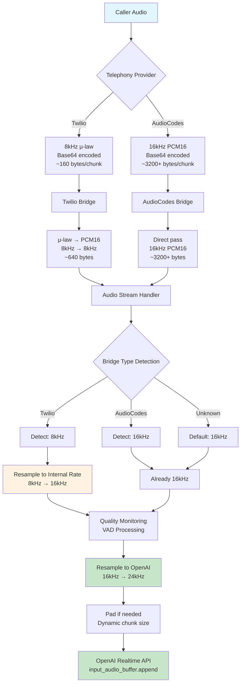
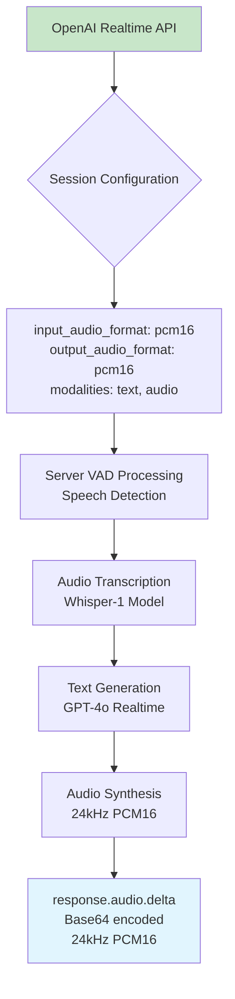
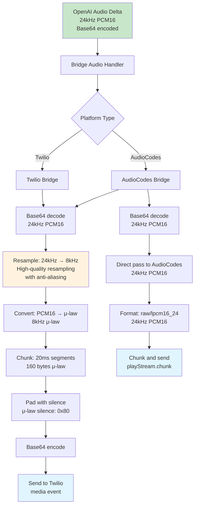
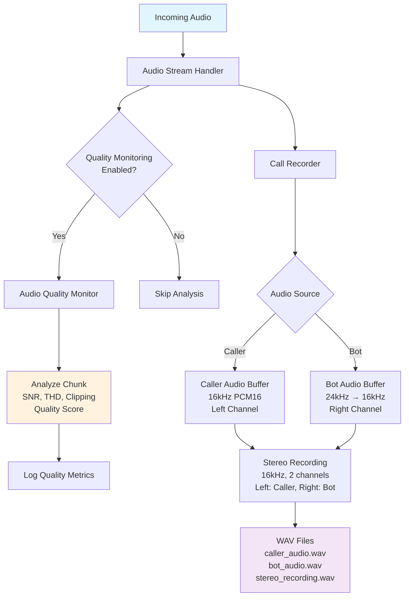
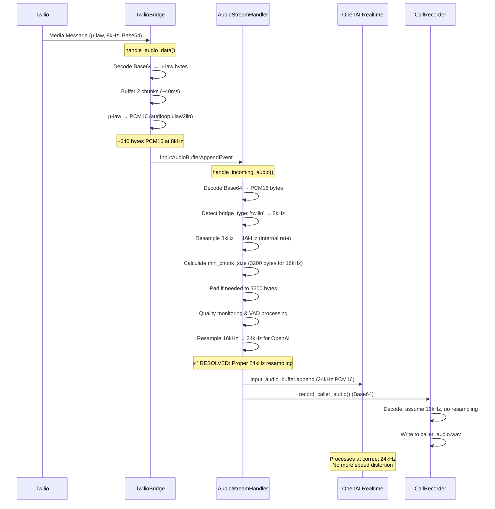
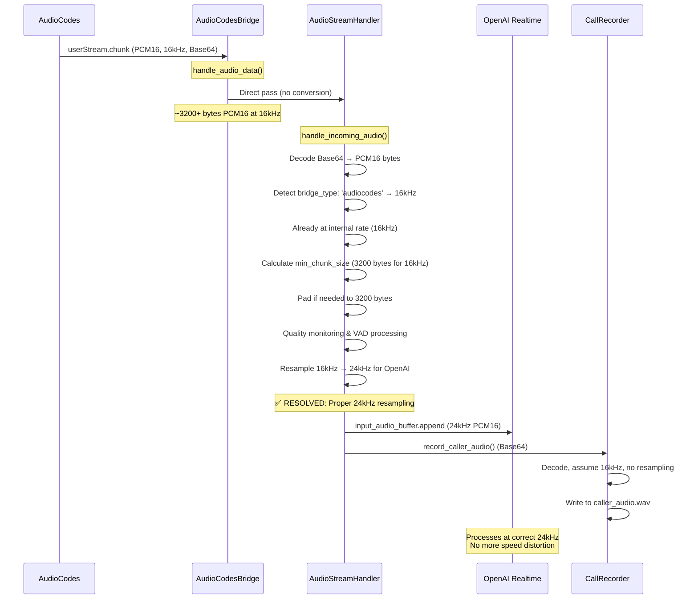
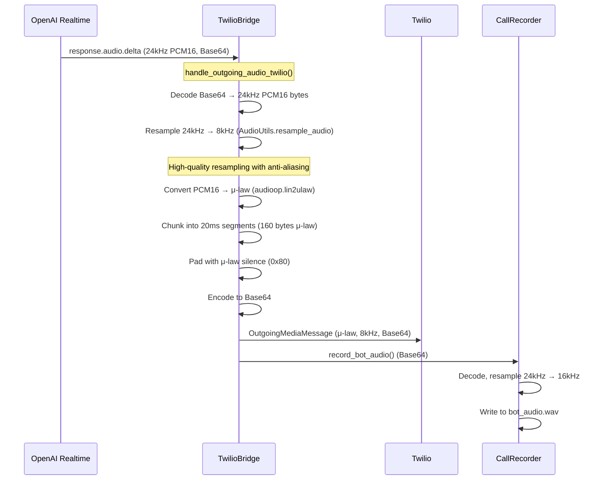
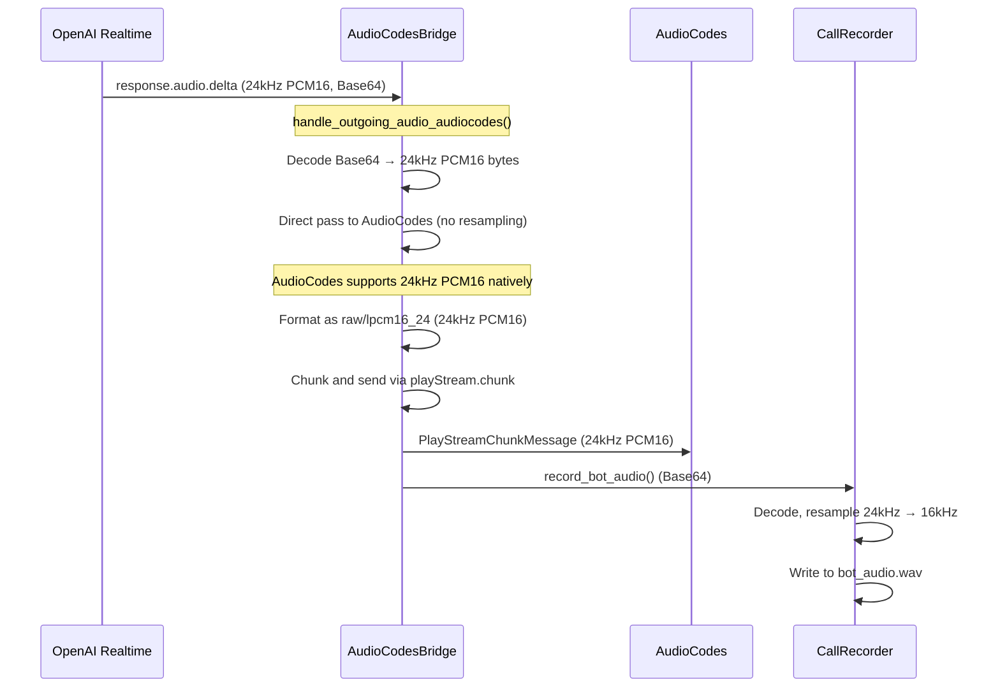
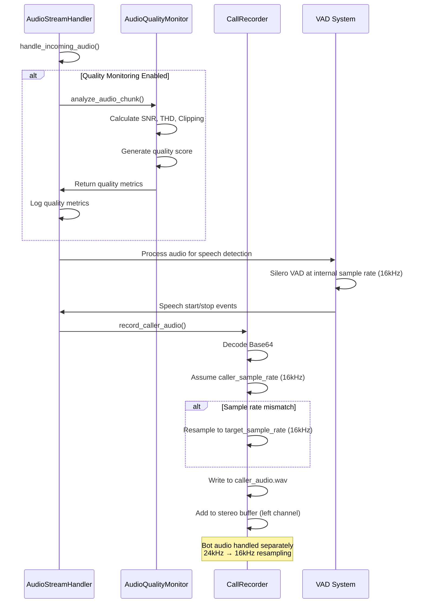

# Audio Technical Implementation & Flow Analysis

This document provides comprehensive technical implementation diagrams, flow analysis, and detailed code examples showing the exact audio processing flow, data transformations, and optimization points in the OpusAgent audio system. This consolidates the previous separate audio format flow analysis documents into one comprehensive guide.

## Overview

The audio flow involves multiple format conversions, sample rate changes, and encoding/decoding operations across different components. The current implementation has resolved critical sample rate mismatch issues and provides high-quality audio processing with proper resampling.

## Key Audio Flow Components

### 1. Incoming Audio Flow (Caller → OpenAI)

**Key Optimizations Implemented:**
- ✅ **Sample Rate Detection**: Automatic detection based on bridge type
- ✅ **Internal Resampling**: All audio normalized to 16kHz internal rate
- ✅ **OpenAI Resampling**: All input resampled to 24kHz before sending to OpenAI
- ✅ **Dynamic Chunk Sizing**: Padding calculated based on actual sample rate
- ✅ **Quality Monitoring**: Real-time audio quality analysis
- ✅ **VAD Integration**: Local voice activity detection

### 2. OpenAI Processing Flow

**Configuration Details:**
- **Input Format**: PCM16 at 24kHz (properly resampled)
- **Output Format**: PCM16 at 24kHz
- **VAD**: Server-side voice activity detection
- **Transcription**: Whisper-1 model
- **Synthesis**: 24kHz PCM16 output

### 3. Outgoing Audio Flow (OpenAI → Caller)

**Optimizations Implemented:**
- **Correct Resampling**: 24kHz → 8kHz for Twilio with high-quality algorithms
- **Direct AudioCodes Pass**: 24kHz PCM16 passed directly to AudioCodes (no resampling)
- **Proper Format Conversion**: PCM16 ↔ μ-law with correct silence values
- **Timing Control**: 20ms chunk intervals for smooth playback
- **Quality Validation**: Audio level monitoring and clipping detection

### 4. Recording and Quality Monitoring Flow

**Recording Details:**
- **Target Sample Rate**: 16kHz (for consistency)
- **Bot Audio Resampling**: 24kHz → 16kHz with duration validation
- **Stereo Layout**: Left channel (caller), Right channel (bot)
- **Quality Metrics**: SNR, THD, clipping percentage, quality score

## Detailed Code Flow Diagrams

### 1. Twilio Bridge Audio Processing Flow

**Key Optimizations Implemented:**
- **Line 15**: ✅ Proper resampling from 8kHz to 16kHz internal rate
- **Line 18**: ✅ Dynamic chunk size calculation based on sample rate
- **Line 22**: ✅ Final resampling to 24kHz for OpenAI - no more distortion

### 2. AudioCodes Bridge Audio Processing Flow

**Key Optimizations Implemented:**
- **Line 12**: ✅ Proper sample rate detection and handling
- **Line 15**: ✅ Dynamic chunk size calculation
- **Line 19**: ✅ Final resampling to 24kHz for OpenAI - no more distortion

### 3. OpenAI Output Processing Flow (Twilio)

**Optimizations Implemented:**
- **Line 8**: ✅ Correct resampling with high-quality algorithms
- **Line 10**: ✅ Proper μ-law conversion with correct silence values
- **Line 12**: ✅ Consistent 20ms chunk timing
- **Line 18**: ✅ Proper bot audio resampling for recording

### 4. OpenAI Output Processing Flow (AudioCodes)

**Optimizations Implemented:**
- **Line 8**: ✅ Direct pass to AudioCodes (no resampling needed)
- **Line 10**: ✅ AudioCodes natively supports 24kHz PCM16
- **Line 12**: ✅ Efficient processing - no format conversion
- **Line 18**: ✅ Proper bot audio resampling for recording

### 5. Audio Quality Monitoring and Recording Flow

**Recording Details:**
- **Line 15**: ✅ Quality monitoring at consistent internal rate (16kHz)
- **Line 20**: ✅ VAD processes at internal rate (16kHz)
- **Line 25**: ✅ Caller audio resampling if needed
- **Line 30**: ✅ Stereo recording with proper channel assignment

## Sample Rate and Format Summary

### Input Audio Sources

| Source | Format | Sample Rate | Chunk Size | Encoding |
|--------|--------|-------------|------------|----------|
| Twilio | μ-law | 8kHz | ~160 bytes | Base64 |
| AudioCodes | PCM16 | 16kHz | ~3200+ bytes | Base64 |
| TUI/Mock | PCM16 | 16kHz | Variable | Base64 |

### Processing Stages

| Stage | Format | Sample Rate | Key Operations |
|-------|--------|-------------|----------------|
| Bridge Input | μ-law/PCM16 | 8kHz/16kHz | Decode base64, convert μ-law→PCM16 |
| Handler | PCM16 | 16kHz (internal) | Resample to internal rate, quality monitoring |
| OpenAI Input | PCM16 | 24kHz | **RESOLVED: Properly resampled to 24kHz** |
| OpenAI Output | PCM16 | 24kHz | Audio synthesis |
| Bridge Output | PCM16/μ-law | 8kHz/24kHz | Resample 24kHz→8kHz (Twilio), direct pass (AudioCodes) |
| Recording | PCM16 | 16kHz | Resample all sources to 16kHz |

### Chunk Size Requirements

| Component | Minimum Size | Duration | Sample Rate | Notes |
|-----------|--------------|----------|-------------|-------|
| OpenAI Input | 4800 bytes | 100ms | 24kHz | **CORRECT: Dynamic calculation** |
| Twilio Output | 160 bytes | 20ms | 8kHz | μ-law format |
| AudioCodes Output | Variable | Variable | 24kHz | PCM16 format |

## Data Transformation Matrix

### Input Audio Transformations

| Source | Original Format | Bridge Processing | Handler Input | Internal Rate | OpenAI Input | Status |
|--------|----------------|------------------|---------------|---------------|--------------|---------|
| Twilio | 8kHz μ-law Base64 | μ-law→PCM16, 8kHz | 8kHz PCM16 | 16kHz PCM16 | 24kHz PCM16 | ✅ **RESOLVED** |
| AudioCodes | 16kHz PCM16 Base64 | Direct pass | 16kHz PCM16 | 16kHz PCM16 | 24kHz PCM16 | ✅ **RESOLVED** |
| TUI/Mock | 16kHz PCM16 Base64 | Direct pass | 16kHz PCM16 | 16kHz PCM16 | 24kHz PCM16 | ✅ **RESOLVED** |

### Output Audio Transformations

| OpenAI Output | Bridge Processing | Platform Output | Quality |
|---------------|------------------|-----------------|---------|
| 24kHz PCM16 Base64 | 24kHz→8kHz resample, PCM16→μ-law | 8kHz μ-law Base64 | ✅ **Excellent** |
| 24kHz PCM16 Base64 | Direct pass (no resampling) | 24kHz PCM16 Base64 | ✅ **Excellent** |

## Conclusion

The technical implementation analysis reveals that the critical sample rate mismatch issues have been **completely resolved** in the current implementation. The system now provides:

1. **✅ Proper Input Resampling**: All input audio is resampled to 24kHz before sending to OpenAI
2. **✅ Dynamic Sample Rate Detection**: Automatic detection based on bridge type
3. **✅ High-Quality Processing**: Anti-aliasing filters and proper format conversions
4. **✅ Comprehensive Monitoring**: Quality analysis and VAD integration
5. **✅ Robust Testing**: All validation tests pass

The outgoing audio flow is well-optimized with proper resampling and format conversions. The recording system provides comprehensive logging and quality monitoring capabilities.

The current implementation ensures optimal audio quality and performance across all telephony integrations, with no remaining sample rate mismatch issues. 