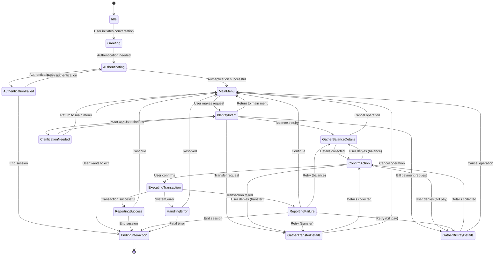

```mermaid
stateDiagram-v2
    [*] --> Idle
    Idle --> Greeting: User initiates conversation
    Greeting --> Authenticating: Authentication needed
    
    Authenticating --> MainMenu: Authentication successful
    Authenticating --> AuthenticationFailed: Authentication failed
    
    AuthenticationFailed --> Authenticating: Retry authentication
    AuthenticationFailed --> EndingInteraction: End session
    
    MainMenu --> IdentifyIntent: User makes request
    MainMenu --> EndingInteraction: User wants to exit
    
    IdentifyIntent --> GatherBalanceDetails: Balance inquiry
    IdentifyIntent --> GatherTransferDetails: Transfer request
    IdentifyIntent --> GatherBillPayDetails: Bill payment request
    IdentifyIntent --> ClarificationNeeded: Intent unclear
    IdentifyIntent --> MainMenu: Return to main menu
    
    GatherBalanceDetails --> ConfirmAction: Details collected
    GatherBalanceDetails --> MainMenu: Cancel operation
    
    GatherTransferDetails --> ConfirmAction: Details collected
    GatherTransferDetails --> MainMenu: Cancel operation
    
    GatherBillPayDetails --> ConfirmAction: Details collected
    GatherBillPayDetails --> MainMenu: Cancel operation
    
    ClarificationNeeded --> IdentifyIntent: User clarifies
    ClarificationNeeded --> MainMenu: Return to main menu
    
    ConfirmAction --> ExecutingTransaction: User confirms
    ConfirmAction --> GatherBalanceDetails: User denies (balance)
    ConfirmAction --> GatherTransferDetails: User denies (transfer)
    ConfirmAction --> GatherBillPayDetails: User denies (bill pay)
    
    ExecutingTransaction --> ReportingSuccess: Transaction successful
    ExecutingTransaction --> ReportingFailure: Transaction failed
    ExecutingTransaction --> HandlingError: System error
    
    ReportingSuccess --> MainMenu: Continue
    ReportingSuccess --> EndingInteraction: End session
    
    ReportingFailure --> MainMenu: Continue
    ReportingFailure --> GatherBalanceDetails: Retry (balance)
    ReportingFailure --> GatherTransferDetails: Retry (transfer)
    ReportingFailure --> GatherBillPayDetails: Retry (bill pay)
    ReportingFailure --> EndingInteraction: End session
    
    HandlingError --> MainMenu: Resolved
    HandlingError --> EndingInteraction: Fatal error
    
    EndingInteraction --> [*]
``` 