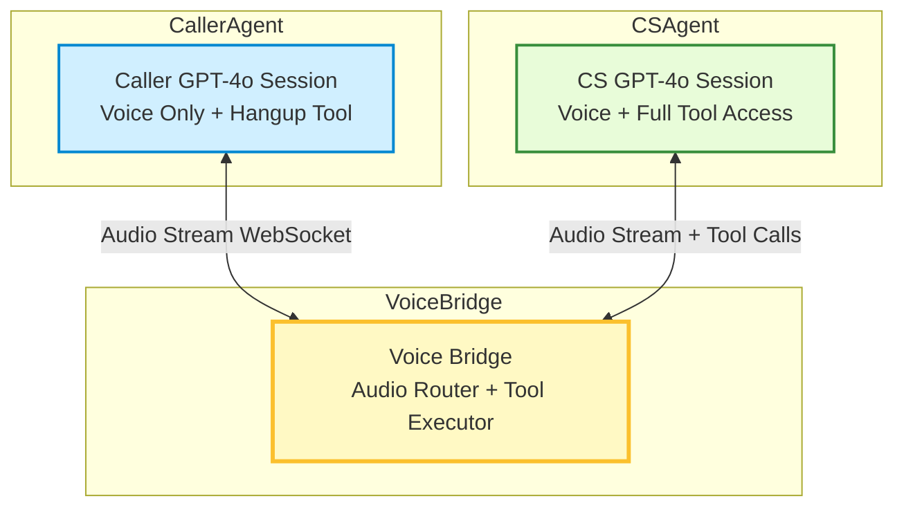

# 🧠 Final Architecture: Dual GPT-4o Agents + Voice Bridge + Tooling

### 🔷 **High-Level Summary**

* **Caller Agent** is a GPT-4o-realtime session that sends and receives audio via the **Voice Bridge**
* **Customer Service Agent (CS Agent)** is another GPT-4o-realtime session
* The **Voice Bridge**:

  * **Routes audio** between both GPT-4o agents
  * **Executes tool calls** issued by the **CS Agent**
  * Handles session management, tool results, and audio relay
* The **Caller Agent** can only issue a **hangup tool call**

---

## 🧭 Component Breakdown

| Component                                                             | Role                                                                     |
| --------------------------------------------------------------------- | ------------------------------------------------------------------------ |
| **Caller Agent (GPT-4o-realtime)**                                             | Simple GPT-4o voice-only session; responds in audio; may call `hangup()` |
| **Voice Bridge**                                                      | Central logic that:                                                      |
|     - Relays audio between GPT-4o sessions                            |                                                                          |
|     - Handles tool call requests from CS Agent                        |                                                                          |
|     - Sends tool call results back as `function_call_result` messages |                                                                          |
| **CS Agent (GPT-4o)**                                                 | Full GPT-4o session with memory and tools, responding to caller input    |

---

## 🗂️ Voice Bridge Responsibilities

| Function                 | Description                                                            |
| ------------------------ | ---------------------------------------------------------------------- |
| **Audio Relay**          | Streams Opus/PCM audio between both GPT-4o sessions                    |
| **Tool Call Handling**   | Watches for tool calls from CS Agent, executes them                    |
| **Tool Call Results**    | Injects results back into CS Agent session via `function_call_result`  |
| **Hangup Handling**      | If caller invokes `hangup()`, gracefully close both sessions           |
| **Session Context Sync** | Optionally add system/user messages for context during session startup |

---

## 🧩 Mermaid Diagram (Full Final Version)

