# OpusAgent Flow Design & Implementation Guide

## 🚀 Quick Start: From Idea to Working Flow in Minutes

This guide shows how to design and implement conversational flows quickly and efficiently using the OpusAgent system.

## 📋 Phase 1: Design Your Flow (5 minutes)

### Step 1: Define the User Journey
Start with a simple user story:
- **What** does the user want to accomplish?
- **What information** do you need to collect?
- **What decisions** need to be made along the way?

### Step 2: Map the Flow Steps
Break down the conversation into logical steps:

```
User Intent → Information Gathering → Decision Points → Action → Confirmation
```

### Step 3: Create Your Flow Diagram
Use simple boxes and arrows to visualize the flow.

## 🔧 Phase 2: Implementation (10-15 minutes)

### Architecture Overview

Our flow implementation uses three key components:

1. **Prompt Templates** (`*_prompts.py`) - What the AI says
2. **Function Handlers** (`function_handler.py`) - Business logic
3. **Tool Definitions** (`telephony_realtime_bridge.py`) - OpenAI integration

## 📚 Example: Account Balance Inquiry Flow

Let's build a complete flow from scratch:

### Step 1: Design the Flow

```mermaid
graph TD
    A["User: 'What's my balance?'"] --> B["call_intent(intent='balance_inquiry')"]
    B --> C["verify_account()<br/>🔐 Verify identity"]
    C --> D["get_account_balance()<br/>💰 Retrieve balance"]
    D --> E["offer_additional_services()<br/>❓ Anything else?"]
    E --> F["wrap_up()<br/>👋 Thank you"]
```



### Step 2: Create Prompt Templates

```python
# balance_inquiry_prompts.py
verify_account_prompt = """
For security purposes, I need to verify your identity. 
Can you please provide the last 4 digits of your social security number?
"""

balance_response_prompt = """
Your current account balance is ${balance:.2f}. 
Your available balance is ${available_balance:.2f}.
Is there anything else I can help you with today?
"""

additional_services_prompt = """
I can also help you with:
- Transfer funds between accounts
- Set up account alerts
- Update your contact information
Would you like help with any of these?
"""
```

### Step 3: Implement Function Handlers

```python
# In function_handler.py - add these methods

def _func_verify_account(self, arguments: Dict[str, Any]) -> Dict[str, Any]:
    """Verify customer account access."""
    from balance_inquiry_prompts import verify_account_prompt
    
    ssn_last4 = arguments.get("ssn_last4", "")
    
    return {
        "status": "success",
        "function_name": "verify_account",
        "prompt_guidance": verify_account_prompt,
        "next_action": "get_balance" if ssn_last4 else "request_verification",
        "verified": bool(ssn_last4),
        "context": {
            "stage": "account_verification",
            "ssn_last4": ssn_last4
        }
    }

def _func_get_account_balance(self, arguments: Dict[str, Any]) -> Dict[str, Any]:
    """Retrieve and present account balance."""
    from balance_inquiry_prompts import balance_response_prompt
    
    # Simulate balance retrieval
    balance = 2543.67
    available_balance = 2543.67
    
    formatted_prompt = balance_response_prompt.format(
        balance=balance,
        available_balance=available_balance
    )
    
    return {
        "status": "success",
        "function_name": "get_account_balance",
        "prompt_guidance": formatted_prompt,
        "next_action": "offer_services",
        "balance": balance,
        "available_balance": available_balance,
        "context": {
            "stage": "balance_provided",
            "balance": balance
        }
    }

def _func_offer_additional_services(self, arguments: Dict[str, Any]) -> Dict[str, Any]:
    """Offer additional banking services."""
    from balance_inquiry_prompts import additional_services_prompt
    
    return {
        "status": "success",
        "function_name": "offer_additional_services",
        "prompt_guidance": additional_services_prompt,
        "next_action": "wrap_up",
        "context": {
            "stage": "services_offered"
        }
    }
```

### Step 4: Register Functions

```python
# In function_handler.py __init__ method
def _register_default_functions(self):
    # ... existing functions
    
    # Balance inquiry flow
    self.register_function("verify_account", self._func_verify_account)
    self.register_function("get_account_balance", self._func_get_account_balance)
    self.register_function("offer_additional_services", self._func_offer_additional_services)
```

### Step 5: Add OpenAI Tool Definitions

```python
# In telephony_realtime_bridge.py initialize_session function
tools=[
    # ... existing tools
    {
        "type": "function",
        "name": "verify_account",
        "description": "Verify customer account access for security.",
        "parameters": {
            "type": "object",
            "properties": {
                "ssn_last4": {"type": "string", "description": "Last 4 digits of SSN"}
            }
        },
    },
    {
        "type": "function",
        "name": "get_account_balance",
        "description": "Retrieve customer account balance information.",
        "parameters": {"type": "object", "properties": {}},
    },
    {
        "type": "function",
        "name": "offer_additional_services",
        "description": "Offer additional banking services to customer.",
        "parameters": {"type": "object", "properties": {}},
    },
    # ... other tools
]
```

## 🎯 Flow Design Patterns

### Pattern 1: Linear Flow
Sequential steps with no branching:
```
A → B → C → D → End
```

### Pattern 2: Conditional Flow
Branching based on user input:
```
A → B → (C1 | C2 | C3) → D → End
```

### Pattern 3: Loop Flow
Repeat steps until condition met:
```
A → B → C → (Back to B | Continue to D) → End
```

### Pattern 4: Multi-Path Flow
Different paths for different user types:
```
A → (Path1: B1→C1→D1 | Path2: B2→C2→D2) → End
```

## 🛠️ Quick Implementation Template

### 1. Create New Flow File

```python
# new_flow_prompts.py
step1_prompt = """Your prompt for step 1 with {variable} placeholders."""
step2_prompt = """Your prompt for step 2 with {variable} placeholders."""
completion_prompt = """Flow completion message."""
```

### 2. Add Function Handlers

```python
def _func_new_flow_step1(self, arguments: Dict[str, Any]) -> Dict[str, Any]:
    from new_flow_prompts import step1_prompt
    
    # Process arguments
    param1 = arguments.get("param1", "")
    
    # Format prompt
    formatted_prompt = step1_prompt.format(param1=param1)
    
    return {
        "status": "success",
        "function_name": "new_flow_step1",
        "prompt_guidance": formatted_prompt,
        "next_action": "next_step",
        "context": {
            "stage": "step1_complete",
            "param1": param1
        }
    }
```

### 3. Register and Configure

```python
# Register function
self.register_function("new_flow_step1", self._func_new_flow_step1)

# Add tool definition
{
    "type": "function",
    "name": "new_flow_step1",
    "description": "Description of what this step does",
    "parameters": {
        "type": "object",
        "properties": {
            "param1": {"type": "string", "description": "Parameter description"}
        }
    }
}
```

## 📊 Testing Your Flow

### 1. Unit Test Individual Functions
```python
def test_new_flow_step1():
    handler = FunctionHandler(None)
    result = handler._func_new_flow_step1({"param1": "test_value"})
    assert result["status"] == "success"
    assert "test_value" in result["context"]["param1"]
```

### 2. Integration Test Complete Flow
Use the telephony bridge to test the complete conversation flow.

### 3. Monitor Flow Performance
Check logs for:
- Function execution times
- Error rates
- User completion rates

## 🚀 Advanced Flow Features

### Dynamic Branching
```python
def _func_dynamic_routing(self, arguments: Dict[str, Any]) -> Dict[str, Any]:
    user_type = arguments.get("user_type")
    
    if user_type == "premium":
        next_action = "premium_flow"
    elif user_type == "business":
        next_action = "business_flow"
    else:
        next_action = "standard_flow"
    
    return {
        "next_action": next_action,
        "routing_decision": user_type
    }
```

### State Persistence
```python
def _func_save_state(self, arguments: Dict[str, Any]) -> Dict[str, Any]:
    # Save conversation state for later retrieval
    conversation_state = {
        "user_id": arguments.get("user_id"),
        "current_step": arguments.get("current_step"),
        "collected_data": arguments.get("collected_data"),
        "timestamp": datetime.now().isoformat()
    }
    
    # Save to database/cache
    return {"state_saved": True, "state_id": "unique_id"}
```

### Error Handling & Recovery
```python
def _func_error_recovery(self, arguments: Dict[str, Any]) -> Dict[str, Any]:
    error_type = arguments.get("error_type")
    
    if error_type == "validation_failed":
        return {
            "prompt_guidance": "I'm sorry, that information doesn't seem correct. Let's try again.",
            "next_action": "retry_previous_step"
        }
    
    return {
        "prompt_guidance": "I apologize for the confusion. Let me connect you with a human agent.",
        "next_action": "escalate_to_human"
    }
```

## 📈 Best Practices

### 1. Keep Functions Focused
- One function = one logical step
- Single responsibility principle
- Easy to test and maintain

### 2. Use Descriptive Names
- Function names should describe what they do
- Parameter names should be clear
- Consistent naming conventions

### 3. Handle Edge Cases
- Always provide default values
- Validate input parameters
- Include error handling

### 4. Make Prompts Conversational
- Use natural language
- Include context from previous steps
- Provide clear next steps

### 5. Design for Scalability
- Modular architecture
- Reusable components
- Configuration-driven flows

## 🎯 Common Flow Types & Templates

### Customer Service Flows
- Account inquiries
- Issue resolution
- Service requests
- Complaint handling

### Sales Flows  
- Product recommendations
- Quote generation
- Order processing
- Upselling/cross-selling

### Support Flows
- Troubleshooting guides
- Technical assistance
- Knowledge base queries
- Escalation processes

### Onboarding Flows
- Account setup
- Document collection
- Identity verification
- Welcome processes

## 📊 Measuring Flow Success

### Key Metrics
- **Completion Rate**: % of users who complete the flow
- **Drop-off Points**: Where users abandon the conversation
- **Average Flow Time**: How long flows take to complete
- **User Satisfaction**: Feedback scores and ratings

### Optimization Strategies
- A/B test different prompts
- Simplify complex steps
- Reduce information collection
- Improve error messages

This architecture makes it incredibly easy to design, implement, and iterate on conversational flows. The modular approach means you can build complex conversations by combining simple, reusable components. 