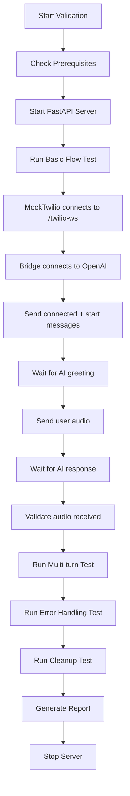

# Twilio Realtime Bridge Integration Validation

This document explains how to use the comprehensive integration validation script for testing the TwilioRealtimeBridge with both MockTwilioClient and real OpenAI Realtime API.

## Overview

The `validate_twilio_realtime_bridge.py` script provides a **full end-to-end integration test** that:

1. **Starts a FastAPI server** with Twilio WebSocket endpoint
2. **Uses MockTwilioClient** to simulate Twilio Media Streams
3. **Connects to real OpenAI Realtime API** for authentic responses
4. **Tests the complete bridge functionality** end-to-end
5. **Provides comprehensive reporting** on all aspects

## 🚀 Quick Start

### Prerequisites

```bash
# 1. Set OpenAI API Key
export OPENAI_API_KEY="your-openai-api-key-here"

# 2. Ensure dependencies are installed
pip install fastapi uvicorn websockets numpy scipy

# 3. Have test audio files ready (optional - script will find them)
# Place WAV files in demo/user_audio/ or validate/test_audio/
```

### Basic Usage

```bash
# Run full validation suite
python validate/validate_twilio_realtime_bridge.py

# Run on custom host/port
python validate/validate_twilio_realtime_bridge.py --host 0.0.0.0 --port 8080

# Save results to JSON file
python validate/validate_twilio_realtime_bridge.py --output validation_results.json
```

## 🧪 What Gets Tested

### 1. **Server Startup** ✅
- FastAPI server starts successfully
- WebSocket endpoint `/twilio-ws` is accessible
- Health check endpoints work

### 2. **OpenAI Connection** ✅
- Successfully connects to OpenAI Realtime API
- Authentication works with API key
- WebSocket connection is stable

### 3. **Twilio Connection** ✅ 
- MockTwilioClient connects to bridge
- Twilio protocol messages are handled correctly
- Bridge creates TwilioRealtimeBridge instance

### 4. **Audio Flow** ✅
- Audio flows from MockTwilio → Bridge → OpenAI
- OpenAI responses flow back through Bridge → MockTwilio
- Audio format conversions work (mulaw ↔ PCM16)

### 5. **Session Management** ✅
- AI greeting is received and processed
- Session initialization works correctly
- Conversation state is maintained

### 6. **Multi-turn Conversation** ✅
- Multiple audio exchanges work
- Context is maintained across turns
- Turn timing and sequencing work

### 7. **Error Handling** ✅
- DTMF digits are processed correctly
- Graceful handling of connection issues
- Proper error logging and recovery

### 8. **Resource Cleanup** ✅
- WebSocket connections are closed properly
- Bridge instances are cleaned up
- No resource leaks

## 📊 Test Flow



## 📁 Audio File Setup

The validator looks for test audio files in these locations:

```
static/                     # Primary location - Banking conversation audio
├── tell_me_about_your_bank.wav    # "Tell me about your bank"
├── what_is_my_balance.wav         # "What is my balance?"
├── need_to_replace_card.wav       # "I need to replace my card"
├── my_gold_card.wav               # "My gold card"
├── i_lost_it.wav                  # "I lost it"
├── when_last_payment.wav          # "When was my last payment?"
├── actually_i_moved.wav           # "Actually I moved"
├── yes_that_address.wav           # "Yes, that address"
├── hold_on_a_sec.wav              # "Hold on a second"
└── thanks_thats_all.wav           # "Thanks, that's all"

demo/user_audio/           # Secondary location
├── hello.wav              # "Hello, how are you?"
├── question1.wav          # Banking question
└── followup.wav           # Follow-up question

validate/test_audio/        # Tertiary location
├── sample.wav
└── test.wav

test_audio/                 # Quaternary location
└── *.wav
```

### Audio Requirements:
- **Format**: WAV files (any sample rate, mono/stereo)
- **Content**: Short conversational audio (2-10 seconds)
- **Quality**: Clear speech for best results

## 🔧 Configuration Options

### Command Line Arguments:
```bash
--host localhost           # Server bind address
--port 6060               # Server port
--output results.json     # Save JSON report
```

### Environment Variables:
```bash
OPENAI_API_KEY            # Required - your OpenAI API key
```

## 📋 Example Output

```
🚀 Starting Twilio Realtime Bridge Full Validation
============================================================

=== Testing Basic Flow ===
[INFO] Starting validation server on localhost:6060
[INFO] Validation server started successfully
[INFO] Connecting to OpenAI Realtime API...
[INFO] Connected to OpenAI Realtime API
[INFO] Bridge created: bridge_1703123456
[INFO] Twilio WebSocket connection accepted
[INFO] Waiting for AI greeting...
✅ Received AI greeting: 25 chunks
[INFO] Sending user audio: hello.wav
[INFO] Waiting for AI response...
✅ Received AI response: 45 chunks
✅ Basic flow validation completed successfully

🧪 Running Multi-turn Conversation validation...
✅ Multi-turn conversation successful: 3 turns

🧪 Running Error Handling validation...
✅ Error handling validation completed

🧪 Running Cleanup validation...
✅ Cleanup validation completed

================================================================================
🔍 TWILIO REALTIME BRIDGE VALIDATION REPORT
================================================================================
📅 Start Time: 2024-12-19 14:30:15
⏱️  Duration: 45.2s
🌐 Server: localhost:6060

✅ OVERALL RESULT: SUCCESS

📊 TEST RESULTS:
  ✅ Server Startup
  ✅ OpenAI Connection
  ✅ Twilio Connection
  ✅ Audio Flow
  ✅ Session Management
  ✅ Multi-turn Conversation
  ✅ Error Handling
  ✅ Resource Cleanup

📈 SUMMARY:
  Total Tests: 8
  Passed: 8
  Failed: 0
  Success Rate: 100.0%
================================================================================
```

## 🚨 Common Issues & Solutions

### 1. OpenAI API Key Issues
```
❌ OPENAI_API_KEY environment variable not set
```
**Solution**: Set your OpenAI API key:
```bash
export OPENAI_API_KEY="sk-..."
```

### 2. Port Already in Use
```
❌ Failed to start server: [Errno 98] Address already in use
```
**Solutions**:
```bash
# Use different port
python validate/validate_twilio_realtime_bridge.py --port 8080

# Kill existing process
lsof -ti:6060 | xargs kill -9
```

### 3. No Test Audio Files
```
❌ No test audio file available
```
**Solutions**:
- Create `demo/user_audio/` directory
- Add WAV files with conversational content
- Or provide path to existing audio files

### 4. OpenAI Connection Timeout
```
❌ Error connecting to OpenAI Realtime API
```
**Solutions**:
- Check internet connection
- Verify API key has Realtime API access
- Check OpenAI service status

## 🔄 Integration with CI/CD

### GitHub Actions Example:
```yaml
name: Twilio Bridge Integration Test
on: [push, pull_request]

jobs:
  integration-test:
    runs-on: ubuntu-latest
    steps:
      - uses: actions/checkout@v3
      - name: Setup Python
        uses: actions/setup-python@v4
        with:
          python-version: '3.11'
      
      - name: Install dependencies
        run: pip install -r requirements.txt
      
      - name: Run Integration Test
        env:
          OPENAI_API_KEY: ${{ secrets.OPENAI_API_KEY }}
        run: |
          python validate/validate_twilio_realtime_bridge.py \
            --output integration_results.json
      
      - name: Upload Results
        uses: actions/upload-artifact@v3
        with:
          name: integration-results
          path: integration_results.json
```

## 🔍 Monitoring & Debugging

### Live Monitoring:
```bash
# Check server status during test
curl http://localhost:6060/health
curl http://localhost:6060/status
```

### Debug Logging:
The validator uses comprehensive logging. Check logs for:
- WebSocket connection details
- Audio processing information
- OpenAI API interactions
- Bridge state changes

### Output Files:
- **Audio files**: Saved to `validation_output/`
- **JSON report**: Saved if `--output` specified
- **Logs**: Console output with timestamps

This integration validation provides complete confidence that your TwilioRealtimeBridge works correctly with both simulated Twilio connections and real OpenAI Realtime API responses. 