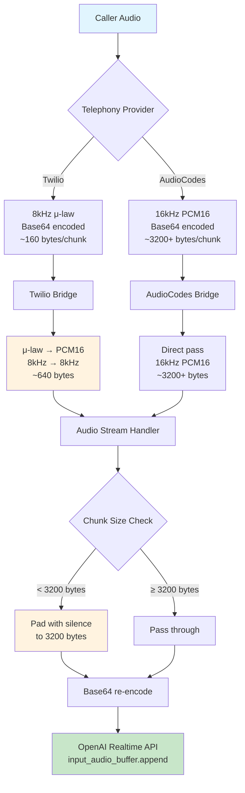
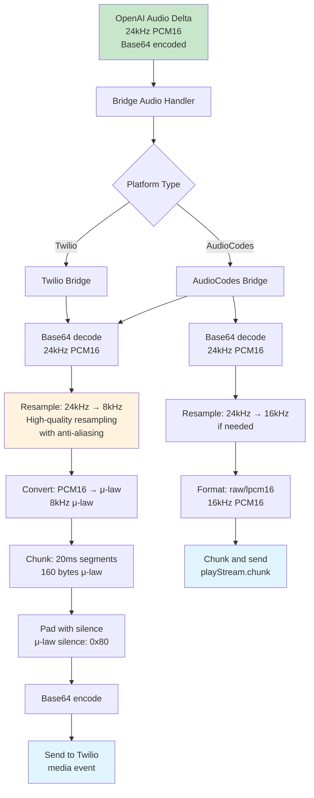
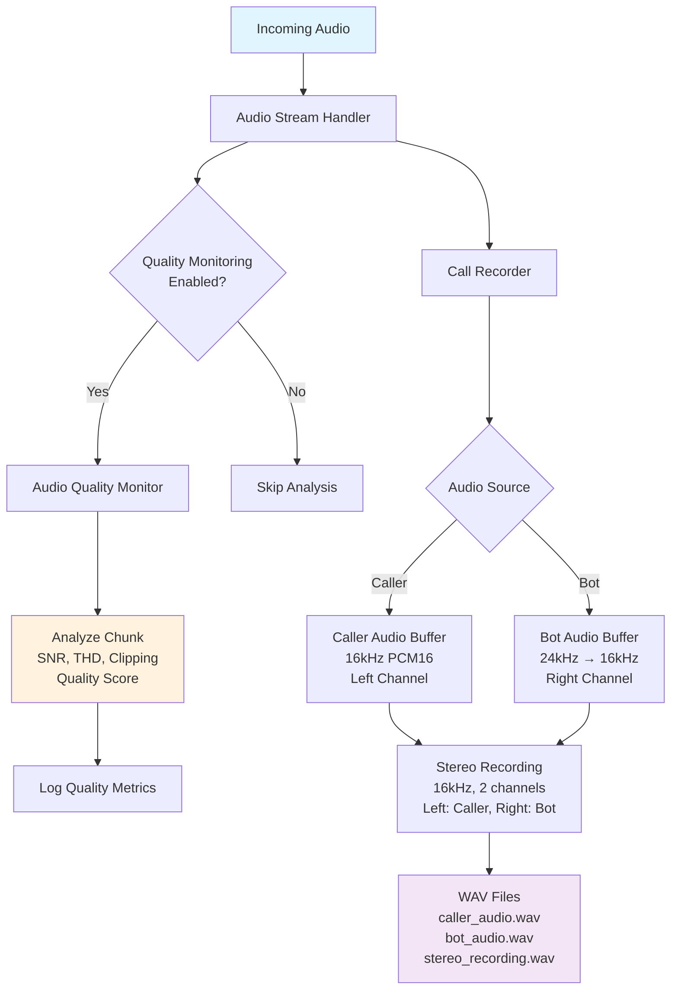

# Audio Format Flow Analysis

This document provides a comprehensive analysis of audio format changes throughout the OpusAgent platform, from incoming base64-encoded chunks through processing to OpenAI Realtime API and back to callers.

## Overview

The audio flow involves multiple format conversions, sample rate changes, and encoding/decoding operations across different components. Understanding this flow is crucial for optimizing performance and identifying potential issues.

## Key Audio Flow Components

### 1. Incoming Audio Flow (Caller → OpenAI)



**Key Issues Identified:**
- **Sample Rate Mismatch**: OpenAI expects 24kHz, but receives 8kHz (Twilio) or 16kHz (AudioCodes)
- **No Resampling**: Input audio is not resampled to 24kHz before sending to OpenAI
- **Potential Distortion**: 8kHz audio interpreted as 24kHz would sound 3x faster

### 2. OpenAI Processing Flow

```mermaid
graph TD
    A[OpenAI Realtime API] --> B{Session Configuration}
    B --> C[input_audio_format: pcm16<br/>output_audio_format: pcm16<br/>modalities: [text, audio]]
    
    C --> D[Server VAD Processing<br/>Speech Detection]
    D --> E[Audio Transcription<br/>Whisper-1 Model]
    E --> F[Text Generation<br/>GPT-4o Realtime]
    F --> G[Audio Synthesis<br/>24kHz PCM16]
    
    G --> H[response.audio.delta<br/>Base64 encoded<br/>24kHz PCM16]
    
    style A fill:#c8e6c9
    style H fill:#e1f5fe
```

**Configuration Details:**
- **Input Format**: PCM16 (no explicit sample rate specified)
- **Output Format**: PCM16 at 24kHz
- **VAD**: Server-side voice activity detection
- **Transcription**: Whisper-1 model
- **Synthesis**: 24kHz PCM16 output

### 3. Outgoing Audio Flow (OpenAI → Caller)



**Optimizations Implemented:**
- **Correct Resampling**: 24kHz → 8kHz/16kHz with high-quality algorithms
- **Proper Format Conversion**: PCM16 ↔ μ-law with correct silence values
- **Timing Control**: 20ms chunk intervals for smooth playback

### 4. Recording and Quality Monitoring Flow



**Recording Details:**
- **Target Sample Rate**: 16kHz (for consistency)
- **Bot Audio Resampling**: 24kHz → 16kHz with duration validation
- **Stereo Layout**: Left channel (caller), Right channel (bot)
- **Quality Metrics**: SNR, THD, clipping percentage, quality score

## Sample Rate and Format Summary

### Input Audio Sources

| Source | Format | Sample Rate | Chunk Size | Encoding |
|--------|--------|-------------|------------|----------|
| Twilio | μ-law | 8kHz | ~160 bytes | Base64 |
| AudioCodes | PCM16 | 16kHz | ~3200+ bytes | Base64 |
| TUI/Mock | PCM16 | 16kHz | Variable | Base64 |

### Processing Stages

| Stage | Format | Sample Rate | Key Operations |
|-------|--------|-------------|----------------|
| Bridge Input | μ-law/PCM16 | 8kHz/16kHz | Decode base64, convert μ-law→PCM16 |
| Handler | PCM16 | 8kHz/16kHz | Pad to 3200 bytes, re-encode base64 |
| OpenAI Input | PCM16 | 8kHz/16kHz | **ISSUE: Not resampled to 24kHz** |
| OpenAI Output | PCM16 | 24kHz | Audio synthesis |
| Bridge Output | PCM16/μ-law | 8kHz/16kHz | Resample 24kHz→target, convert formats |
| Recording | PCM16 | 16kHz | Resample all sources to 16kHz |

### Chunk Size Requirements

| Component | Minimum Size | Duration | Sample Rate | Notes |
|-----------|--------------|----------|-------------|-------|
| OpenAI Input | 3200 bytes | 100ms | 16kHz | **Should be 4800 bytes for 24kHz** |
| Twilio Output | 160 bytes | 20ms | 8kHz | μ-law format |
| AudioCodes Output | Variable | Variable | 16kHz | PCM16 format |

## Critical Issues and Optimizations

### 1. Sample Rate Mismatch (Critical)

**Issue**: OpenAI Realtime API expects 24kHz input, but receives 8kHz (Twilio) or 16kHz (AudioCodes).

**Impact**: 
- Audio plays 3x faster (8kHz→24kHz) or 1.5x faster (16kHz→24kHz)
- Poor transcription accuracy
- Incorrect VAD timing
- Potential audio artifacts

**Solution**: Add resampling in `AudioStreamHandler.handle_incoming_audio()`:

```python
# Before sending to OpenAI, resample to 24kHz
if sample_rate != 24000:
    audio_bytes = AudioUtils.resample_audio(
        audio_bytes, sample_rate, 24000
    )
    # Update padding requirement to 4800 bytes (100ms at 24kHz)
    min_chunk_size = 4800
```

### 2. Chunk Size Padding (Medium)

**Issue**: Padding assumes 16kHz (3200 bytes), but should be 24kHz (4800 bytes) for optimal performance.

**Solution**: Update padding logic to use correct sample rate:

```python
# Dynamic padding based on sample rate
min_chunk_size = int(0.1 * sample_rate * 2)  # 100ms at sample_rate
```

### 3. Audio Quality Monitoring (Low)

**Issue**: Quality monitoring processes at input rate, not target rate.

**Solution**: Resample to target rate before analysis for consistent metrics.

## Optimization Recommendations

### Immediate Fixes (High Priority)

1. **Add Input Resampling**: Resample all input audio to 24kHz before sending to OpenAI
2. **Update Chunk Padding**: Use 4800 bytes minimum for 24kHz audio
3. **Sample Rate Detection**: Add automatic sample rate detection for unknown sources

### Performance Improvements (Medium Priority)

1. **Buffer Optimization**: Increase buffer sizes for smoother resampling
2. **Quality Monitoring**: Process at consistent sample rates
3. **Error Handling**: Add validation for audio format consistency

### Monitoring and Debugging (Low Priority)

1. **Audio Metrics**: Log sample rates, chunk sizes, and conversion ratios
2. **Quality Alerts**: Set thresholds for audio quality issues
3. **Performance Monitoring**: Track resampling overhead and latency

## Implementation Example

Here's a proposed fix for the sample rate mismatch:

```python
async def handle_incoming_audio(self, data: Dict[str, Any]) -> None:
    """Handle incoming audio chunk with proper resampling."""
    audio_chunk_b64 = data["audioChunk"]
    
    try:
        # Decode base64 to get raw audio bytes
        audio_bytes = base64.b64decode(audio_chunk_b64)
        original_size = len(audio_bytes)
        
        # Detect or assume sample rate (improve with detection)
        sample_rate = self._detect_sample_rate(audio_bytes) or 16000
        
        # Resample to OpenAI's expected 24kHz
        if sample_rate != 24000:
            audio_bytes = AudioUtils.resample_audio(
                audio_bytes, sample_rate, 24000
            )
            logger.debug(f"Resampled from {sample_rate}Hz to 24000Hz")
        
        # Update minimum chunk size for 24kHz
        min_chunk_size = 4800  # 100ms of 24kHz 16-bit mono audio
        
        # Pad if needed
        if len(audio_bytes) < min_chunk_size:
            padding_needed = min_chunk_size - len(audio_bytes)
            audio_bytes += b"\x00" * padding_needed
            logger.debug(f"Padded to {min_chunk_size} bytes")
        
        # Re-encode and send to OpenAI
        audio_chunk_b64 = base64.b64encode(audio_bytes).decode("utf-8")
        await self._send_to_openai(audio_chunk_b64)
        
    except Exception as e:
        logger.error(f"Error processing audio chunk: {e}")
```

## Conclusion

The audio flow analysis reveals a critical sample rate mismatch that likely causes audio distortion and poor performance. The main optimization is adding 24kHz resampling for input audio before sending to OpenAI. This should significantly improve transcription accuracy, VAD performance, and overall audio quality.

The outgoing audio flow is well-optimized with proper resampling and format conversions. The recording system provides comprehensive logging and quality monitoring capabilities.

Implementing these fixes will ensure optimal audio quality and performance across all telephony integrations. 