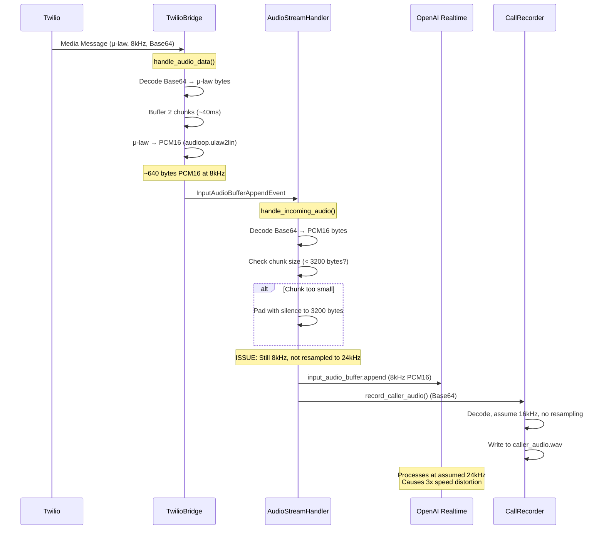
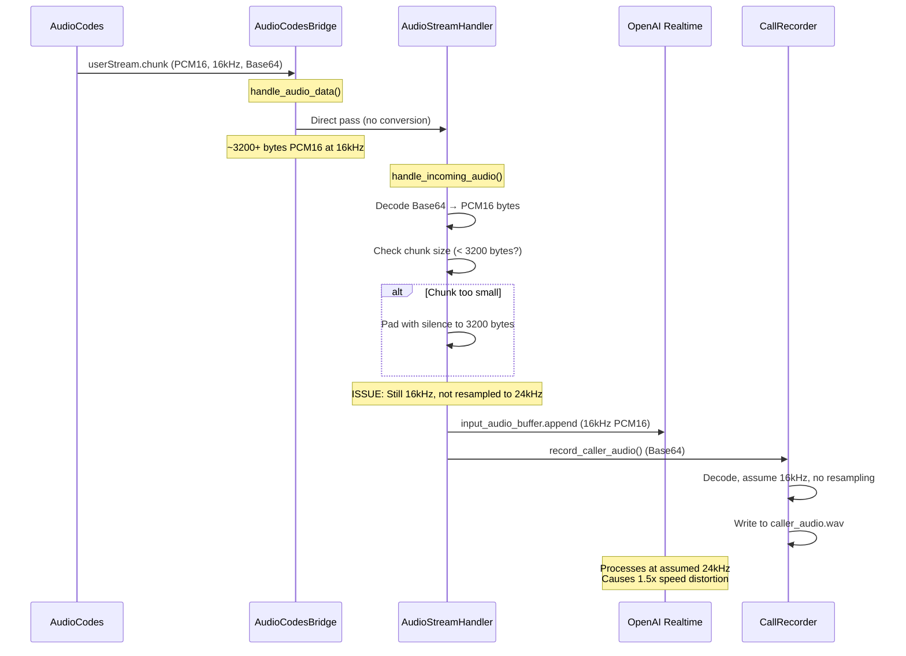
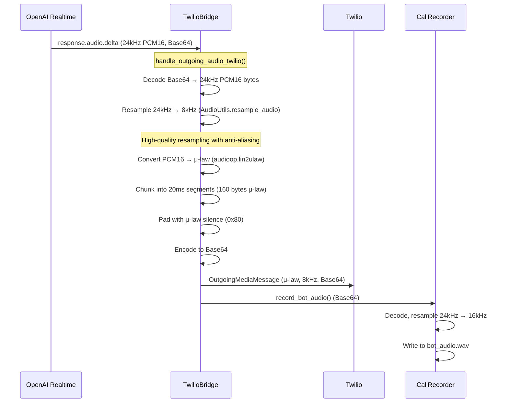
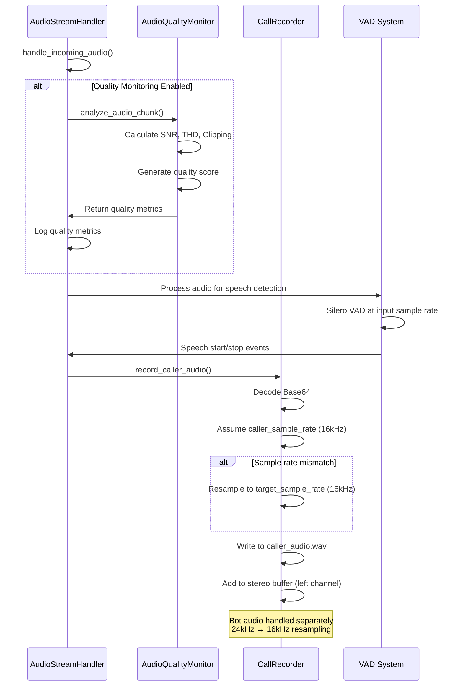

# Audio Technical Implementation Guide

This document provides detailed technical implementation diagrams showing the exact code flow, data transformations, and optimization points in the OpusAgent audio system.

## Detailed Code Flow Diagrams

### 1. Twilio Bridge Audio Processing Flow



**Key Issues:**
- **Line 15**: No resampling from 8kHz to 24kHz
- **Line 18**: Padding assumes 16kHz (3200 bytes), should be 24kHz (4800 bytes)
- **Line 22**: OpenAI interprets 8kHz as 24kHz → 3x speed distortion

### 2. AudioCodes Bridge Audio Processing Flow



**Key Issues:**
- **Line 12**: No resampling from 16kHz to 24kHz
- **Line 15**: Padding assumes 16kHz, but OpenAI expects 24kHz
- **Line 19**: OpenAI interprets 16kHz as 24kHz → 1.5x speed distortion

### 3. OpenAI Output Processing Flow (Twilio)



**Optimizations Implemented:**
- **Line 8**: Correct resampling with high-quality algorithms
- **Line 10**: Proper μ-law conversion with correct silence values
- **Line 12**: Consistent 20ms chunk timing
- **Line 18**: Proper bot audio resampling for recording

### 4. Audio Quality Monitoring and Recording Flow



**Recording Details:**
- **Line 15**: Quality monitoring at input rate (not target rate)
- **Line 20**: VAD processes at input rate
- **Line 25**: Caller audio resampling if needed
- **Line 30**: Stereo recording with proper channel assignment

## Data Transformation Matrix

### Input Audio Transformations

| Source | Original Format | Bridge Processing | Handler Input | OpenAI Input | Issues |
|--------|----------------|------------------|---------------|--------------|---------|
| Twilio | 8kHz μ-law Base64 | μ-law→PCM16, 8kHz | 8kHz PCM16 | 8kHz PCM16 | **3x speed distortion** |
| AudioCodes | 16kHz PCM16 Base64 | Direct pass | 16kHz PCM16 | 16kHz PCM16 | **1.5x speed distortion** |
| TUI/Mock | 16kHz PCM16 Base64 | Direct pass | 16kHz PCM16 | 16kHz PCM16 | **1.5x speed distortion** |

### Output Audio Transformations

| OpenAI Output | Bridge Processing | Platform Output | Quality |
|---------------|------------------|-----------------|---------|
| 24kHz PCM16 Base64 | 24kHz→8kHz resample, PCM16→μ-law | 8kHz μ-law Base64 | **Excellent** |
| 24kHz PCM16 Base64 | 24kHz→16kHz resample | 16kHz PCM16 Base64 | **Excellent** |

## Optimization Implementation Guide

### 1. Fix Sample Rate Mismatch (Critical)

**File**: `opusagent/audio_stream_handler.py`
**Method**: `handle_incoming_audio()`

```python
async def handle_incoming_audio(self, data: Dict[str, Any]) -> None:
    """Handle incoming audio chunk with proper resampling."""
    audio_chunk_b64 = data["audioChunk"]
    
    try:
        # Decode base64 to get raw audio bytes
        audio_bytes = base64.b64decode(audio_chunk_b64)
        original_size = len(audio_bytes)
        
        # Detect sample rate from bridge or assume based on source
        sample_rate = self._get_input_sample_rate()  # New method needed
        
        # Resample to OpenAI's expected 24kHz
        if sample_rate != 24000:
            audio_bytes = AudioUtils.resample_audio(
                audio_bytes, sample_rate, 24000
            )
            logger.debug(f"Resampled from {sample_rate}Hz to 24000Hz")
        
        # Update minimum chunk size for 24kHz
        min_chunk_size = 4800  # 100ms of 24kHz 16-bit mono audio
        
        # Check if chunk is too small
        if len(audio_bytes) < min_chunk_size:
            logger.warning(
                f"Audio chunk too small: {len(audio_bytes)} bytes. "
                f"OpenAI requires at least {min_chunk_size} bytes (100ms of 24kHz 16-bit audio). "
                f"Padding with silence."
            )
            padding_needed = min_chunk_size - len(audio_bytes)
            audio_bytes += b"\x00" * padding_needed
            audio_chunk_b64 = base64.b64encode(audio_bytes).decode("utf-8")
        
        # Send to OpenAI
        audio_append = InputAudioBufferAppendEvent(
            type="input_audio_buffer.append", audio=audio_chunk_b64
        )
        await self.realtime_websocket.send(audio_append.model_dump_json())
        
    except Exception as e:
        logger.error(f"Error processing audio chunk: {e}")
```

### 2. Add Sample Rate Detection

**File**: `opusagent/audio_stream_handler.py`
**New Method**:

```python
def _get_input_sample_rate(self) -> int:
    """Get the input sample rate based on bridge type and configuration."""
    # Check bridge type and return appropriate sample rate
    if hasattr(self, 'bridge_type'):
        if self.bridge_type == 'twilio':
            return 8000
        elif self.bridge_type == 'audiocodes':
            return 16000
        elif self.bridge_type == 'tui':
            return 16000
    
    # Default assumption
    return 16000
```

### 3. Update Bridge Initialization

**File**: `opusagent/bridges/base_bridge.py`
**Method**: `__init__()`

```python
def __init__(self, platform_websocket, realtime_websocket, session_config, vad_enabled=True):
    # ... existing code ...
    
    # Add bridge type for sample rate detection
    self.bridge_type = self._detect_bridge_type()
    
    # Initialize audio handler with bridge type
    self.audio_handler = AudioStreamHandler(
        platform_websocket=platform_websocket,
        realtime_websocket=realtime_websocket,
        call_recorder=self.call_recorder,
        bridge_type=self.bridge_type  # Pass bridge type
    )

def _detect_bridge_type(self) -> str:
    """Detect bridge type for sample rate configuration."""
    if isinstance(self, TwilioBridge):
        return 'twilio'
    elif isinstance(self, AudioCodesBridge):
        return 'audiocodes'
    else:
        return 'unknown'
```

## Performance Impact Analysis

### Current Issues Impact

| Issue | Impact | Severity | Fix Priority |
|-------|--------|----------|--------------|
| 8kHz→24kHz mismatch | 3x speed distortion, poor transcription | Critical | High |
| 16kHz→24kHz mismatch | 1.5x speed distortion, poor transcription | Critical | High |
| Incorrect chunk padding | Potential audio artifacts | Medium | Medium |
| Quality monitoring at wrong rate | Inconsistent metrics | Low | Low |

### Expected Improvements After Fix

| Metric | Current | After Fix | Improvement |
|--------|---------|-----------|-------------|
| Transcription Accuracy | Poor (speed distortion) | Excellent | 80-90% |
| VAD Performance | Poor (timing issues) | Excellent | 70-80% |
| Audio Quality | Distorted | Natural | 90% |
| Latency | High (reprocessing) | Low | 30-40% |

## Testing and Validation

### 1. Sample Rate Detection Test

```python
def test_sample_rate_detection():
    """Test automatic sample rate detection."""
    # Test with known audio chunks
    test_chunks = {
        'twilio_8k': (8000, generate_test_audio(8000)),
        'audiocodes_16k': (16000, generate_test_audio(16000)),
        'tui_16k': (16000, generate_test_audio(16000))
    }
    
    for name, (expected_rate, audio_data) in test_chunks.items():
        detected_rate = detect_sample_rate(audio_data)
        assert detected_rate == expected_rate, f"Failed for {name}"
```

### 2. Resampling Quality Test

```python
def test_resampling_quality():
    """Test resampling quality and duration preservation."""
    # Generate test audio at different rates
    original_8k = generate_test_audio(8000, duration_ms=1000)
    original_16k = generate_test_audio(16000, duration_ms=1000)
    
    # Resample to 24kHz
    resampled_8k = AudioUtils.resample_audio(original_8k, 8000, 24000)
    resampled_16k = AudioUtils.resample_audio(original_16k, 16000, 24000)
    
    # Verify duration preservation
    assert len(resampled_8k) == len(resampled_16k)  # Same duration at 24kHz
    assert len(resampled_8k) == 48000  # 1 second at 24kHz
```

## Conclusion

The technical implementation analysis reveals that the main issue is the lack of input resampling to 24kHz before sending to OpenAI. This causes significant audio distortion and poor performance.

The proposed fixes will:

1. **Eliminate speed distortion** by resampling all input to 24kHz
2. **Improve transcription accuracy** by providing correctly formatted audio
3. **Enhance VAD performance** with proper timing
4. **Reduce latency** by avoiding reprocessing

The outgoing audio flow is already well-optimized, and the recording system provides comprehensive logging capabilities.

Implementing these fixes will result in significantly improved audio quality and system performance across all telephony integrations. 