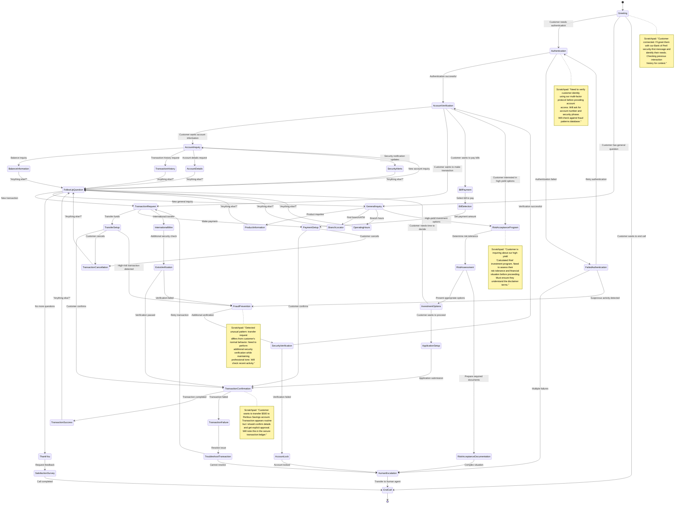

# Bank of Peril - Finite State Agent for Customer Service

This diagram illustrates how a Finite State Agent (FSA) handles customer interactions for a hypothetical company called The Bank of Peril, a financial institution known for its high-security protocols and unique "Risk Acceptance Program" for high-yield investments. The FSA provides a structured framework for managing customer conversations while maintaining context awareness and agent reasoning through scratchpads in each state.

## Key Features
- **State-Aware Conversations**: Each state has specific handling logic and allowed transitions
- **Scratchpad Reasoning**: Internal agent thinking visible in note sections
- **Security-First Design**: Multi-factor authentication required before accessing sensitive information
- **Fallback Mechanisms**: Human escalation paths for complex issues
- **Context Retention**: Customer information persists across state transitions
- **Risk Assessment**: Special states for handling the bank's unique "Risk Acceptance Program"

## Sample Conversation Flow

**Customer**: "Hi, I need to check my account balance and make a transfer."  
*(FSA State: Greeting → Authentication)*

**Agent**: "Welcome to Bank of Peril, where we secure what matters most. For account access, I'll need to verify your identity. Can you please provide your account number and the last 4 digits of your security phrase?"  
*(FSA State: Authentication)*

**Customer**: *Provides authentication information*  
*(FSA State: Authentication → AccountVerification)*

**Agent**: "Thank you, your identity has been verified. How can I help with your account today?"  
*(FSA State: AccountVerification → AccountInquiry)*

**Customer**: "I want to check my balance and transfer $500 to my Perilous Savings account."  
*(FSA State: AccountInquiry → BalanceInformation → TransactionRequest → TransferSetup)*

**Agent**: "Your current balance is $2,450 in your Peril Checking account. I can help you transfer $500 to your Perilous Savings account. The transfer will be secured with our Advanced Risk Protocol. Would you like to proceed?"  
*(FSA State: TransferSetup → TransactionConfirmation)*

**Customer**: "Yes, please proceed with the transfer."  
*(FSA State: TransactionConfirmation → TransactionSuccess)*

**Agent**: "I've completed the transfer of $500 to your Perilous Savings account. The transaction is secured with our 256-bit encryption and recorded in our secure ledger. Is there anything else I can help you with today?"  
*(FSA State: TransactionSuccess → FollowUpQuestion)*

**Customer**: "No, that's all. Thank you."  
*(FSA State: FollowUpQuestion → ThankYou → SatisfactionSurvey → EndCall)*

## FSA Implementation Notes

The Bank of Peril FSA is implemented using OpusAgent's core architecture and focuses on:

1. **Security-First Design**: Multi-factor authentication and fraud detection are deeply integrated
2. **Specialized Banking States**: Custom states for handling Bank of Peril's unique offerings 
3. **Low-Latency Responses**: Optimized for sub-300ms response times for natural conversation
4. **Comprehensive Logging**: All transactions and state transitions are securely logged
5. **Risk Assessment**: Specialized states for evaluating customer risk tolerance for high-yield products
