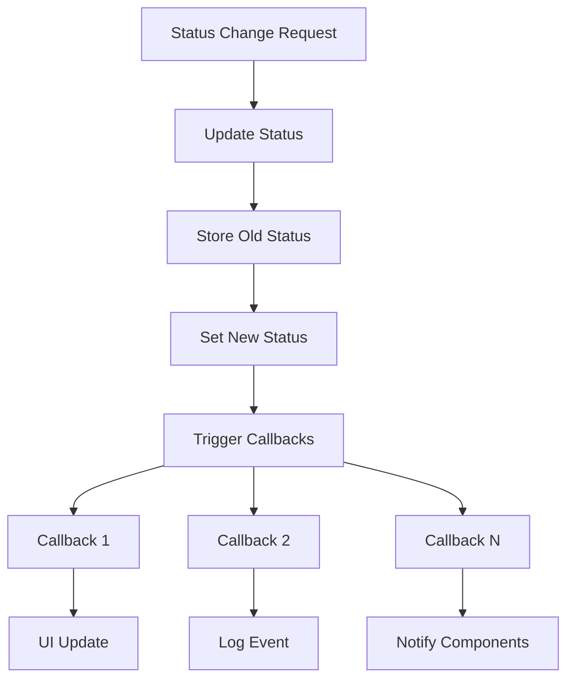

# Callbacks Implementation Guide

## Overview

Callbacks are a fundamental programming pattern where a function is passed as an argument to another function and executed at a later time. In the OpusAgent codebase, callbacks are extensively used for event handling, state management, and asynchronous operations.

## Visual Explanation

### Basic Callback Flow


### Callback Registration Pattern


### Multiple Callback Execution


## Callback Patterns in OpusAgent

### 1. Event Handler Callbacks

**Purpose**: Handle specific events with custom logic
**Location**: `opusagent/handlers/event_router.py`

```python
class EventRouter:
    def __init__(self):
        self.telephony_handlers: Dict[TelephonyEventType, Callable] = {}
        self.realtime_handlers: Dict[str, Callable] = {}
    
    def register_telephony_handler(self, event_type: TelephonyEventType, handler: Callable):
        """Register a callback for telephony events."""
        self.telephony_handlers[event_type] = handler
    
    async def handle_platform_event(self, data: Dict[str, Any]) -> None:
        """Execute registered callbacks for platform events."""
        msg_type = self._get_platform_event_type(data["type"])
        if msg_type and msg_type in self.telephony_handlers:
            handler = self.telephony_handlers[msg_type]
            try:
                if asyncio.iscoroutinefunction(handler):
                    await handler(data)
                else:
                    handler(data)
            except Exception as e:
                logger.error(f"Error in platform event handler: {e}")
```

**Visual Flow**:


### 2. State Change Callbacks

**Purpose**: React to state transitions
**Location**: `tui/models/session_state.py`

```python
class SessionState:
    def __init__(self):
        self._status_change_callbacks: List[Callable] = []
        self._metrics_update_callbacks: List[Callable] = []
    
    def add_status_change_callback(self, callback: Callable) -> None:
        """Register callback for status changes."""
        self._status_change_callbacks.append(callback)
    
    def _update_status(self, new_status: SessionStatus) -> None:
        """Update status and trigger callbacks."""
        old_status = self.status
        self.status = new_status
        
        # Trigger all registered callbacks
        for callback in self._status_change_callbacks:
            try:
                callback(old_status, new_status)
            except Exception as e:
                logger.error(f"Error in status change callback: {e}")
```

**Visual Flow**:


### 3. Audio Processing Callbacks

**Purpose**: Handle real-time audio events
**Location**: `tui/models/audio_manager.py`

```python
class AudioManager:
    def __init__(self):
        self.on_audio_chunk: Optional[Callable] = None
    
    def set_audio_chunk_callback(self, callback: Callable[[bytes], None]):
        """Register callback for audio chunk processing."""
        self.on_audio_chunk = callback
    
    def _recording_callback(self, indata: np.ndarray, frames: int, time, status) -> None:
        """Audio recording callback function."""
        try:
            audio_bytes = indata.astype(np.int16).tobytes()
            
            # Trigger callback if set
            if self.on_audio_chunk:
                self.on_audio_chunk(audio_bytes)
                
        except Exception as e:
            logger.error(f"Error in recording callback: {e}")
```

**Visual Flow**:


### 4. Function Call Callbacks

**Purpose**: Handle AI function execution results
**Location**: `opusagent/handlers/function_handler.py`

```python
class FunctionHandler:
    def __init__(self, realtime_websocket, hang_up_callback=None):
        self.hang_up_callback = hang_up_callback
        self.function_registry: Dict[str, Callable] = {}
    
    def register_function(self, name: str, func: Callable) -> None:
        """Register a function callback."""
        self.function_registry[name] = func
    
    async def _execute_and_respond_to_function(self, function_name: str, arguments: Dict[str, Any]):
        """Execute function and handle results."""
        try:
            func = self.function_registry.get(function_name)
            if not func:
                raise NotImplementedError(f"Function '{function_name}' not implemented.")
            
            result = await func(arguments) if asyncio.iscoroutinefunction(func) else func(arguments)
            
            # Check for hang-up condition
            if self.hang_up_callback and self._should_hang_up(result):
                self.hang_up_callback(result)
                
        except Exception as e:
            logger.error(f"Function execution failed: {e}")
```

**Visual Flow**:


### 5. Error Handling Callbacks

**Purpose**: Centralized error processing
**Location**: `tui/websocket/message_handler.py`

```python
class MessageHandler:
    def __init__(self):
        self._error_handlers: List[Callable] = []
    
    def add_error_handler(self, handler: Callable) -> None:
        """Register error handling callback."""
        self._error_handlers.append(handler)
    
    async def _handle_error_message(self, message: Dict[str, Any]) -> None:
        """Process error messages through callbacks."""
        error_code = message.get("error", {}).get("code", "unknown")
        error_message = message.get("error", {}).get("message", "Unknown error")
        
        logger.error(f"Error received: {error_code} - {error_message}")
        
        # Execute all error handlers
        for handler in self._error_handlers:
            try:
                if asyncio.iscoroutinefunction(handler):
                    await handler(message)
                else:
                    handler(message)
            except Exception as e:
                logger.error(f"Error in error handler: {e}")
```

**Visual Flow**:


## Implementation Best Practices

### 1. Callback Registration Pattern

```python
class CallbackManager:
    def __init__(self):
        self.callbacks: Dict[str, List[Callable]] = {}
    
    def register_callback(self, event_type: str, callback: Callable) -> None:
        """Register a callback for a specific event type."""
        if event_type not in self.callbacks:
            self.callbacks[event_type] = []
        self.callbacks[event_type].append(callback)
    
    def unregister_callback(self, event_type: str, callback: Callable) -> bool:
        """Unregister a specific callback."""
        if event_type in self.callbacks and callback in self.callbacks[event_type]:
            self.callbacks[event_type].remove(callback)
            return True
        return False
    
    async def trigger_callbacks(self, event_type: str, data: Any) -> None:
        """Execute all registered callbacks for an event type."""
        if event_type in self.callbacks:
            for callback in self.callbacks[event_type]:
                try:
                    if asyncio.iscoroutinefunction(callback):
                        await callback(data)
                    else:
                        callback(data)
                except Exception as e:
                    logger.error(f"Error in callback {callback.__name__}: {e}")
```

### 2. Error Isolation Pattern

```python
def safe_callback_execution(callback: Callable, data: Any, context: str = "") -> None:
    """Execute callback with error isolation."""
    try:
        if asyncio.iscoroutinefunction(callback):
            await callback(data)
        else:
            callback(data)
    except Exception as e:
        logger.error(f"Error in {context} callback: {e}")
        # Optionally trigger error recovery callbacks
```

### 3. Callback Chaining Pattern

```python
class CallbackChain:
    def __init__(self):
        self.callbacks: List[Callable] = []
    
    def add_callback(self, callback: Callable) -> None:
        """Add callback to the chain."""
        self.callbacks.append(callback)
    
    async def execute_chain(self, initial_data: Any) -> Any:
        """Execute callbacks in sequence, passing result to next."""
        result = initial_data
        for callback in self.callbacks:
            try:
                if asyncio.iscoroutinefunction(callback):
                    result = await callback(result)
                else:
                    result = callback(result)
            except Exception as e:
                logger.error(f"Error in callback chain: {e}")
                break
        return result
```

## Common Callback Types

### 1. Event Callbacks
- **Purpose**: React to system events
- **Signature**: `Callable[[Dict[str, Any]], None]`
- **Example**: WebSocket message handlers

### 2. State Change Callbacks
- **Purpose**: React to state transitions
- **Signature**: `Callable[[Any, Any], None]`
- **Example**: Session status changes

### 3. Error Callbacks
- **Purpose**: Handle errors and exceptions
- **Signature**: `Callable[[Exception, str], None]`
- **Example**: Error logging and recovery

### 4. Completion Callbacks
- **Purpose**: Execute after operation completion
- **Signature**: `Callable[[Any], None]`
- **Example**: Function execution results

### 5. Progress Callbacks
- **Purpose**: Report operation progress
- **Signature**: `Callable[[float], None]`
- **Example**: Audio processing progress

## Debugging Callbacks

### 1. Callback Tracing

```python
def trace_callback(callback: Callable, name: str = None):
    """Decorator to trace callback execution."""
    def traced_callback(*args, **kwargs):
        logger.debug(f"Executing callback: {name or callback.__name__}")
        try:
            result = callback(*args, **kwargs)
            logger.debug(f"Callback completed: {name or callback.__name__}")
            return result
        except Exception as e:
            logger.error(f"Callback failed: {name or callback.__name__} - {e}")
            raise
    return traced_callback
```

### 2. Callback Performance Monitoring

```python
import time
from functools import wraps

def monitor_callback_performance(callback: Callable):
    """Decorator to monitor callback performance."""
    @wraps(callback)
    def monitored_callback(*args, **kwargs):
        start_time = time.time()
        try:
            result = callback(*args, **kwargs)
            duration = time.time() - start_time
            logger.debug(f"Callback {callback.__name__} took {duration:.3f}s")
            return result
        except Exception as e:
            duration = time.time() - start_time
            logger.error(f"Callback {callback.__name__} failed after {duration:.3f}s: {e}")
            raise
    return monitored_callback
```

## Testing Callbacks

### 1. Mock Callback Testing

```python
class MockCallback:
    def __init__(self):
        self.calls: List[Any] = []
        self.call_count = 0
    
    def __call__(self, *args, **kwargs):
        self.calls.append((args, kwargs))
        self.call_count += 1
    
    def assert_called_with(self, expected_args, expected_kwargs=None):
        """Assert callback was called with specific arguments."""
        assert self.call_count > 0, "Callback was not called"
        last_call = self.calls[-1]
        assert last_call[0] == expected_args
        if expected_kwargs:
            assert last_call[1] == expected_kwargs
```

### 2. Callback Integration Testing

```python
async def test_callback_integration():
    """Test callback integration with main system."""
    manager = CallbackManager()
    mock_callback = MockCallback()
    
    # Register callback
    manager.register_callback("test_event", mock_callback)
    
    # Trigger event
    await manager.trigger_callbacks("test_event", {"data": "test"})
    
    # Verify callback was called
    assert mock_callback.call_count == 1
    mock_callback.assert_called_with({"data": "test"})
```

## Conclusion

Callbacks are a powerful pattern that enables loose coupling, event-driven programming, and flexible system architecture. In the OpusAgent codebase, callbacks are used extensively to handle real-time events, state changes, and asynchronous operations.

Key benefits of the callback pattern:
- **Loose Coupling**: Components don't need to know about each other
- **Extensibility**: Easy to add new behaviors without modifying existing code
- **Testability**: Callbacks can be easily mocked and tested
- **Flexibility**: Dynamic behavior based on runtime conditions

When implementing callbacks, remember to:
- Always handle exceptions in callback execution
- Provide clear documentation for callback signatures
- Use type hints for better code clarity
- Consider performance implications of callback chains
- Implement proper cleanup for registered callbacks 