# Callbacks Visual Diagrams

This document contains additional visual diagrams to help understand callback patterns in the OpusAgent codebase.

## Callback Lifecycle

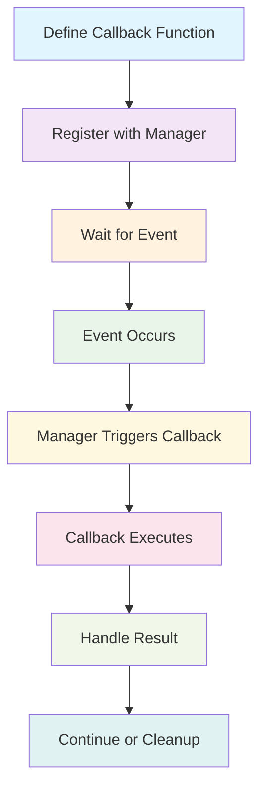

## Callback Registration Flow

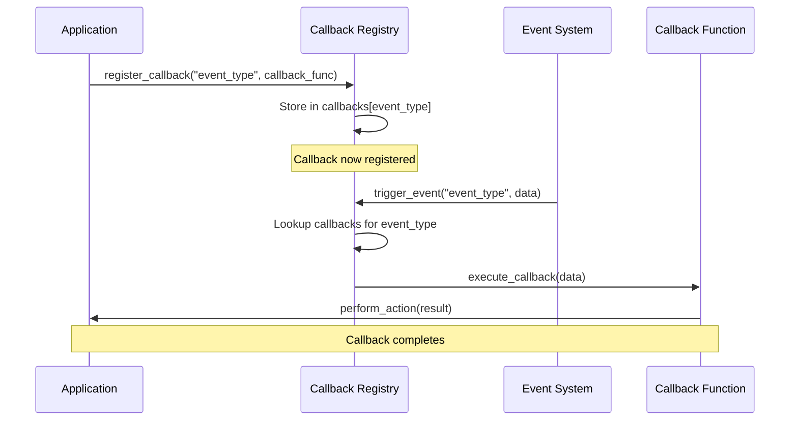

## Multiple Callback Execution

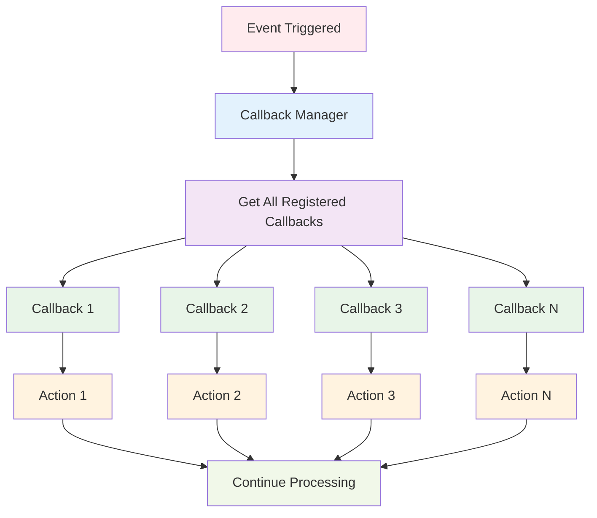

## Error Handling in Callbacks

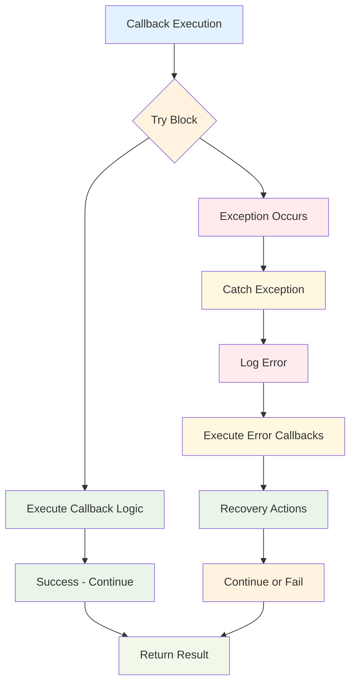

## Callback Chain Execution

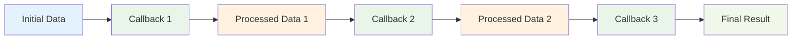

## State Change Callback Flow

```mermaid
stateDiagram-v2
    [*] --> Idle
    Idle --> Connecting : initiate_connection()
    Connecting --> Connected : connection_established()
    Connected --> Active : session_started()
    Active --> Ending : end_session()
    Ending --> Ended : cleanup_complete()
    Active --> Error : error_occurred()
    Error --> Ended : cleanup_complete()
    
    note right of Idle : Callbacks: on_idle()
    note right of Connecting : Callbacks: on_connecting()
    note right of Connected : Callbacks: on_connected()
    note right of Active : Callbacks: on_active()
    note right of Ending : Callbacks: on_ending()
    note right of Ended : Callbacks: on_ended()
    note right of Error : Callbacks: on_error()
```

## Audio Processing Callback Flow

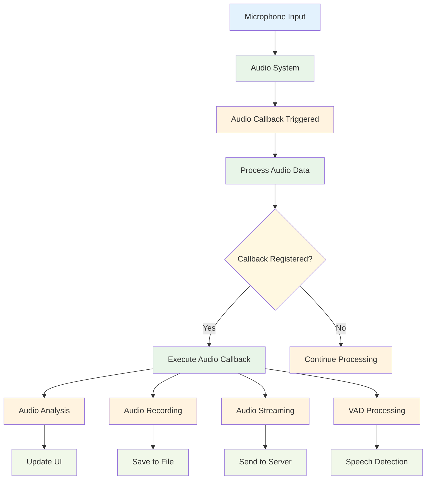

## WebSocket Message Callback Flow

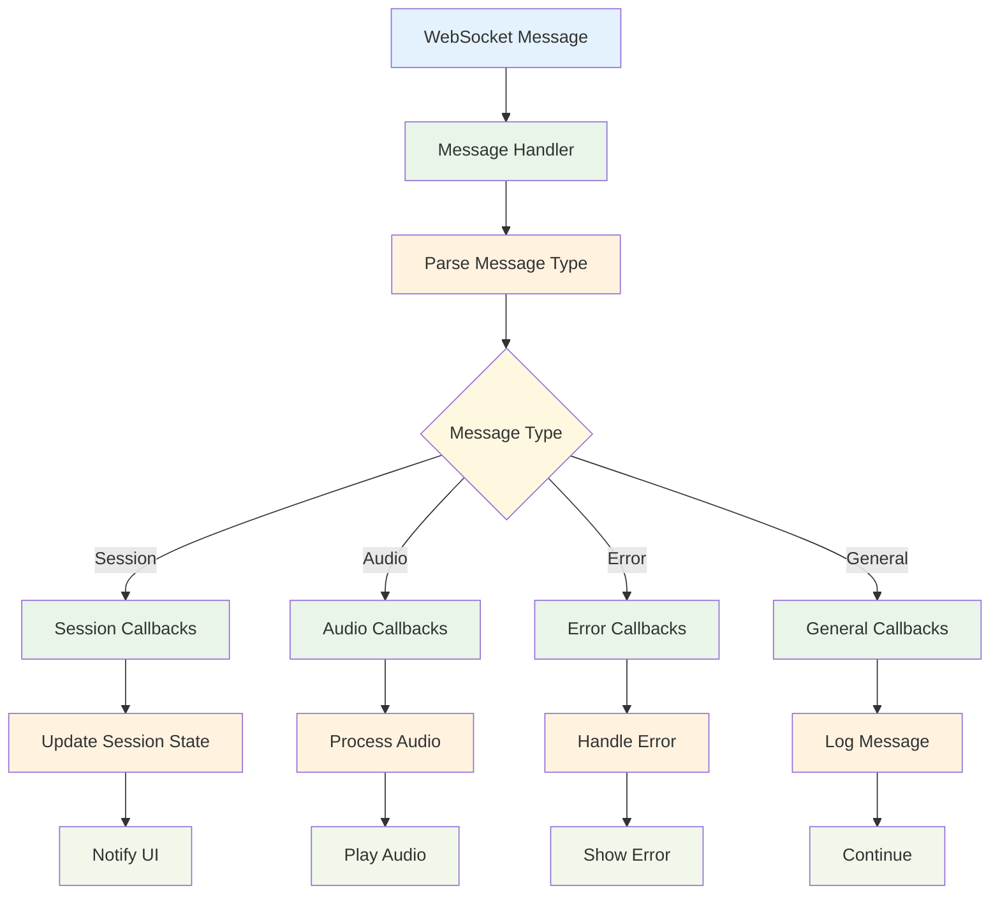

## Function Call Callback Flow

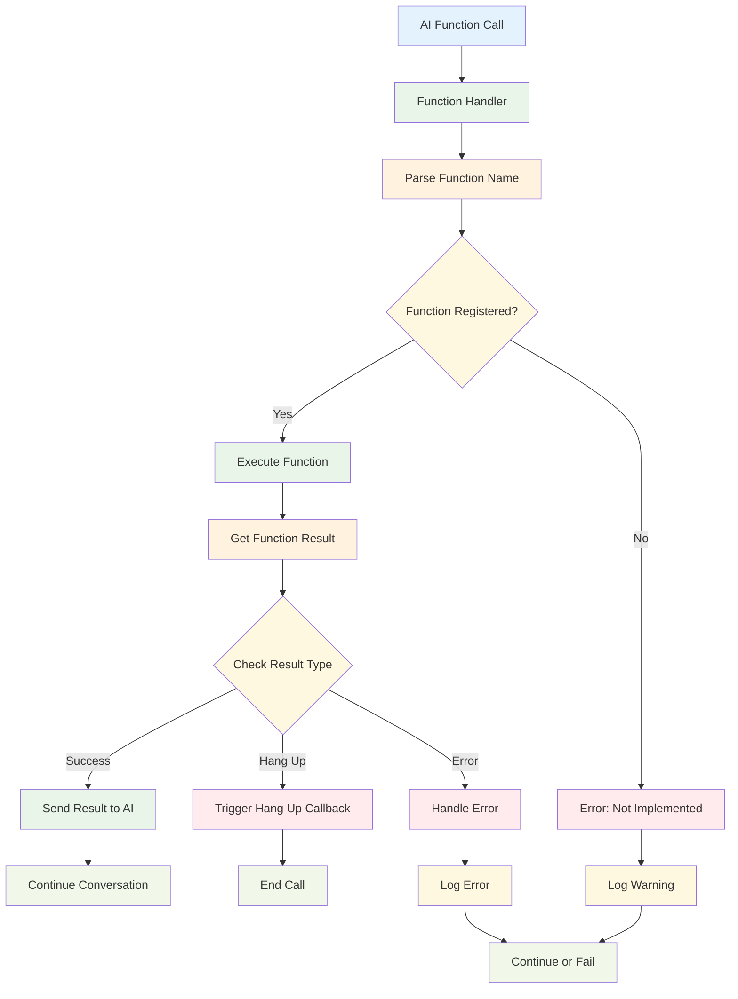

## Callback Performance Monitoring

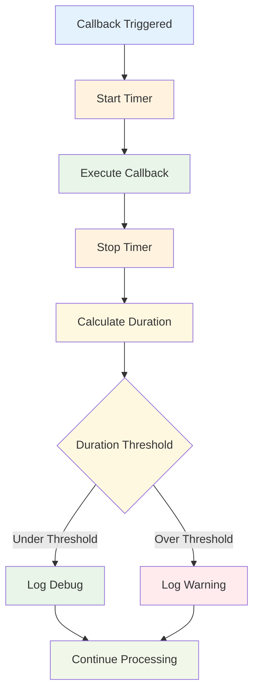

## Callback Testing Flow

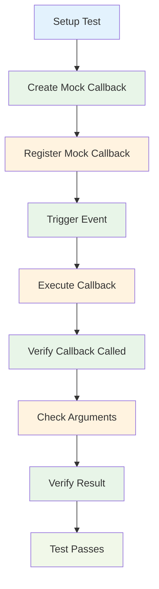

## Callback Cleanup Flow

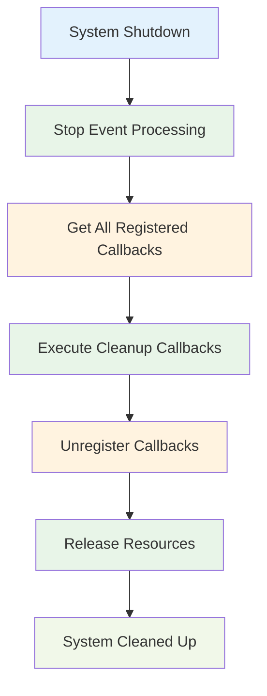

## Callback Memory Management

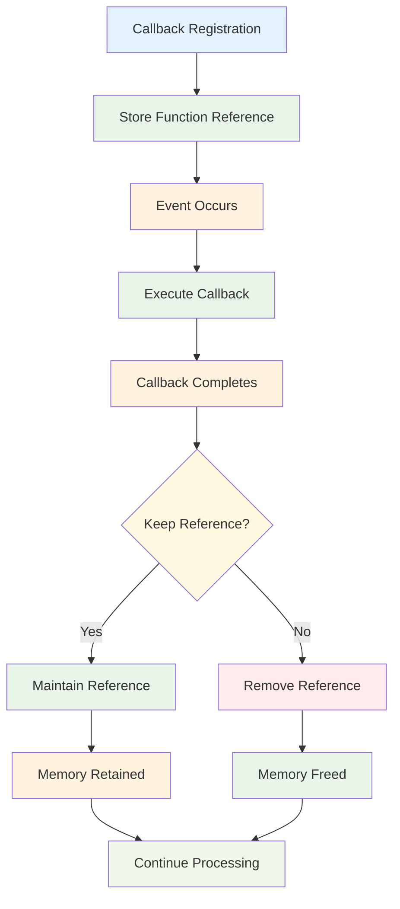

## Callback Priority Execution

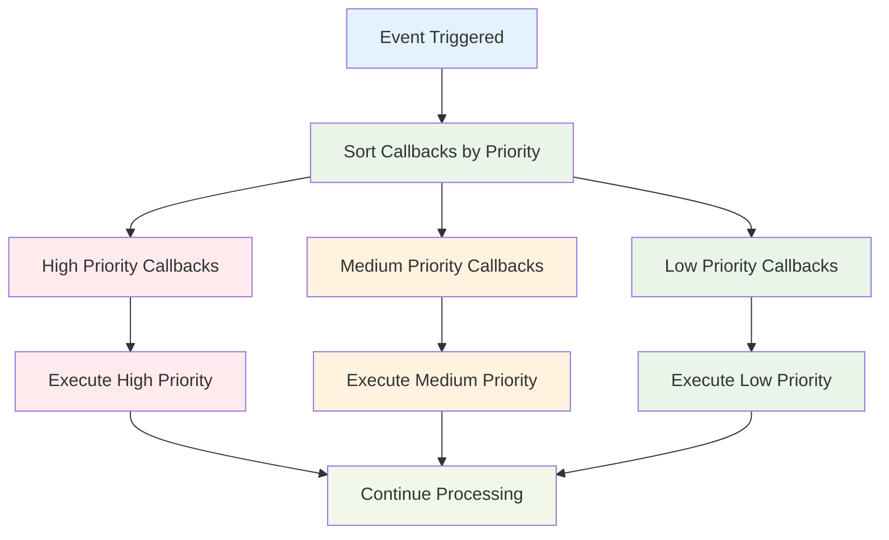

## Callback Error Recovery

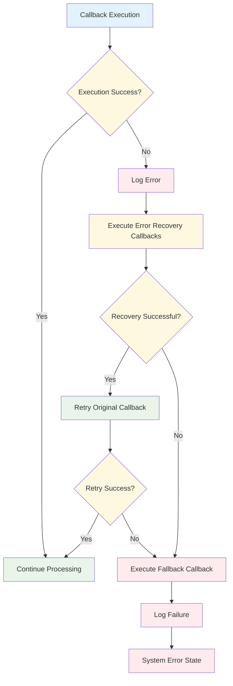

These diagrams provide visual representations of how callbacks work in different scenarios within the OpusAgent system. They help illustrate the flow of execution, error handling, and the relationships between different components. 