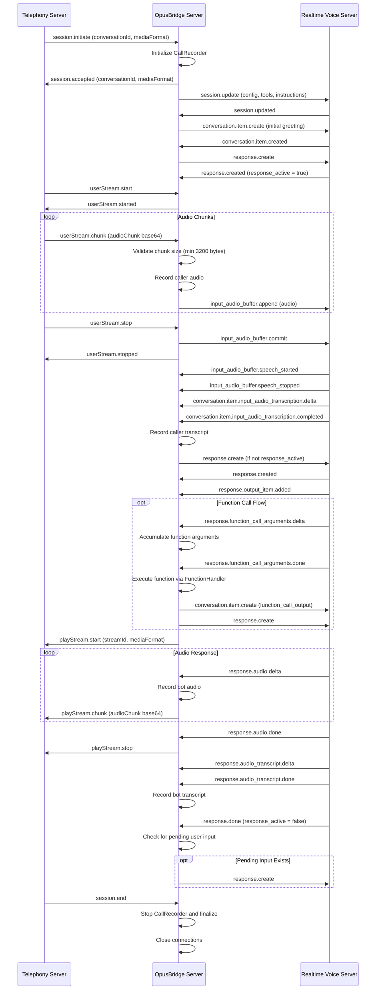

---

## Additional Technical Details

### Audio Specifications
- **Format**: PCM16, 16kHz, mono
- **Minimum chunk**: 3200 bytes (100ms)
- **Encoding**: Base64 for transport
- **Validation**: Auto-padding for undersized chunks

### Function Registry (12 Banking Functions)
- `get_balance` - Account balance lookup
- `transfer_funds` - Money transfers  
- `call_intent` - Intent classification
- `member_account_confirmation` - Card account selection
- `replacement_reason` - Card replacement reasons
- `confirm_address` - Address verification
- `start_card_replacement` - Begin replacement process
- `finish_card_replacement` - Complete replacement
- `wrap_up` - Call conclusion
- `loan_type_selection` - Loan product selection
- `income_verification` - Income validation
- `transfer_to_human` - Escalation to human agent

### State Management
- **Response Race Prevention**: `response_active` flag + `pending_user_input` queue
- **Stream Tracking**: `active_stream_id` for audio flow control
- **Buffer Management**: Separate transcript buffers for input/output
- **Function Call State**: `active_function_calls` dictionary with incremental argument building

### Recording & Monitoring
- **CallRecorder**: Persistent audio + transcript storage
- **Channels**: CALLER vs BOT audio separation
- **Formats**: Both raw audio (base64) and text transcripts
- **Metadata**: Timestamps, conversation_id, session_id

### Error Recovery
- **Quota Exhaustion**: Graceful session termination with detailed logging
- **Connection Loss**: Automatic cleanup and resource deallocation  
- **Invalid Audio**: Chunk validation and padding
- **Function Failures**: Error logging while maintaining conversation flow
