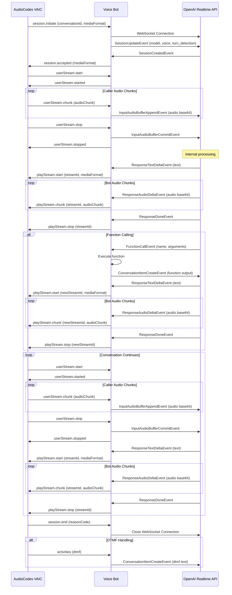

---

CALL FLOW: AudioCodes VAIC to OpenAI Realtime API Bridge

Session Initialization:
1. AudioCodes → Voice Bot: session.initiate (conversationId, mediaFormat)
2. Voice Bot → OpenAI: WebSocket Connection
3. Voice Bot → OpenAI: SessionUpdateEvent (model, voice, turn_detection)
4. OpenAI → Voice Bot: SessionCreatedEvent
5. Voice Bot → AudioCodes: session.accepted (mediaFormat)

Audio Exchange Start:
6. AudioCodes → Voice Bot: userStream.start
7. Voice Bot → AudioCodes: userStream.started

Audio Streaming (User to Bot):
8. AudioCodes → Voice Bot: userStream.chunk (audioChunk) [multiple times]
9. Voice Bot → OpenAI: InputAudioBufferAppendEvent (audio base64) [multiple times]

User Turn End:
10. AudioCodes → Voice Bot: userStream.stop
11. Voice Bot → OpenAI: InputAudioBufferCommitEvent
12. Voice Bot → AudioCodes: userStream.stopped

OpenAI Response:
13. OpenAI → Voice Bot: ResponseTextDeltaEvent (text)

Audio Response:
14. Voice Bot → AudioCodes: playStream.start (streamId, mediaFormat)
15. OpenAI → Voice Bot: ResponseAudioDeltaEvent (audio base64) [multiple times]
16. Voice Bot → AudioCodes: playStream.chunk (streamId, audioChunk) [multiple times]
17. OpenAI → Voice Bot: ResponseDoneEvent
18. Voice Bot → AudioCodes: playStream.stop (streamId)

Function Calling (Optional):
19. OpenAI → Voice Bot: FunctionCallEvent (name, arguments)
20. Voice Bot: Execute function internally
21. Voice Bot → OpenAI: ConversationItemCreateEvent (function output)
22. OpenAI → Voice Bot: ResponseTextDeltaEvent (text)
23. Voice Bot → AudioCodes: playStream.start (newStreamId, mediaFormat)
24. OpenAI → Voice Bot: ResponseAudioDeltaEvent (audio base64) [multiple times]
25. Voice Bot → AudioCodes: playStream.chunk (newStreamId, audioChunk) [multiple times]
26. OpenAI → Voice Bot: ResponseDoneEvent
27. Voice Bot → AudioCodes: playStream.stop (newStreamId)

Multi-Turn Conversation (Repeats):
28. AudioCodes → Voice Bot: userStream.start
29. Voice Bot → AudioCodes: userStream.started
30. AudioCodes → Voice Bot: userStream.chunk (audioChunk) [multiple times]
31. Voice Bot → OpenAI: InputAudioBufferAppendEvent (audio base64) [multiple times]
32. AudioCodes → Voice Bot: userStream.stop
33. Voice Bot → OpenAI: InputAudioBufferCommitEvent
34. Voice Bot → AudioCodes: userStream.stopped
35. OpenAI → Voice Bot: ResponseTextDeltaEvent (text)
36. Voice Bot → AudioCodes: playStream.start (streamId, mediaFormat)
37. OpenAI → Voice Bot: ResponseAudioDeltaEvent (audio base64) [multiple times]
38. Voice Bot → AudioCodes: playStream.chunk (streamId, audioChunk) [multiple times]
39. OpenAI → Voice Bot: ResponseDoneEvent
40. Voice Bot → AudioCodes: playStream.stop (streamId)

Call Termination:
41. AudioCodes → Voice Bot: session.end (reasonCode)
42. Voice Bot → OpenAI: Close WebSocket Connection

DTMF Handling (Optional):
43. AudioCodes → Voice Bot: activities (dtmf)
44. Voice Bot → OpenAI: ConversationItemCreateEvent (dtmf text)