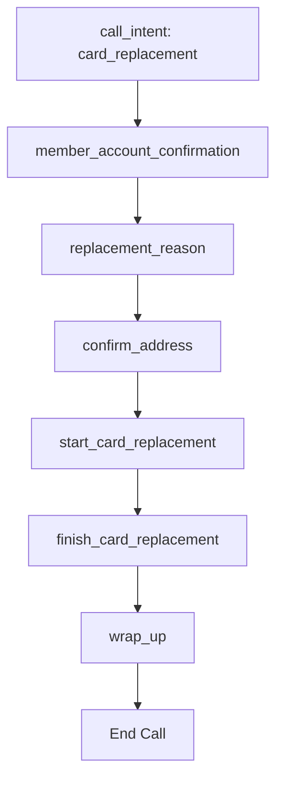

# Card Replacement Function Handlers

## Overview

This document describes the function handlers implemented for the card replacement flow in the FastAgent system. These handlers integrate with the finite state rational agents to drive a structured card replacement conversation flow.

## Architecture

Each function handler:
- Imports the corresponding prompt from `rc_prompts.py`
- Formats the prompt with contextual data
- Returns structured guidance for the AI and state management data
- Drives the progression through the card replacement finite state machine

## Function Handlers

### 1. `member_account_confirmation`

**Purpose**: Confirm which member account/card needs replacement

**Prompt Used**: `member_account_confirmation_prompt`

**Parameters**:
- `member_accounts` (array): List of available cards (default: ["Gold card", "Silver card", "Basic card"])
- `organization_name` (string): Name of the organization (default: "Bank of Peril")

**Returns**:
```json
{
  "status": "success",
  "function_name": "member_account_confirmation",
  "prompt_guidance": "Formatted prompt asking which card to replace",
  "next_action": "confirm_card_selection",
  "available_cards": ["Gold card", "Silver card", "Basic card"],
  "context": {
    "stage": "account_confirmation",
    "organization_name": "Bank of Peril"
  }
}
```

### 2. `replacement_reason`

**Purpose**: Collect the reason for card replacement

**Prompt Used**: `replacement_reason_prompt`

**Parameters**:
- `card_in_context` (string): The card being replaced (default: "your card")
- `reason` (string): Selected reason (enum: ["Lost", "Damaged", "Stolen", "Other"])

**Returns**:
```json
{
  "status": "success",
  "function_name": "replacement_reason",
  "prompt_guidance": "Formatted prompt asking for replacement reason",
  "next_action": "collect_address" | "ask_reason",
  "valid_reasons": ["Lost", "Damaged", "Stolen", "Other"],
  "selected_reason": "Lost",
  "context": {
    "stage": "reason_collection",
    "card_in_context": "Gold card",
    "reason": "Lost"
  }
}
```

### 3. `confirm_address`

**Purpose**: Confirm the address for card delivery

**Prompt Used**: `confirm_address_prompt`

**Parameters**:
- `card_in_context` (string): The card being replaced
- `address_on_file` (string): Current address on file (default: "123 Main St, Anytown, ST 12345")
- `confirmed_address` (string): Address confirmed by customer

**Returns**:
```json
{
  "status": "success",
  "function_name": "confirm_address",
  "prompt_guidance": "Formatted prompt asking to confirm address",
  "next_action": "start_replacement" | "confirm_address",
  "address_on_file": "123 Main St, Anytown, ST 12345",
  "confirmed_address": "123 Main St, Anytown, ST 12345",
  "context": {
    "stage": "address_confirmation",
    "card_in_context": "Gold card",
    "address_on_file": "123 Main St, Anytown, ST 12345",
    "confirmed_address": "123 Main St, Anytown, ST 12345"
  }
}
```

### 4. `start_card_replacement`

**Purpose**: Start the card replacement process

**Prompt Used**: `start_card_replacement_prompt`

**Parameters**:
- `card_in_context` (string): The card being replaced
- `address_in_context` (string): Confirmed delivery address

**Returns**:
```json
{
  "status": "success",
  "function_name": "start_card_replacement",
  "prompt_guidance": "Formatted prompt announcing replacement start",
  "next_action": "finish_replacement",
  "context": {
    "stage": "replacement_started",
    "card_in_context": "Gold card",
    "address_in_context": "123 Main St, Anytown, ST 12345"
  }
}
```

### 5. `finish_card_replacement`

**Purpose**: Complete the card replacement process

**Prompt Used**: `finish_card_replacement_prompt`

**Parameters**:
- `card_in_context` (string): The card being replaced
- `address_in_context` (string): Delivery address
- `delivery_time` (string): Expected delivery time (default: "5-7 business days")

**Returns**:
```json
{
  "status": "success",
  "function_name": "finish_card_replacement",
  "prompt_guidance": "Formatted prompt with delivery information",
  "next_action": "wrap_up",
  "delivery_time": "5-7 business days",
  "context": {
    "stage": "replacement_complete",
    "card_in_context": "Gold card",
    "address_in_context": "123 Main St, Anytown, ST 12345",
    "delivery_time": "5-7 business days"
  }
}
```

### 6. `wrap_up`

**Purpose**: Wrap up the call with closing remarks

**Prompt Used**: `wrap_up_prompt`

**Parameters**:
- `organization_name` (string): Name of the organization (default: "Bank of Peril")

**Returns**:
```json
{
  "status": "success",
  "function_name": "wrap_up",
  "prompt_guidance": "Formatted closing prompt",
  "next_action": "end_call",
  "context": {
    "stage": "call_complete",
    "organization_name": "Bank of Peril"
  }
}
```

## State Flow

The card replacement flow follows this sequence:



## Integration with Finite State Machine

Each function handler returns context data that can be used by finite state rational agents:

- **`stage`**: Current position in the replacement flow
- **`next_action`**: What the system should do next
- **`context`**: Preserved state information for continuity

## Example Usage Flow

1. **Intent Detection**
   ```
   User: "I need to replace my card"
   → call_intent(intent="card_replacement")
   ```

2. **Account Confirmation**
   ```
   → member_account_confirmation(member_accounts=["Gold card", "Silver card"])
   AI: "Which card do you want to replace - Gold card or Silver card?"
   ```

3. **Reason Collection**
   ```
   User: "My Gold card"
   → replacement_reason(card_in_context="Gold card")
   AI: "What's the reason for replacing your Gold card?"
   ```

4. **Address Confirmation**
   ```
   User: "I lost it"
   → confirm_address(card_in_context="Gold card", address_on_file="...")
   AI: "We'll send the new card to [address]. Is this correct?"
   ```

5. **Process Start**
   ```
   User: "Yes, that's correct"
   → start_card_replacement(card_in_context="Gold card", address_in_context="...")
   AI: "Starting the replacement process for your Gold card..."
   ```

6. **Process Completion**
   ```
   → finish_card_replacement(card_in_context="Gold card", address_in_context="...")
   AI: "Your new Gold card will arrive in 5-7 business days..."
   ```

7. **Call Wrap-up**
   ```
   → wrap_up(organization_name="Bank of Peril")
   AI: "Thank you for calling Bank of Peril. Have a great day!"
   ```

## OpenAI Function Tool Definitions

The handlers are registered as OpenAI function tools in the session configuration:

```python
tools=[
    {
        "type": "function",
        "name": "member_account_confirmation",
        "description": "Confirm which member account/card needs replacement.",
        "parameters": {
            "type": "object",
            "properties": {
                "member_accounts": {
                    "type": "array",
                    "items": {"type": "string"},
                    "description": "List of available member accounts/cards"
                },
                "organization_name": {"type": "string"}
            }
        },
    },
    # ... other tools
]
```

## Benefits

- **Modular Design**: Each step is handled by a dedicated function
- **Prompt Separation**: Business logic separated from prompt templates
- **State Management**: Rich context data for finite state machines
- **Testability**: Each handler can be tested independently
- **Flexibility**: Easy to modify prompts without changing function logic
- **Extensibility**: New steps can be added easily

## Example Conversation with Under-the-Hood Context

Here's a detailed walkthrough of a complete card replacement conversation showing the internal function calls, context management, and state transitions:

### **1. Call Initiation**

**User**: "Hello, I need to replace my card"

**🔧 Under the Hood**:
```json
// OpenAI detects intent and calls function
Function Call: call_intent({
  "intent": "card_replacement"
})

// Function returns guidance
Function Response: {
  "status": "success",
  "intent": "card_replacement",
  "next_action": "ask_card_type",
  "available_cards": ["Gold card", "Silver card", "Basic card"],
  "prompt_guidance": "Ask the customer which type of card they need to replace: Gold card, Silver card, or Basic card."
}

// State Management
Current Stage: "intent_detected"
Context: {
  "intent": "card_replacement",
  "available_cards": ["Gold card", "Silver card", "Basic card"]
}
```

**AI Response**: "I can help you with that! Which type of card do you need to replace - Gold card, Silver card, or Basic card?"

---

### **2. Account Confirmation**

**User**: "My Gold card please"

**🔧 Under the Hood**:
```json
// AI calls account confirmation function
Function Call: member_account_confirmation({
  "member_accounts": ["Gold card", "Silver card", "Basic card"],
  "organization_name": "Bank of Peril"
})

// Function returns formatted prompt and context
Function Response: {
  "status": "success",
  "function_name": "member_account_confirmation",
  "prompt_guidance": "If the customer has not stated the card they intend to replace, confirm which card they intend to replace from this list of cards: Gold card, Silver card, Basic card\n\nIf they have only one card, ask something like \"Do you want to replace your gold card?\"\nIf they have multiple cards, ask something like \"Which card do you want to replace?\"",
  "next_action": "confirm_card_selection",
  "available_cards": ["Gold card", "Silver card", "Basic card"],
  "context": {
    "stage": "account_confirmation",
    "organization_name": "Bank of Peril"
  }
}

// State Management
Current Stage: "account_confirmation"
Context: {
  "intent": "card_replacement",
  "selected_card": "Gold card",
  "organization_name": "Bank of Peril"
}
```

**AI Response**: "Perfect! I'll help you replace your Gold card. What's the reason you need to replace it?"

---

### **3. Reason Collection**

**User**: "I lost it yesterday"

**🔧 Under the Hood**:
```json
// AI calls replacement reason function
Function Call: replacement_reason({
  "card_in_context": "Gold card",
  "reason": "Lost"
})

// Function returns formatted prompt and next steps
Function Response: {
  "status": "success",
  "function_name": "replacement_reason",
  "prompt_guidance": "The customer wants to replace their Gold card. We need the reason they want to replace their card.\n\nBased on their response, call the `replacement_reason` function with the reason.\n\nLost\nDamaged\nStolen\nOther",
  "next_action": "collect_address",
  "valid_reasons": ["Lost", "Damaged", "Stolen", "Other"],
  "selected_reason": "Lost",
  "context": {
    "stage": "reason_collection",
    "card_in_context": "Gold card",
    "reason": "Lost"
  }
}

// State Management
Current Stage: "reason_collection"
Context: {
  "intent": "card_replacement",
  "selected_card": "Gold card",
  "reason": "Lost",
  "organization_name": "Bank of Peril"
}
```

**AI Response**: "I'm sorry to hear you lost your Gold card. Let me verify your mailing address for the replacement card."

---

### **4. Address Confirmation**

**User**: "Yes, please send it to my address on file"

**🔧 Under the Hood**:
```json
// AI calls address confirmation function
Function Call: confirm_address({
  "card_in_context": "Gold card",
  "address_on_file": "123 Main Street, Anytown, ST 12345",
  "confirmed_address": "123 Main Street, Anytown, ST 12345"
})

// Function returns address validation prompt
Function Response: {
  "status": "success",
  "function_name": "confirm_address",
  "prompt_guidance": "The customer wants to replace their Gold card. We need the address to mail the new card.\nThe address on file with this card is: 123 Main Street, Anytown, ST 12345.\n\nCall the `confirm_address` function with the confirmed address.",
  "next_action": "start_replacement",
  "address_on_file": "123 Main Street, Anytown, ST 12345",
  "confirmed_address": "123 Main Street, Anytown, ST 12345",
  "context": {
    "stage": "address_confirmation",
    "card_in_context": "Gold card",
    "address_on_file": "123 Main Street, Anytown, ST 12345",
    "confirmed_address": "123 Main Street, Anytown, ST 12345"
  }
}

// State Management
Current Stage: "address_confirmation"
Context: {
  "intent": "card_replacement",
  "selected_card": "Gold card",
  "reason": "Lost",
  "address": "123 Main Street, Anytown, ST 12345",
  "organization_name": "Bank of Peril"
}
```

**AI Response**: "Great! I have your address as 123 Main Street, Anytown, ST 12345. Let me start the replacement process for your Gold card now."

---

### **5. Process Initiation**

**🔧 Under the Hood** (AI automatically triggers next step):
```json
// AI calls start replacement function
Function Call: start_card_replacement({
  "card_in_context": "Gold card",
  "address_in_context": "123 Main Street, Anytown, ST 12345"
})

// Function returns process start confirmation
Function Response: {
  "status": "success",
  "function_name": "start_card_replacement",
  "prompt_guidance": "The customer has confirmed the address for the Gold card at 123 Main Street, Anytown, ST 12345.\nLet them know you are starting the card replacement process.",
  "next_action": "finish_replacement",
  "context": {
    "stage": "replacement_started",
    "card_in_context": "Gold card",
    "address_in_context": "123 Main Street, Anytown, ST 12345"
  }
}

// State Management
Current Stage: "replacement_started"
Context: {
  "intent": "card_replacement",
  "selected_card": "Gold card",
  "reason": "Lost",
  "address": "123 Main Street, Anytown, ST 12345",
  "process_started": true,
  "organization_name": "Bank of Peril"
}
```

**AI Response**: "I've started the card replacement process for your Gold card. Your new card is being prepared for shipment."

---

### **6. Process Completion**

**🔧 Under the Hood** (AI continues the flow):
```json
// AI calls finish replacement function
Function Call: finish_card_replacement({
  "card_in_context": "Gold card",
  "address_in_context": "123 Main Street, Anytown, ST 12345",
  "delivery_time": "5-7 business days"
})

// Function returns completion details
Function Response: {
  "status": "success",
  "function_name": "finish_card_replacement",
  "prompt_guidance": "The card replacement process is complete.\nLet them know you are sending the new Gold card to 123 Main Street, Anytown, ST 12345 and it will arrive in 5-7 business days.\nAlso ask if they have any other questions.",
  "next_action": "wrap_up",
  "delivery_time": "5-7 business days",
  "context": {
    "stage": "replacement_complete",
    "card_in_context": "Gold card",
    "address_in_context": "123 Main Street, Anytown, ST 12345",
    "delivery_time": "5-7 business days"
  }
}

// State Management
Current Stage: "replacement_complete"
Context: {
  "intent": "card_replacement",
  "selected_card": "Gold card",
  "reason": "Lost",
  "address": "123 Main Street, Anytown, ST 12345",
  "process_complete": true,
  "delivery_time": "5-7 business days",
  "organization_name": "Bank of Peril"
}
```

**AI Response**: "Perfect! Your new Gold card replacement has been processed and will be sent to 123 Main Street, Anytown, ST 12345. You can expect it to arrive in 5-7 business days. Do you have any other questions I can help you with today?"

---

### **7. Call Wrap-up**

**User**: "No, that's all. Thank you!"

**🔧 Under the Hood**:
```json
// AI calls wrap-up function
Function Call: wrap_up({
  "organization_name": "Bank of Peril"
})

// Function returns closing prompt
Function Response: {
  "status": "success",
  "function_name": "wrap_up",
  "prompt_guidance": "Thank you for calling Bank of Peril. Have a great day!",
  "next_action": "end_call",
  "context": {
    "stage": "call_complete",
    "organization_name": "Bank of Peril"
  }
}

// Final State Management
Current Stage: "call_complete"
Final Context: {
  "intent": "card_replacement",
  "selected_card": "Gold card",
  "reason": "Lost",
  "address": "123 Main Street, Anytown, ST 12345",
  "process_complete": true,
  "delivery_time": "5-7 business days",
  "organization_name": "Bank of Peril",
  "call_completed": true
}
```

**AI Response**: "Thank you for calling Bank of Peril. Have a great day!"

---

### **State Flow Summary**

The conversation progressed through these finite states:

1. **`intent_detected`** → User expresses card replacement need
2. **`account_confirmation`** → System confirms which card to replace
3. **`reason_collection`** → System collects replacement reason
4. **`address_confirmation`** → System verifies delivery address
5. **`replacement_started`** → Process initiation
6. **`replacement_complete`** → Process completion with delivery info
7. **`call_complete`** → Conversation termination

### **Context Preservation**

Throughout the conversation, the system maintained and enriched context:
- **Initial**: Intent and available options
- **Progressive**: Selected card, reason, address details
- **Complete**: Full transaction history for potential follow-up

This context enables the finite state machine to make intelligent transitions and provide personalized responses at each step.

## Implementation Files

- **Function Handlers**: `fastagent/function_handler.py`
- **Prompt Templates**: `rc_prompts.py`
- **Session Configuration**: `fastagent/telephony_realtime_bridge.py` 