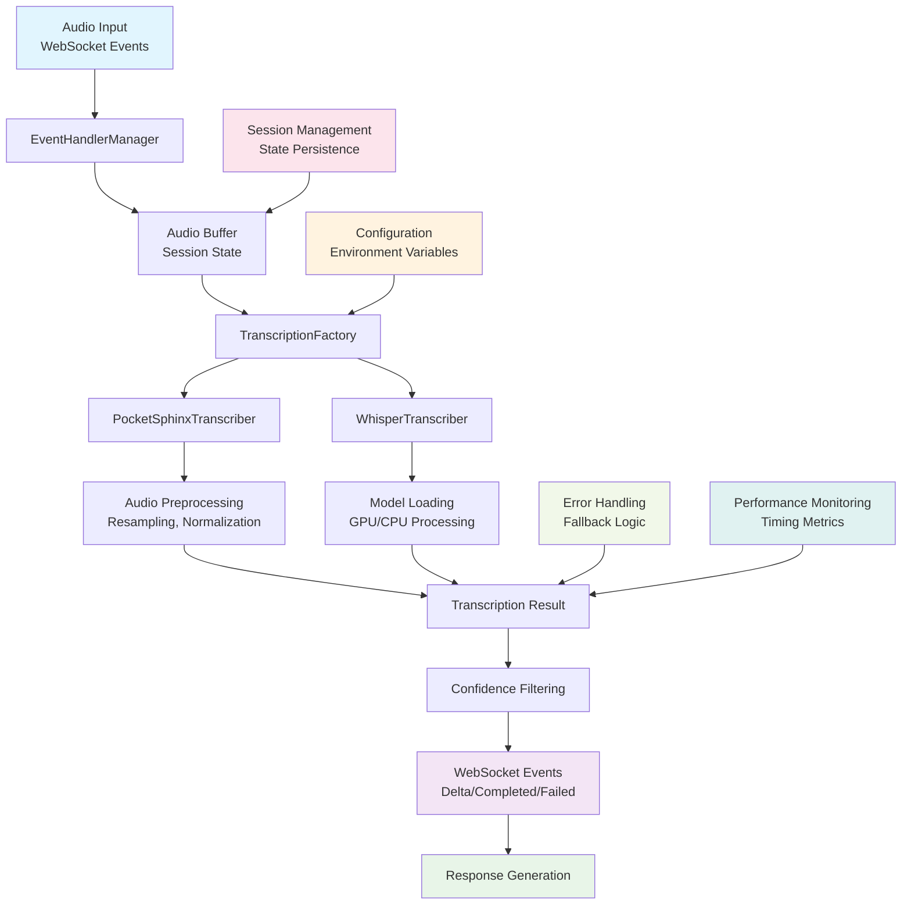

# Local Audio Transcription Guide

This guide explains how to use the local audio transcription feature in the LocalRealtimeClient mock system. The transcription feature allows you to process incoming audio from callers and convert it to text using either PocketSphinx or Whisper models, mimicking the OpenAI Realtime API's transcription behavior.

## Overview

The local transcription system provides:

- **Real-time transcription**: Process audio chunks as they arrive and emit delta events
- **Multiple backends**: Support for both PocketSphinx (lightweight) and Whisper (high accuracy)
- **OpenAI API compatibility**: Emits the same WebSocket events as the real OpenAI Realtime API
- **Configurable settings**: Customize backends, models, languages, and confidence thresholds
- **Error handling**: Graceful fallbacks and comprehensive error reporting
- **Performance tracking**: Monitor transcription timing and accuracy
- **Advanced audio preprocessing**: Normalization, amplification, noise reduction, and silence trimming
- **Session management**: Robust session state management across multiple audio files

## Architecture



### Component Details

- **EventHandlerManager**: Processes incoming WebSocket events and manages audio buffer
- **TranscriptionFactory**: Creates and manages transcription backend instances
- **Audio Preprocessing**: Resampling, normalization, amplification, noise reduction, silence trimming
- **Session Management**: Maintains conversation state and audio buffer across multiple interactions
- **Performance Monitoring**: Tracks transcription timing, accuracy, and resource usage
- **Error Handling**: Comprehensive error recovery with graceful fallbacks

## Installation

### Prerequisites

Install the base requirements:

```bash
pip install -r requirements.txt
```

### Backend-Specific Dependencies

#### PocketSphinx (Lightweight, Offline)

```bash
pip install pocketsphinx
```

#### Whisper (High Accuracy)

```bash
pip install openai-whisper
```

For GPU acceleration with Whisper:

```bash
pip install torch torchvision torchaudio --index-url https://download.pytorch.org/whl/cu118
```

## Configuration

### Environment Variables

Configure transcription behavior using environment variables:

```bash
# Backend selection
TRANSCRIPTION_BACKEND=pocketsphinx  # or "whisper"
TRANSCRIPTION_LANGUAGE=en
TRANSCRIPTION_SAMPLE_RATE=16000

# PocketSphinx specific
POCKETSPHINX_HMM=/path/to/acoustic/model
POCKETSPHINX_LM=/path/to/language/model
POCKETSPHINX_DICT=/path/to/pronunciation/dictionary
POCKETSPHINX_AUDIO_PREPROCESSING=normalize  # none, normalize, amplify, noise_reduction, silence_trim
POCKETSPHINX_VAD_SETTINGS=conservative  # default, aggressive, conservative
POCKETSPHINX_AUTO_RESAMPLE=true
POCKETSPHINX_INPUT_SAMPLE_RATE=24000

# Whisper specific
WHISPER_MODEL_SIZE=base  # tiny, base, small, medium, large
WHISPER_DEVICE=cpu       # or "cuda" for GPU
WHISPER_MODEL_DIR=/path/to/custom/models
WHISPER_TEMPERATURE=0.0

# Performance tuning
TRANSCRIPTION_CHUNK_DURATION=1.0
TRANSCRIPTION_CONFIDENCE_THRESHOLD=0.5
TRANSCRIPTION_ENABLE_VAD=true
```

### Programmatic Configuration

```python
from opusagent.local.realtime import LocalRealtimeClient, TranscriptionConfig

# Configure transcription
transcription_config = {
    "backend": "whisper",
    "model_size": "base",
    "language": "en",
    "device": "cpu",
    "confidence_threshold": 0.7,
    "chunk_duration": 2.0,
    "pocketsphinx_audio_preprocessing": "normalize",
    "pocketsphinx_vad_settings": "conservative"
}

# Create client with transcription enabled
client = LocalRealtimeClient(
    enable_transcription=True,
    transcription_config=transcription_config
)
```

## Usage Examples

### Basic Usage

```python
import asyncio
from opusagent.local.realtime import LocalRealtimeClient

async def main():
    # Create client with transcription enabled
    client = LocalRealtimeClient(enable_transcription=True)
    
    # Connect to WebSocket server
    await client.connect("ws://localhost:8080")
    
    # Transcription will automatically occur when audio is committed
    print("Client ready for audio transcription")
    
    # Keep connection alive
    try:
        await asyncio.sleep(3600)  # Run for 1 hour
    finally:
        await client.disconnect()

if __name__ == "__main__":
    asyncio.run(main())
```

### Advanced Configuration

```python
import asyncio
import logging
from opusagent.local.realtime import (
    LocalRealtimeClient, 
    TranscriptionConfig,
    SessionConfig
)

async def main():
    # Set up logging
    logging.basicConfig(level=logging.INFO)
    logger = logging.getLogger("transcription_demo")
    
    # Configure session with input audio transcription
    session_config = SessionConfig(
        model="gpt-4o-realtime-preview-2025-06-03",
        modalities=["text", "audio"],
        voice="alloy",
        input_audio_transcription={"model": "whisper-1"}  # This enables transcription
    )
    
    # Configure transcription backend with advanced options
    transcription_config = {
        "backend": "whisper",
        "model_size": "base",
        "language": "en",
        "device": "cpu",
        "confidence_threshold": 0.6,
        "chunk_duration": 2.0,  # Process in 2-second chunks
        "pocketsphinx_audio_preprocessing": "normalize",
        "pocketsphinx_vad_settings": "conservative",
        "pocketsphinx_auto_resample": True,
        "whisper_temperature": 0.0
    }
    
    # Create client
    client = LocalRealtimeClient(
        logger=logger,
        session_config=session_config,
        enable_transcription=True,
        transcription_config=transcription_config
    )
    
    # Connect and initialize
    await client.connect("ws://localhost:8080")
    
    # Monitor transcription state
    transcription_state = client.get_transcription_state()
    logger.info(f"Transcription state: {transcription_state}")
    
    # Set up custom event handlers for transcription events
    async def handle_transcript_delta(data):
        item_id = data.get("item_id")
        delta = data.get("delta", "")
        logger.info(f"Transcript delta for {item_id}: '{delta}'")
    
    async def handle_transcript_completed(data):
        item_id = data.get("item_id")
        transcript = data.get("transcript", "")
        logger.info(f"Transcript completed for {item_id}: '{transcript}'")
    
    async def handle_transcript_failed(data):
        item_id = data.get("item_id")
        error = data.get("error", {})
        logger.error(f"Transcript failed for {item_id}: {error}")
    
    # Register event handlers
    client.register_event_handler(
        "conversation.item.input_audio_transcription.delta",
        handle_transcript_delta
    )
    client.register_event_handler(
        "conversation.item.input_audio_transcription.completed",
        handle_transcript_completed
    )
    client.register_event_handler(
        "conversation.item.input_audio_transcription.failed",
        handle_transcript_failed
    )
    
    # Keep running
    try:
        await asyncio.sleep(3600)
    finally:
        await client.disconnect()

if __name__ == "__main__":
    asyncio.run(main())
```

### Runtime Configuration Changes

```python
# Check current transcription state
state = client.get_transcription_state()
print(f"Backend: {state['backend']}")
print(f"Enabled: {state['enabled']}")
print(f"Initialized: {state['initialized']}")

# Update transcription configuration
client.update_transcription_config({
    "backend": "whisper",
    "model_size": "large",
    "confidence_threshold": 0.8,
    "pocketsphinx_audio_preprocessing": "amplify"
})

# Enable/disable transcription
client.enable_transcription({"backend": "pocketsphinx"})
client.disable_transcription()

# Check available backends
from opusagent.local.transcription import TranscriptionFactory
available = TranscriptionFactory.get_available_backends()
print(f"Available backends: {available}")
```

## WebSocket Events

The transcription system emits standard OpenAI Realtime API events:

### Transcription Delta Event

Sent for each chunk of transcribed text:

```json
{
  "type": "conversation.item.input_audio_transcription.delta",
  "item_id": "item_abc123",
  "content_index": 0,
  "delta": "Hello "
}
```

### Transcription Completed Event

Sent when transcription is finalized:

```json
{
  "type": "conversation.item.input_audio_transcription.completed",
  "item_id": "item_abc123",
  "content_index": 0,
  "transcript": "Hello world, how are you today?"
}
```

### Transcription Failed Event

Sent when transcription encounters an error:

```json
{
  "type": "conversation.item.input_audio_transcription.failed",
  "item_id": "item_abc123",
  "content_index": 0,
  "error": {
    "code": "transcription_failed",
    "message": "Audio format not supported"
  }
}
```

## Backend Comparison

### PocketSphinx

**Pros:**
- Lightweight and fast (0.288s average processing time)
- Works offline
- Low resource usage
- Good for real-time applications
- Advanced audio preprocessing options
- Configurable VAD settings

**Cons:**
- Lower accuracy than Whisper
- Limited language support
- Requires acoustic model training for best results

**Best for:**
- Development and testing
- Resource-constrained environments
- Real-time applications
- Simple command recognition

**Advanced Features:**
- Audio preprocessing: normalize, amplify, noise_reduction, silence_trim
- VAD settings: default, aggressive, conservative
- Auto-resampling: 24kHz → 16kHz conversion
- Custom model paths for HMM, LM, and dictionary

### Whisper

**Pros:**
- High accuracy
- Excellent multilingual support
- Robust to accents and noise
- Pre-trained models available
- Multiple model sizes for speed/accuracy trade-offs

**Cons:**
- Higher resource usage
- Requires more setup
- Slower than PocketSphinx
- May need GPU for best performance

**Best for:**
- Production environments
- High accuracy requirements
- Multilingual applications
- Complex vocabulary

**Advanced Features:**
- Multiple model sizes: tiny, base, small, medium, large
- GPU acceleration with CUDA
- Custom model directories
- Temperature control for generation

## Performance Tuning

### Chunk Duration

Adjust the chunk duration for your use case:

```python
# Faster response, lower accuracy
transcription_config = {"chunk_duration": 0.5}

# Better accuracy, slower response  
transcription_config = {"chunk_duration": 2.0}
```

### Confidence Threshold

Filter out low-confidence results:

```python
transcription_config = {
    "confidence_threshold": 0.7  # Only emit results with >70% confidence
}
```

### Audio Preprocessing (PocketSphinx)

Optimize audio quality:

```python
# Normalize audio levels
transcription_config = {"pocketsphinx_audio_preprocessing": "normalize"}

# Amplify quiet audio
transcription_config = {"pocketsphinx_audio_preprocessing": "amplify"}

# Reduce background noise
transcription_config = {"pocketsphinx_audio_preprocessing": "noise_reduction"}

# Trim silence
transcription_config = {"pocketsphinx_audio_preprocessing": "silence_trim"}
```

### VAD Settings (PocketSphinx)

Configure voice activity detection:

```python
# Conservative - fewer false positives
transcription_config = {"pocketsphinx_vad_settings": "conservative"}

# Aggressive - more sensitive
transcription_config = {"pocketsphinx_vad_settings": "aggressive"}

# Default - balanced approach
transcription_config = {"pocketsphinx_vad_settings": "default"}
```

### Whisper Model Size

Balance accuracy vs. speed:

```python
# Fastest, lowest accuracy
transcription_config = {"model_size": "tiny"}

# Balanced
transcription_config = {"model_size": "base"}  

# Highest accuracy, slowest
transcription_config = {"model_size": "large"}
```

### GPU Acceleration

For Whisper with CUDA:

```python
transcription_config = {
    "backend": "whisper",
    "device": "cuda",
    "model_size": "large"
}
```

## Session Management

The transcription system includes robust session management:

### Session Lifecycle

```python
# Start new session
transcriber.start_session()

# Process audio chunks
result = await transcriber.transcribe_chunk(audio_data)

# Finalize session
final_result = await transcriber.finalize()

# End session
transcriber.end_session()

# Reset for next session
transcriber.reset_session()
```

### Session State Persistence

```python
# Session state is automatically managed
# Audio buffer accumulates across multiple chunks
# Session context is maintained for conversation continuity
```

## Troubleshooting

### Common Issues

#### "No module named 'pocketsphinx'"

```bash
pip install pocketsphinx
```

#### "No module named 'whisper'"

```bash
pip install openai-whisper
```

#### "CUDA out of memory"

```python
# Use CPU instead
transcription_config = {"device": "cpu"}

# Or use smaller model
transcription_config = {
    "device": "cuda", 
    "model_size": "base"  # instead of "large"
}
```

#### Poor transcription accuracy

1. Check audio quality and format
2. Adjust confidence threshold
3. Use larger Whisper model
4. Enable VAD for better speech detection
5. Configure audio preprocessing
6. Adjust VAD settings

#### Audio preprocessing issues

```python
# Try different preprocessing options
transcription_config = {
    "pocketsphinx_audio_preprocessing": "normalize"  # or "amplify", "noise_reduction"
}
```

### Debugging

Enable detailed logging:

```python
import logging
logging.basicConfig(level=logging.DEBUG)
logger = logging.getLogger("opusagent.local.realtime")
logger.setLevel(logging.DEBUG)
```

Check transcription state:

```python
state = client.get_transcription_state()
print(f"Transcription state: {state}")

# Check if transcriber is properly initialized
if not state["initialized"]:
    print("Transcriber failed to initialize")
```

Monitor performance:

```python
# Transcription timing is logged automatically
# Look for log messages like:
# [MOCK REALTIME] Transcription completed for item_123: 'hello world' (confidence: 0.85)
```

## Integration with Bridges

The transcription system works seamlessly with telephony bridges:

### Twilio Bridge

```python
from opusagent.bridges.twilio_bridge import TwilioBridge
from opusagent.local.realtime import LocalRealtimeClient

# Create bridge with transcription-enabled client
client = LocalRealtimeClient(enable_transcription=True)
bridge = TwilioBridge(realtime_client=client)

# Audio from Twilio calls will be automatically transcribed
await bridge.start()
```

### AudioCodes Bridge

```python
from opusagent.bridges.audiocodes_bridge import AudioCodesBridge
from opusagent.local.realtime import LocalRealtimeClient

# Create bridge with transcription
client = LocalRealtimeClient(
    enable_transcription=True,
    transcription_config={"backend": "whisper", "model_size": "base"}
)
bridge = AudioCodesBridge(realtime_client=client)

# SIP calls will be transcribed in real-time
await bridge.start()
```

## Testing

Run the transcription tests:

```bash
# Run all transcription tests
pytest tests/opusagent/transcription/

# Run specific test class
pytest tests/opusagent/transcription/test_factory.py::TestTranscriptionFactory

# Run with coverage
pytest --cov=opusagent.local.transcription tests/opusagent/transcription/
```

Test with real audio:

```python
import asyncio
from opusagent.local.realtime import LocalRealtimeClient

async def test_transcription():
    client = LocalRealtimeClient(enable_transcription=True)
    await client.connect()
    
    # Simulate audio commit (normally done by bridge)
    await client.handle_audio_commit({})
    
    await client.disconnect()

asyncio.run(test_transcription())
```

## Best Practices

1. **Choose the right backend**: Use PocketSphinx for development/testing, Whisper for production
2. **Monitor performance**: Track transcription timing and accuracy
3. **Handle errors gracefully**: Always provide fallbacks for transcription failures
4. **Optimize chunk duration**: Balance responsiveness vs. accuracy
5. **Use appropriate confidence thresholds**: Filter out low-quality results
6. **Configure audio preprocessing**: Use normalization, amplification, or noise reduction as needed
7. **Test with real audio**: Validate with actual call recordings
8. **Consider resource usage**: Monitor CPU/memory usage, especially with Whisper
9. **Enable VAD**: Use Voice Activity Detection for better speech segmentation
10. **Manage sessions properly**: Use session lifecycle methods for clean state management

## Conclusion

The local transcription feature provides a powerful way to test and develop applications that rely on audio-to-text conversion. By supporting both PocketSphinx and Whisper backends with advanced configuration options, you can choose the right balance of speed, accuracy, and resource usage for your specific needs.

For more information, see the API documentation and example implementations in the `scripts/` directory. 