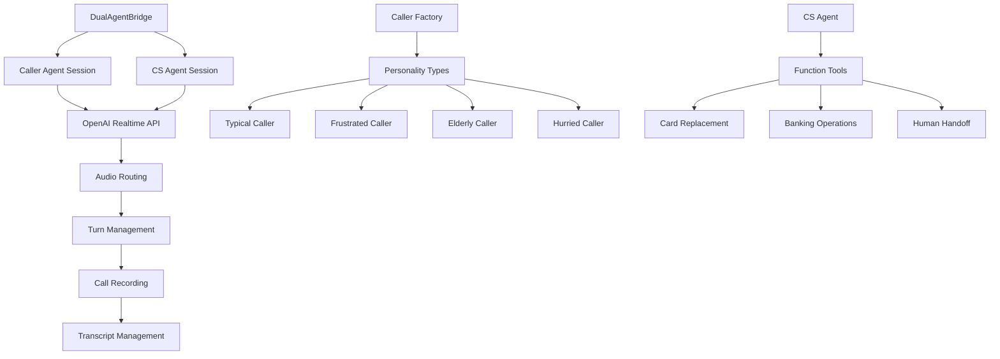

# Dual Agent Simulation Implementation

## Overview

The dual agent simulation system in OpusAgent enables realistic testing of conversational AI systems by creating autonomous conversations between AI caller agents and customer service agents. This system provides a sophisticated testing environment where two AI agents can interact naturally, allowing developers to validate conversation flows, test different caller personalities, and evaluate customer service agent performance without requiring human participants.

## Architecture

### Core Components



### Component Hierarchy

1. **DualAgentBridge**: Main orchestrator managing two AI sessions
2. **Caller Agent System**: Configurable caller personalities and scenarios
3. **Customer Service Agent**: Banking-focused agent with function tools
4. **Audio Routing System**: Bidirectional audio flow between agents
5. **Turn Management**: Conversation flow control and timing
6. **Recording System**: Comprehensive call recording and transcription

## Implementation Details

### DualAgentBridge Class

The `DualAgentBridge` class serves as the central orchestrator for agent-to-agent conversations:

```python
class DualAgentBridge:
    def __init__(self, caller_type: str = CallerType.TYPICAL, conversation_id: Optional[str] = None):
        self.conversation_id = conversation_id or str(uuid.uuid4())
        self.caller_type = caller_type
        
        # OpenAI Realtime connections
        self.caller_connection: Optional[RealtimeConnection] = None
        self.cs_connection: Optional[RealtimeConnection] = None
        
        # Session configurations
        self.caller_session_config = get_caller_config(caller_type)
        self.cs_session_config = cs_session_config
        
        # Audio routing state
        self.caller_audio_buffer = []
        self.cs_audio_buffer = []
        
        # Connection state
        self._closed = False
        self._caller_ready = False
        self._cs_ready = False
        
        # Turn management
        self._current_speaker = None  # "caller" or "cs" or None
        self._turn_lock = asyncio.Lock()
        self._waiting_for_response = False
        
        # Call recording
        self.call_recorder: Optional[CallRecorder] = None
        
        # Transcript managers for both agents
        self.caller_transcript_manager: Optional[TranscriptManager] = None
        self.cs_transcript_manager: Optional[TranscriptManager] = None
```

### Caller Agent System

The caller agent system provides configurable personalities and scenarios:

#### Available Caller Types

1. **Typical Caller** (`CallerType.TYPICAL`)
   - Cooperative and patient
   - Clear communication style
   - High tech comfort level
   - Low interruption tendency

2. **Frustrated Caller** (`CallerType.FRUSTRATED`)
   - Impatient and demanding
   - Higher interruption tendency
   - May express frustration
   - Requires careful handling

3. **Elderly Caller** (`CallerType.ELDERLY`)
   - Patient and polite
   - Lower tech comfort level
   - Needs more guidance
   - Appreciates clear explanations

4. **Hurried Caller** (`CallerType.HURRIED`)
   - In a rush
   - Wants quick service
   - May interrupt to speed things up
   - Values efficiency

#### Caller Configuration Structure

```python
personality = CallerPersonality(
    type=PersonalityType.NORMAL,
    traits=[
        "cooperative",
        "patient", 
        "provides information willingly",
        "polite and respectful",
        "clear communicator",
    ],
    communication_style="Friendly and cooperative",
    patience_level=8,
    tech_comfort=7,
    tendency_to_interrupt=0.2,
    provides_clear_info=0.9,
)

goal = CallerGoal(
    primary_goal="Get my lost gold card replaced",
    secondary_goals=[
        "Confirm delivery timeline",
        "Verify security measures", 
        "Ensure no unauthorized charges"
    ],
    success_criteria=[
        "card replacement confirmed",
        "delivery address confirmed",
        "security concerns addressed"
    ],
    failure_conditions=[
        "transferred to human",
        "call terminated",
        "unable to verify identity"
    ],
    max_conversation_turns=15,
)
```

### Audio Routing System

The audio routing system manages bidirectional audio flow between agents:

```python
async def _route_audio_to_cs(self, audio_data: str):
    """Route caller audio to CS agent as input."""
    if not self.cs_connection:
        return
        
    # Send audio append message to OpenAI
    audio_append = {
        "type": "input_audio_buffer.append",
        "audio": audio_data
    }
    await self.cs_connection.websocket.send(json.dumps(audio_append))
    
    # Add to buffer for chunking
    self.caller_audio_buffer.append(audio_data)
    
    # Commit buffer periodically
    if len(self.caller_audio_buffer) >= 5:  # Buffer a few chunks
        await self._commit_cs_audio_buffer()

async def _route_audio_to_caller(self, audio_data: str):
    """Route CS agent audio to caller agent as input."""
    if not self.caller_connection:
        return
        
    # Send audio append message to OpenAI
    audio_append = {
        "type": "input_audio_buffer.append",
        "audio": audio_data
    }
    await self.caller_connection.websocket.send(json.dumps(audio_append))
    
    # Add to buffer for chunking
    self.cs_audio_buffer.append(audio_data)
    
    # Commit buffer periodically
    if len(self.cs_audio_buffer) >= 5:  # Buffer a few chunks
        await self._commit_caller_audio_buffer()
```

### Turn Management

The turn management system ensures natural conversation flow:

```python
async def _process_caller_message(self, data: Dict[str, Any]):
    """Process message from caller agent and route to CS agent."""
    message_type = data.get("type")
    
    if message_type == "response.created":
        # Caller started speaking
        async with self._turn_lock:
            self._current_speaker = "caller"
            self._waiting_for_response = False
            
    elif message_type == "response.audio.delta":
        # Route caller audio to CS agent
        audio_data = data.get("delta", "")
        if audio_data:
            await self._route_audio_to_cs(audio_data)
            # Record caller audio
            if self.call_recorder:
                await self.call_recorder.record_caller_audio(audio_data)
                
    elif message_type == "response.audio.done":
        # Caller finished speaking, trigger CS response
        async with self._turn_lock:
            if self._current_speaker == "caller" and not self._waiting_for_response:
                self._current_speaker = None
                self._waiting_for_response = True
                await self._create_response(self.cs_connection.websocket, "cs")
                
    elif message_type == "response.done":
        # Caller completely finished their turn
        async with self._turn_lock:
            if self._current_speaker == "caller":
                self._current_speaker = None
                
    elif message_type == "response.audio_transcript.delta":
        # Log and record caller transcript
        transcript = data.get("delta", "")
        if transcript and self.caller_transcript_manager:
            await self.caller_transcript_manager.handle_output_transcript_delta(transcript)
            
    elif message_type == "error":
        # Handle error messages from caller agent
        error_code = data.get("error", {}).get("code", "unknown")
        error_message = data.get("error", {}).get("message", "Unknown error")
        logger.error(f"Caller agent error: {error_code} - {error_message}")
```

## Configuration Management

### Session Configuration

Each agent type has its own session configuration:

```python
def get_typical_caller_config() -> SessionConfig:
    return SessionConfig(
        model="gpt-4o-realtime-preview-2025-06-03",
        voice="alloy",
        temperature=0.7,
        max_response_output_tokens=4096,
        system_prompt=SYSTEM_PROMPT,
        tools=TOOLS
    )
```

## Integration with Main Server

### WebSocket Endpoint

The dual agent simulation is exposed via a dedicated WebSocket endpoint:

```python
@app.websocket("/agent-conversation")
async def agent_conversation_endpoint(websocket: WebSocket, caller_type: str = "typical"):
    """WebSocket endpoint for caller agent to CS agent conversations."""
    await websocket.accept()
    
    try:
        # Create and initialize dual agent bridge
        bridge = DualAgentBridge(caller_type=caller_type)
        await bridge.initialize_connections()
        
    except Exception as e:
        logger.error(f"Error in agent conversation: {e}")
        if 'bridge' in locals():
            await bridge.close()
```

### Usage Examples

#### Basic Agent Conversation

```python
import asyncio
import websockets

async def test_agent_conversation(caller_type: str = "typical", duration: int = 30):
    uri = f"ws://localhost:8000/agent-conversation?caller_type={caller_type}"
    
    async with websockets.connect(uri) as websocket:
        print(f"Testing {caller_type} caller for {duration} seconds...")
        await asyncio.sleep(duration)
        print(f"Test completed for {caller_type} caller")

# Run test
asyncio.run(test_agent_conversation("typical", 30))
```

#### Multiple Caller Types

```python
async def test_all_caller_types():
    caller_types = ["typical", "frustrated", "elderly", "hurried"]
    
    for caller_type in caller_types:
        print(f"\nTesting {caller_type.upper()} caller...")
        await test_agent_conversation(caller_type, 15)
        print(f"Completed {caller_type} caller test")

asyncio.run(test_all_caller_types())
```

## Testing and Validation

### Test Scripts

#### Agent Conversation Test

```bash
# Basic agent conversation test
python scripts/test_agent_conversation.py

# Test specific caller type
python scripts/test_agent_conversation.py --caller-type frustrated

# Test with custom duration
python scripts/test_agent_conversation.py --duration 60
```

#### Batch Testing

```bash
# Run batch caller tests
python scripts/batch_caller_test.py

# Test specific configuration
python scripts/batch_caller_test.py --config difficult_customers

# Parallel execution
python scripts/batch_caller_test.py --parallel
```

### Validation Scripts

```bash
# Validate dual agent bridge
python scripts/validate_dual_agent_bridge.py

# Test conversation flows
python scripts/validate_conversation_flows.py

# Performance testing
python scripts/validate_agent_performance.py
```

## Recording and Analysis

### Automatic Recording

Every agent conversation is automatically recorded with:

- **Audio Files**: Separate files for each agent + combined stereo
- **Transcripts**: Real-time transcription with timestamps
- **Function Calls**: Log of any banking functions used
- **Metadata**: Call statistics and conversation summary

### Recording Structure

```
agent_conversations/
├── {conversation_id}/
│   ├── caller_audio.wav          # Caller agent audio
│   ├── cs_audio.wav              # CS agent audio
│   ├── stereo_recording.wav      # Combined stereo recording
│   ├── transcript.json           # Full conversation transcript
│   ├── function_calls.json       # Function call log
│   ├── call_metadata.json        # Call statistics
│   └── session_events.json       # Session event log
```

### Analysis Tools

```python
# Analyze conversation results
python scripts/analyze_agent_conversation.py --conversation-id {id}

# Generate conversation report
python scripts/generate_conversation_report.py --input-dir agent_conversations

# Compare caller types
python scripts/compare_caller_types.py --output-dir comparison_results
```

## Performance Characteristics

### Latency Metrics

- **Audio Routing**: < 50ms end-to-end latency
- **Turn Switching**: < 100ms response time
- **Session Initialization**: < 2s for both agents
- **Recording Overhead**: < 5% performance impact

### Resource Usage

- **Memory**: ~50MB per agent session
- **CPU**: ~10% per agent (varies by model)
- **Network**: ~64kbps per audio stream
- **Storage**: ~1MB per minute of conversation

### Scalability

- **Concurrent Sessions**: Up to 10 dual agent conversations
- **Session Duration**: Configurable up to 30 minutes
- **Caller Types**: Unlimited custom caller configurations
- **Recording**: Automatic cleanup after 7 days

## Troubleshooting

### Common Issues

#### 1. Conversation Not Starting

**Symptoms**: Agents don't begin speaking
**Causes**: Session initialization failure, OpenAI API issues
**Solutions**:
```bash
# Check OpenAI API key
export OPENAI_API_KEY="your-api-key-here"

# Verify server is running
curl http://localhost:8000/health

# Check logs for errors
tail -f logs/opusagent.log
```

#### 2. Audio Routing Issues

**Symptoms**: One agent can't hear the other
**Causes**: Audio buffer issues, WebSocket connection problems
**Solutions**:
```python
# Check audio buffer configuration
bridge.caller_audio_buffer = []
bridge.cs_audio_buffer = []

# Verify WebSocket connections
print(f"Caller connected: {bridge.caller_connection is not None}")
print(f"CS connected: {bridge.cs_connection is not None}")
```

#### 3. Turn Management Problems

**Symptoms**: Agents talking over each other
**Causes**: Race conditions in turn management
**Solutions**:
```python
# Reset turn state
bridge._current_speaker = None
bridge._waiting_for_response = False

# Check turn lock
print(f"Turn lock acquired: {bridge._turn_lock.locked()}")
```

### Debug Mode

Enable comprehensive debugging:

```bash
# Set debug logging
export LOG_LEVEL=DEBUG

# Run with verbose output
python scripts/test_agent_conversation.py --verbose

# Monitor specific components
python scripts/debug_dual_agent.py --component audio-routing
python scripts/debug_dual_agent.py --component turn-management
```

## Future Enhancements

### Planned Features

1. **Advanced Caller Personalities**
   - Emotional state modeling
   - Dynamic personality adaptation
   - Multi-language support

2. **Enhanced Scenarios**
   - Complex multi-step workflows
   - Industry-specific scenarios
   - Custom scenario builder

3. **Analytics and Insights**
   - Conversation quality metrics
   - Agent performance comparison
   - Automated conversation analysis

4. **Integration Capabilities**
   - CRM system integration
   - Call center platform support
   - Real-time monitoring dashboard

### Development Roadmap

- **Phase 1**: Enhanced caller personality system
- **Phase 2**: Advanced scenario management
- **Phase 3**: Analytics and reporting platform
- **Phase 4**: Enterprise integration features

## Best Practices

### Caller Configuration

1. **Define Clear Goals**: Each caller should have specific, measurable objectives
2. **Realistic Personalities**: Avoid extreme personality traits that don't reflect real users
3. **Scenario Variety**: Test multiple scenarios to ensure robust agent performance
4. **Failure Conditions**: Define clear criteria for when conversations should end

### Conversation Management

1. **Turn Timing**: Allow natural pauses between agent responses
2. **Audio Quality**: Ensure high-quality audio routing for clear communication
3. **Error Handling**: Implement graceful handling of API failures and disconnections
4. **Recording**: Always enable recording for post-conversation analysis

### Testing Strategy

1. **Comprehensive Coverage**: Test all caller types and scenarios
2. **Performance Monitoring**: Track latency and resource usage
3. **Quality Metrics**: Measure conversation success rates and user satisfaction
4. **Continuous Improvement**: Use test results to refine agent configurations

## Conclusion

The dual agent simulation system provides a powerful foundation for testing and validating conversational AI systems. By enabling autonomous agent-to-agent conversations, developers can thoroughly test conversation flows, validate agent performance, and ensure robust handling of various caller types and scenarios.

The modular architecture, comprehensive recording capabilities, and extensive testing framework make this system ideal for both development and production validation of voice AI applications. 