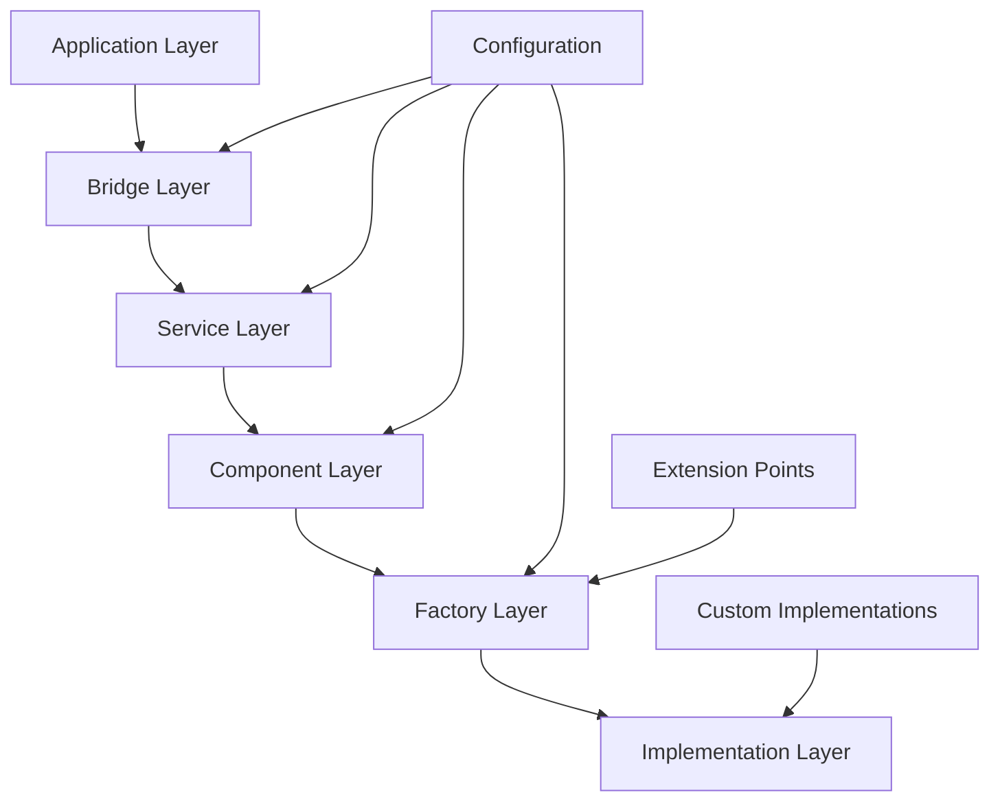

# Extensible Architecture Implementation

## Overview

The extensible architecture in OpusAgent provides a robust, modular foundation that enables developers to easily extend and customize the framework without modifying core components. Built on solid design principles including separation of concerns, dependency inversion, and the open/closed principle, the architecture supports pluggable components, factory patterns, and comprehensive configuration management.

## Architecture Principles

### Core Design Principles

1. **Separation of Concerns**: Each component has a single, well-defined responsibility
2. **Open/Closed Principle**: Easy to add new features without modifying existing code
3. **Dependency Inversion**: High-level modules depend on abstractions, not concrete implementations
4. **Factory Pattern**: Centralized creation of component instances
5. **Configuration Management**: Environment-based configuration with sensible defaults
6. **Interface Segregation**: Clean, focused interfaces for each component type

### Architectural Patterns



## Core Extension Points

### 1. Bridge System

The bridge system provides the primary extension point for integrating new telephony platforms.

#### BaseBridge Interface

```python
from opusagent.bridges.base_bridge import BaseRealtimeBridge

class BaseRealtimeBridge(ABC):
    """Base bridge class for handling bidirectional communication between platforms and OpenAI Realtime API."""
    
    @abstractmethod
    def register_platform_event_handlers(self):
        """Register platform-specific event handlers."""
        pass
    
    @abstractmethod
    async def send_platform_json(self, payload: dict):
        """Send JSON payload to platform."""
        pass
    
    @abstractmethod
    async def handle_session_start(self, data: Dict[str, Any]):
        """Handle session start event."""
        pass
    
    @abstractmethod
    async def handle_audio_start(self, data: Dict[str, Any]):
        """Handle audio start event."""
        pass
    
    @abstractmethod
    async def handle_audio_data(self, data: Dict[str, Any]):
        """Handle audio data event."""
        pass
    
    @abstractmethod
    async def handle_audio_end(self, data: Dict[str, Any]):
        """Handle audio end event."""
        pass
    
    @abstractmethod
    async def handle_session_end(self, data: Dict[str, Any]):
        """Handle session end event."""
        pass
```

#### Creating a New Bridge

```python
from opusagent.bridges.base_bridge import BaseRealtimeBridge

class CustomPlatformBridge(BaseRealtimeBridge):
    """Custom platform bridge implementation."""
    
    def __init__(self, platform_websocket, realtime_websocket, session_config):
        super().__init__(platform_websocket, realtime_websocket, session_config, bridge_type="custom")
    
    def register_platform_event_handlers(self):
        """Register custom platform event handlers."""
        # Register platform-specific event handlers
        self.event_router.register_handler("custom.event", self.handle_custom_event)
    
    async def send_platform_json(self, payload: dict):
        """Send JSON to custom platform."""
        await self.platform_websocket.send_json(payload)
    
    async def handle_session_start(self, data: Dict[str, Any]):
        """Handle custom platform session start."""
        # Custom session start logic
        await self.initialize_conversation()
    
    async def handle_audio_start(self, data: Dict[str, Any]):
        """Handle custom platform audio start."""
        # Custom audio start logic
        pass
    
    async def handle_audio_data(self, data: Dict[str, Any]):
        """Handle custom platform audio data."""
        # Custom audio data processing
        audio_chunk = data.get("audio")
        await self.audio_handler.handle_incoming_audio(audio_chunk)
    
    async def handle_audio_end(self, data: Dict[str, Any]):
        """Handle custom platform audio end."""
        # Custom audio end logic
        await self.audio_handler.handle_audio_commit()
    
    async def handle_session_end(self, data: Dict[str, Any]):
        """Handle custom platform session end."""
        # Custom session end logic
        await self.hang_up("Session ended by platform")
    
    async def handle_custom_event(self, data: Dict[str, Any]):
        """Handle custom platform-specific events."""
        # Custom event handling logic
        pass
```

### 2. VAD (Voice Activity Detection) System

The VAD system supports pluggable backends through a factory pattern.

#### BaseVAD Interface

```python
from opusagent.vad.base_vad import BaseVAD

class BaseVAD(ABC):
    """Abstract base class for VAD implementations."""
    
    @abstractmethod
    def initialize(self, config):
        """Initialize the VAD system with configuration."""
        pass
    
    @abstractmethod
    def process_audio(self, audio_data: bytes) -> dict:
        """Process audio data and return VAD results."""
        pass
    
    @abstractmethod
    def reset(self):
        """Reset VAD state."""
        pass
    
    @abstractmethod
    def cleanup(self):
        """Cleanup VAD resources."""
        pass
```

#### VAD Factory

```python
from opusagent.vad.vad_factory import VADFactory

class VADFactory:
    """Factory class for creating VAD instances."""
    
    @staticmethod
    def create_vad(config=None):
        """Create a VAD instance based on the configuration."""
        if config is None:
            config = {}
            
        backend = config.get('backend', 'silero')
        if backend == 'silero':
            vad = SileroVAD()
            vad.initialize(config)
            return vad
        else:
            raise ValueError(f'Unsupported VAD backend: {backend}')
```

#### Adding a Custom VAD Backend

```python
from opusagent.vad.base_vad import BaseVAD

class CustomVAD(BaseVAD):
    """Custom VAD implementation."""
    
    def __init__(self):
        self.initialized = False
        self.config = None
    
    def initialize(self, config):
        """Initialize custom VAD with configuration."""
        self.config = config
        # Custom initialization logic
        self.initialized = True
    
    def process_audio(self, audio_data: bytes) -> dict:
        """Process audio data using custom VAD algorithm."""
        if not self.initialized:
            raise RuntimeError("VAD not initialized")
        
        # Custom VAD processing logic
        speech_detected = self._custom_speech_detection(audio_data)
        confidence = self._calculate_confidence(audio_data)
        
        return {
            "speech_detected": speech_detected,
            "confidence": confidence,
            "timestamp": time.time()
        }
    
    def reset(self):
        """Reset custom VAD state."""
        # Custom reset logic
        pass
    
    def cleanup(self):
        """Cleanup custom VAD resources."""
        # Custom cleanup logic
        self.initialized = False
    
    def _custom_speech_detection(self, audio_data: bytes) -> bool:
        """Custom speech detection algorithm."""
        # Implement custom speech detection
        return True
    
    def _calculate_confidence(self, audio_data: bytes) -> float:
        """Calculate confidence score."""
        # Implement confidence calculation
        return 0.8
```

### 3. Transcription System

The transcription system supports multiple backends through a modular architecture.

#### BaseTranscriber Interface

```python
from opusagent.local.transcription.base import BaseTranscriber
from opusagent.local.transcription.models import TranscriptionConfig, TranscriptionResult

class BaseTranscriber(ABC):
    """Abstract base class for transcription backends."""
    
    def __init__(self, config: TranscriptionConfig):
        self.config = config
        self.logger = logging.getLogger(f"{__name__}.{self.__class__.__name__}")
        self._initialized = False
        self._audio_buffer = []
        self._session_active = False

    @abstractmethod
    async def initialize(self) -> bool:
        """Initialize the transcription backend."""
        pass

    @abstractmethod
    async def transcribe_chunk(self, audio_data: bytes) -> TranscriptionResult:
        """Transcribe a chunk of audio data."""
        pass

    @abstractmethod
    async def finalize(self) -> TranscriptionResult:
        """Finalize transcription and return complete result."""
        pass

    @abstractmethod
    async def cleanup(self) -> None:
        """Cleanup transcription resources."""
        pass
```

#### Transcription Factory

```python
from opusagent.local.transcription.factory import TranscriptionFactory

class TranscriptionFactory:
    """Factory for creating transcription backends."""
    
    @staticmethod
    def create_transcriber(config: Union[Dict[str, Any], TranscriptionConfig]):
        """Create transcriber instance based on configuration."""
        if isinstance(config, dict):
            config = TranscriptionConfig(**config)
        
        backend = config.backend.lower()
        if backend == "pocketsphinx":
            return PocketSphinxTranscriber(config)
        elif backend == "whisper":
            return WhisperTranscriber(config)
        else:
            raise ValueError(f"Unsupported transcription backend: {backend}")
    
    @staticmethod
    def get_available_backends() -> List[str]:
        """Get list of available transcription backends."""
        available = []
        try:
            import pocketsphinx
            available.append("pocketsphinx")
        except ImportError:
            pass
        # Whisper is always listed; actual import is checked at runtime
        available.append("whisper")
        return available
```

#### Adding a Custom Transcription Backend

```python
from opusagent.local.transcription.base import BaseTranscriber
from opusagent.local.transcription.models import TranscriptionConfig, TranscriptionResult

class CustomTranscriber(BaseTranscriber):
    """Custom transcription implementation."""
    
    async def initialize(self) -> bool:
        """Initialize custom transcription backend."""
        try:
            # Custom initialization logic
            self._initialized = True
            self.logger.info("Custom transcriber initialized successfully")
            return True
        except Exception as e:
            self.logger.error(f"Failed to initialize custom transcriber: {e}")
            return False
    
    async def transcribe_chunk(self, audio_data: bytes) -> TranscriptionResult:
        """Transcribe audio chunk using custom backend."""
        if not self._initialized:
            raise RuntimeError("Transcriber not initialized")
        
        try:
            # Custom transcription logic
            text = await self._custom_transcribe(audio_data)
            confidence = self._calculate_confidence(audio_data)
            
            return TranscriptionResult(
                text=text,
                confidence=confidence,
                is_final=False,
                processing_time=0.1
            )
        except Exception as e:
            return TranscriptionResult(
                text="",
                confidence=0.0,
                is_final=False,
                error=str(e),
                processing_time=0.0
            )
    
    async def finalize(self) -> TranscriptionResult:
        """Finalize transcription with complete result."""
        # Custom finalization logic
        return TranscriptionResult(
            text=self._get_final_text(),
            confidence=self._get_final_confidence(),
            is_final=True,
            processing_time=0.0
        )
    
    async def cleanup(self) -> None:
        """Cleanup transcription resources."""
        self._initialized = False
    
    async def _custom_transcribe(self, audio_data: bytes) -> str:
        """Custom transcription algorithm."""
        # Implement custom transcription logic
        return "transcribed text"
    
    def _calculate_confidence(self, audio_data: bytes) -> float:
        """Calculate transcription confidence."""
        # Implement confidence calculation
        return 0.9
    
    def _get_final_text(self) -> str:
        """Get final transcribed text."""
        # Implement final text generation
        return "final transcribed text"
    
    def _get_final_confidence(self) -> float:
        """Get final confidence score."""
        # Implement final confidence calculation
        return 0.95
```

### 4. Function Calling System

The function calling system supports dynamic registration of custom functions.

#### Function Registry

```python
from opusagent.function_handler import FunctionHandler

class FunctionHandler:
    """Central orchestrator for function call operations."""
    
    def __init__(self, realtime_websocket, call_recorder=None, voice="verse", hang_up_callback=None):
        self.function_registry: Dict[str, Callable] = {}
        self.active_function_calls: Dict[str, Dict[str, Any]] = {}
        self.realtime_websocket = realtime_websocket
        self.call_recorder = call_recorder
        self.hang_up_callback = hang_up_callback
    
    def register_function(self, name: str, func: Callable[[Dict[str, Any]], Any]) -> None:
        """Register a function in the function registry."""
        self.function_registry[name] = func
        logger.info(f"Registered function: {name}")
    
    def unregister_function(self, name: str) -> bool:
        """Unregister a function from the registry."""
        if name in self.function_registry:
            del self.function_registry[name]
            logger.info(f"Unregistered function: {name}")
            return True
        return False
```

#### Adding Custom Functions

```python
# Register custom functions
def custom_business_function(arguments: Dict[str, Any]) -> Dict[str, Any]:
    """Custom business logic function."""
    # Extract parameters
    user_id = arguments.get("user_id")
    action = arguments.get("action")
    
    # Custom business logic
    result = process_business_action(user_id, action)
    
    return {
        "status": "success",
        "result": result,
        "timestamp": time.time()
    }

# Register with function handler
function_handler.register_function("custom_business_action", custom_business_function)
```

### 5. Mock Client Factory System

The mock client factory system provides pre-configured clients for different testing scenarios.

#### Mock Factory

```python
from opusagent.local.mock_factory import create_customer_service_mock

def create_customer_service_mock(
    audio_dir: str = "demo/audio",
    logger: Optional[logging.Logger] = None
) -> LocalRealtimeClient:
    """Create a mock client configured for customer service scenarios."""
    
    # Create session configuration
    session_config = SessionConfig(
        model="gpt-4o-realtime-preview-2025-06-03",
        modalities=["text", "audio"],
        voice="alloy",
        input_audio_format="pcm16",
        output_audio_format="pcm16"
    )
    
    # Define customer service response configurations
    response_configs = {
        "greeting": LocalResponseConfig(
            text="Hello! Welcome to our customer service. How can I help you today?",
            audio_file=f"{audio_dir}/greeting.wav",
            delay_seconds=0.03,
            audio_chunk_delay=0.15
        ),
        # ... more configurations
    }
    
    # Create and configure client
    client = LocalRealtimeClient(session_config)
    
    # Add response configurations
    for name, config in response_configs.items():
        client.add_response_config(name, config)
    
    return client
```

#### Creating Custom Mock Factories

```python
def create_custom_scenario_mock(
    scenario_type: str,
    custom_responses: Dict[str, str],
    audio_dir: str = "demo/audio"
) -> LocalRealtimeClient:
    """Create a mock client for custom scenarios."""
    
    # Create session configuration
    session_config = SessionConfig(
        model="gpt-4o-realtime-preview-2025-06-03",
        modalities=["text", "audio"],
        voice="alloy",
        input_audio_format="pcm16",
        output_audio_format="pcm16"
    )
    
    # Create client
    client = LocalRealtimeClient(session_config)
    
    # Add custom response configurations
    for name, text in custom_responses.items():
        config = LocalResponseConfig(
            text=text,
            audio_file=f"{audio_dir}/{name}.wav",
            delay_seconds=0.03,
            audio_chunk_delay=0.15
        )
        client.add_response_config(name, config)
    
    return client
```

## Configuration Management

### Environment-Based Configuration

Configuration is loaded from environment variables with sensible defaults across different modules:

```python
# VAD Configuration
from opusagent.vad.vad_config import load_vad_config

def load_vad_config() -> Dict[str, Any]:
    """Load VAD configuration from environment."""
    return {
        "backend": os.getenv("VAD_BACKEND", "silero"),
        "threshold": float(os.getenv("VAD_THRESHOLD", "0.5")),
        "silence_threshold": float(os.getenv("VAD_SILENCE_THRESHOLD", "0.3")),
        "min_speech_duration_ms": int(os.getenv("VAD_MIN_SPEECH_DURATION_MS", "500")),
        "min_silence_duration_ms": int(os.getenv("VAD_MIN_SILENCE_DURATION_MS", "300"))
    }

# Transcription Configuration
from opusagent.local.transcription.config import load_transcription_config

def load_transcription_config() -> TranscriptionConfig:
    """Load transcription configuration from environment."""
    return TranscriptionConfig(
        backend=os.getenv("TRANSCRIPTION_BACKEND", "pocketsphinx"),
        language=os.getenv("TRANSCRIPTION_LANGUAGE", "en"),
        sample_rate=int(os.getenv("TRANSCRIPTION_SAMPLE_RATE", "16000")),
        enable_vad=os.getenv("TRANSCRIPTION_ENABLE_VAD", "true").lower() == "true"
    )
```

### Configuration Validation

Configuration validation is handled through Pydantic models in various modules:

```python
from pydantic import BaseModel, Field, field_validator
from typing import Optional

class VADConfig(BaseModel):
    """VAD configuration with validation."""
    backend: str = "silero"
    threshold: float = Field(default=0.5, ge=0.0, le=1.0)
    silence_threshold: float = Field(default=0.3, ge=0.0, le=1.0)
    min_speech_duration_ms: int = Field(default=500, ge=0)
    min_silence_duration_ms: int = Field(default=300, ge=0)
    
    @field_validator('threshold', 'silence_threshold')
    @classmethod
    def validate_thresholds(cls, v):
        if not 0.0 <= v <= 1.0:
            raise ValueError('Threshold must be between 0.0 and 1.0')
```

## Extension Development Guidelines

### Best Practices

1. **Follow Interface Contracts**: Always implement required abstract methods
2. **Use Configuration Validation**: Validate configuration parameters using Pydantic models
3. **Implement Proper Error Handling**: Handle exceptions gracefully with comprehensive logging
4. **Provide Comprehensive Logging**: Log important events and errors using the configured logger
5. **Include Resource Cleanup**: Implement proper cleanup methods for resource management
6. **Write Unit Tests**: Test your extensions thoroughly using pytest
7. **Document Your Extensions**: Provide clear documentation and examples

### Extension Template

```python
"""
Custom Extension Template

This template provides a foundation for creating OpusAgent extensions.
"""

import logging
from abc import ABC, abstractmethod
from typing import Dict, Any, Optional

logger = logging.getLogger(__name__)

class CustomExtension(ABC):
    """Base class for custom extensions."""
    
    def __init__(self, config: Dict[str, Any]):
        self.config = config
        self.initialized = False
        self.logger = logging.getLogger(f"{__name__}.{self.__class__.__name__}")
    
    @abstractmethod
    def initialize(self) -> bool:
        """Initialize the extension."""
        pass
    
    @abstractmethod
    def process(self, data: Any) -> Any:
        """Process data using the extension."""
        pass
    
    @abstractmethod
    def cleanup(self) -> None:
        """Cleanup extension resources."""
        pass
    
    def validate_config(self) -> bool:
        """Validate configuration parameters."""
        # Implement configuration validation
        return True
    
    def get_status(self) -> Dict[str, Any]:
        """Get extension status."""
        return {
            "initialized": self.initialized,
            "config": self.config
        }

class CustomImplementation(CustomExtension):
    """Custom implementation example."""
    
    def initialize(self) -> bool:
        """Initialize custom implementation."""
        try:
            if not self.validate_config():
                return False
            
            # Custom initialization logic
            self.initialized = True
            self.logger.info("Custom extension initialized successfully")
            return True
            
        except Exception as e:
            self.logger.error(f"Failed to initialize custom extension: {e}")
            return False
    
    def process(self, data: Any) -> Any:
        """Process data using custom logic."""
        if not self.initialized:
            raise RuntimeError("Extension not initialized")
        
        try:
            # Custom processing logic
            result = self._custom_process(data)
            return result
            
        except Exception as e:
            self.logger.error(f"Error processing data: {e}")
            raise
    
    def cleanup(self) -> None:
        """Cleanup custom implementation."""
        # Custom cleanup logic
        self.initialized = False
        self.logger.info("Custom extension cleaned up")
    
    def _custom_process(self, data: Any) -> Any:
        """Custom processing logic."""
        # Implement custom processing
        return data
```

## Testing Extensions

### Unit Testing

```python
import pytest
from unittest.mock import Mock, patch

class TestCustomExtension:
    """Test custom extension functionality."""
    
    def setup_method(self):
        """Setup test fixtures."""
        self.config = {"param1": "value1", "param2": "value2"}
        self.extension = CustomImplementation(self.config)
    
    def test_initialization(self):
        """Test extension initialization."""
        assert self.extension.initialize() == True
        assert self.extension.initialized == True
    
    def test_config_validation(self):
        """Test configuration validation."""
        assert self.extension.validate_config() == True
    
    def test_processing(self):
        """Test data processing."""
        self.extension.initialize()
        result = self.extension.process("test_data")
        assert result is not None
    
    def test_cleanup(self):
        """Test resource cleanup."""
        self.extension.initialize()
        self.extension.cleanup()
        assert self.extension.initialized == False
    
    def test_error_handling(self):
        """Test error handling."""
        with pytest.raises(RuntimeError):
            self.extension.process("test_data")  # Should fail without initialization
```

### Integration Testing

```python
async def test_extension_integration():
    """Test extension integration with OpusAgent."""
    # Create extension
    config = {"param1": "value1"}
    extension = CustomImplementation(config)
    
    # Initialize extension
    assert extension.initialize()
    
    # Test integration with OpusAgent components
    # ... integration test logic ...
    
    # Cleanup
    extension.cleanup()
```

## Performance Considerations

### Optimization Strategies

1. **Lazy Initialization**: Initialize components only when needed
2. **Resource Pooling**: Reuse expensive resources
3. **Caching**: Cache frequently accessed data
4. **Async Processing**: Use async/await for I/O operations
5. **Memory Management**: Implement proper memory cleanup

### Performance Monitoring

```python
import time
from typing import Dict, Any

class PerformanceMonitor:
    """Monitor extension performance."""
    
    def __init__(self):
        self.metrics: Dict[str, Any] = {}
    
    def start_timer(self, operation: str):
        """Start timing an operation."""
        self.metrics[operation] = {"start": time.time()}
    
    def end_timer(self, operation: str):
        """End timing an operation."""
        if operation in self.metrics:
            self.metrics[operation]["end"] = time.time()
            self.metrics[operation]["duration"] = (
                self.metrics[operation]["end"] - self.metrics[operation]["start"]
            )
    
    def get_metrics(self) -> Dict[str, Any]:
        """Get performance metrics."""
        return self.metrics.copy()

# Usage in extensions
class PerformanceAwareExtension(CustomExtension):
    """Extension with performance monitoring."""
    
    def __init__(self, config: Dict[str, Any]):
        super().__init__(config)
        self.monitor = PerformanceMonitor()
    
    def process(self, data: Any) -> Any:
        """Process data with performance monitoring."""
        self.monitor.start_timer("process")
        
        try:
            result = self._custom_process(data)
            return result
        finally:
            self.monitor.end_timer("process")
    
    def get_performance_metrics(self) -> Dict[str, Any]:
        """Get performance metrics."""
        return self.monitor.get_metrics()
```

## Conclusion

The extensible architecture in OpusAgent provides a robust foundation for building and extending voice AI applications. By following the established patterns and interfaces, developers can easily add new functionality without modifying core components, ensuring maintainability and scalability.

The architecture supports:
- **Pluggable Components**: Easy integration of new VAD, transcription, and bridge implementations
- **Factory Patterns**: Centralized component creation and configuration
- **Configuration Management**: Environment-based configuration with validation
- **Performance Monitoring**: Built-in performance tracking and optimization
- **Comprehensive Testing**: Support for unit and integration testing

This extensible design enables OpusAgent to evolve and adapt to new requirements while maintaining stability and performance. 