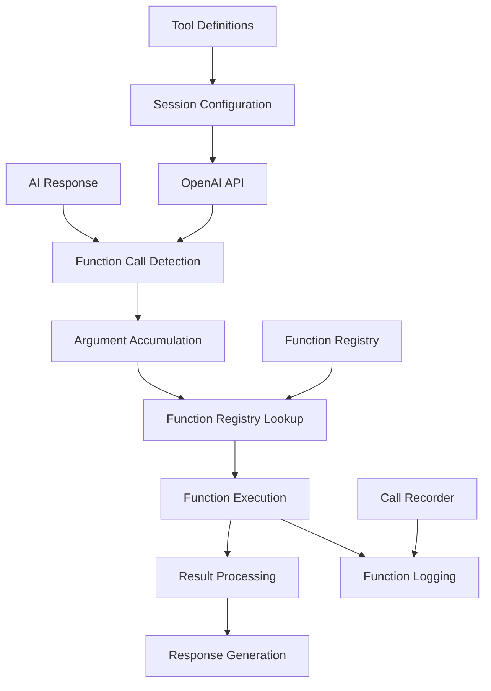

# Function Calling Implementation

## Overview

The function calling system in OpusAgent provides seamless integration between AI conversations and backend business logic through OpenAI's function tools. It enables structured interactions where the AI can invoke specific functions to perform actions, retrieve data, or trigger workflows, creating a bridge between natural language conversations and deterministic business processes.

## Architecture

### Core Components



### Component Hierarchy

1. **FunctionHandler** - Central orchestrator for all function call operations
2. **Tool Models** - Pydantic models for defining function schemas
3. **Function Registry** - Dynamic registration and lookup of callable functions
4. **Bridge Integration** - Integration with telephony bridges and session management
5. **Call Recording** - Comprehensive logging of function calls and results

## Implementation Details

### FunctionHandler Class

The `FunctionHandler` class serves as the central orchestrator for all function call operations:

```python
class FunctionHandler:
    def __init__(self, realtime_websocket, call_recorder=None, voice="verse", hang_up_callback=None):
        self.function_registry: Dict[str, Callable] = {}
        self.active_function_calls: Dict[str, Dict[str, Any]] = {}
        self.realtime_websocket = realtime_websocket
        self.call_recorder = call_recorder
        self.hang_up_callback = hang_up_callback
```

#### Key Features

- **Streaming Support**: Accumulates function arguments delivered across multiple delta events
- **Function Registry**: Dynamic registration/unregistration of callable functions
- **Async/Sync Compatibility**: Supports both synchronous and asynchronous function implementations
- **Error Handling**: Comprehensive error handling with detailed logging
- **Response Management**: Automatic response generation triggering after function execution
- **State Management**: Tracks active function calls and manages cleanup

### Tool Definition System

The system uses Pydantic models to define function tools in a type-safe way:

```python
class ToolParameter(BaseModel):
    type: str
    description: Optional[str] = None
    enum: Optional[List[str]] = None
    default: Optional[Any] = None

class ToolParameters(BaseModel):
    type: str = "object"
    properties: Dict[str, ToolParameter]
    required: Optional[List[str]] = None

class OpenAITool(BaseModel):
    type: str = "function"
    name: str
    description: str
    parameters: ToolParameters
```

### Function Call Lifecycle

1. **Delta Events**: Incremental argument data is accumulated in `active_function_calls`
2. **Done Events**: Complete arguments trigger function lookup and execution
3. **Function Execution**: Registered functions are called with parsed arguments
4. **Result Delivery**: Function results are sent back to OpenAI via WebSocket
5. **Response Generation**: AI response generation is automatically triggered
6. **Cleanup**: Function call state is cleaned up after completion

## Supported Function Flows

### 1. Card Replacement Flow

Complete end-to-end card replacement process:

```python
def func_process_replacement(arguments: Dict[str, Any]) -> Dict[str, Any]:
    card_type = arguments.get("card_type", None)
    reason = arguments.get("reason", None)
    delivery_address = arguments.get("delivery_address", None)
    
    return {
        "status": "success",
        "card_type": card_type,
        "reason": reason,
        "delivery_address": delivery_address,
        "replacement_id": f"REP-{uuid.uuid4().hex[:8].upper()}",
        "estimated_delivery": "5-7 business days"
    }
```

**Tool Definition:**
```python
class ProcessReplacementTool(OpenAITool):
    name: str = "process_replacement"
    description: str = "Process a card replacement request for the customer."
    parameters: ProcessReplacementParameters = ProcessReplacementParameters()
```

### 2. Banking Operations

Basic banking function simulations:

#### Balance Inquiry
```python
def func_get_balance(arguments: Dict[str, Any]) -> Dict[str, Any]:
    account_number = arguments.get("account_number", "unknown")
    include_pending = arguments.get("include_pending", True)
    
    return {
        "status": "success",
        "balance": 1234.56,
        "currency": "USD",
        "account_number": account_number,
        "pending_transactions": include_pending
    }
```

#### Fund Transfer
```python
def func_transfer_funds(arguments: Dict[str, Any]) -> Dict[str, Any]:
    from_account = arguments.get("from_account", "unknown")
    to_account = arguments.get("to_account", "unknown")
    amount = arguments.get("amount", 0)
    transfer_type = arguments.get("transfer_type", "internal")
    
    return {
        "status": "success",
        "amount": amount,
        "from_account": from_account,
        "to_account": to_account,
        "transfer_type": transfer_type,
        "transaction_id": f"TX-{uuid.uuid4().hex[:8].upper()}"
    }
```

### 3. Human Handoff

Transfer to human agent with priority levels:

```python
def func_transfer_to_human(arguments: Dict[str, Any]) -> Dict[str, Any]:
    reason = arguments.get("reason", "General inquiry")
    priority = arguments.get("priority", "normal")
    context = arguments.get("context", {})
    
    return {
        "status": "transfer_initiated",
        "reason": reason,
        "priority": priority,
        "context": context,
        "estimated_wait_time": "2-3 minutes"
    }
```

## Configuration Management

### Environment Variables

```bash
# Function calling configuration
FUNCTION_CALLING_ENABLED=true
FUNCTION_TIMEOUT_SECONDS=30
FUNCTION_RETRY_ATTEMPTS=3
```

### Session Configuration

Functions are configured in the session setup:

```python
def get_customer_service_tools() -> list[dict[str, Any]]:
    tools = [
        ProcessReplacementTool(),
        GetBalanceTool(),
        TransferFundsTool(),
        HumanHandoffTool(),
    ]
    return [tool.model_dump() for tool in tools]

session_config = SessionConfig(
    model="gpt-4o-realtime-preview-2025-06-03",
    modalities=["text", "audio"],
    instructions=SYSTEM_PROMPT,
    tools=get_customer_service_tools(),
    tool_choice="auto",
    temperature=0.6,
    max_response_output_tokens=4096
)
```

## Integration with Bridges

### Base Bridge Integration

The `BaseRealtimeBridge` automatically initializes function handling:

```python
# Initialize function handler
self.function_handler = FunctionHandler(
    realtime_websocket=realtime_websocket,
    call_recorder=self.call_recorder,
    voice=session_config.voice or "verse",
    hang_up_callback=self.hang_up,
)

# Register customer service functions
from opusagent.customer_service_agent import register_customer_service_functions
register_customer_service_functions(self.function_handler)
```

### Bridge-Specific Function Registration

Different bridges register different function sets:

#### Customer Service Bridge
```python
def register_customer_service_functions(function_handler) -> None:
    function_handler.register_function("get_balance", func_get_balance)
    function_handler.register_function("transfer_funds", func_transfer_funds)
    function_handler.register_function("process_replacement", func_process_replacement)
    function_handler.register_function("transfer_to_human", func_transfer_to_human)
```

#### Caller Agent Bridge
```python
def register_caller_functions(function_handler) -> None:
    function_handler.register_function("hang_up", func_hang_up)
```

## Usage Examples

### Basic Function Registration

```python
# Initialize handler
handler = FunctionHandler(realtime_websocket)

# Register custom function
def my_custom_function(args):
    return {"status": "success", "data": args}

handler.register_function("my_function", my_custom_function)
```

### Handling Function Call Events

```python
# Handle streaming argument accumulation
await handler.handle_function_call_arguments_delta(delta_event)

# Handle function execution
await handler.handle_function_call_arguments_done(done_event)
```

### Custom Function Implementation

```python
async def custom_banking_function(arguments: Dict[str, Any]) -> Dict[str, Any]:
    """Custom banking function implementation."""
    try:
        # Extract parameters
        account_id = arguments.get("account_id")
        action = arguments.get("action")
        
        # Perform business logic
        if action == "check_balance":
            balance = await get_account_balance(account_id)
            return {
                "status": "success",
                "balance": balance,
                "account_id": account_id
            }
        else:
            return {
                "status": "error",
                "message": f"Unknown action: {action}"
            }
    except Exception as e:
        return {
            "status": "error",
            "message": str(e)
        }
```

## Testing and Validation

### Unit Tests

Comprehensive test coverage for function calling:

```python
def test_function_registration(function_handler):
    """Test registering a new function."""
    def test_func(args):
        return {"result": "test"}
    
    function_handler.register_function("test_func", test_func)
    assert "test_func" in function_handler.function_registry

def test_customer_service_functions_registration(function_handler):
    """Test that customer service functions can be registered and work correctly."""
    from opusagent.customer_service_agent import register_customer_service_functions
    
    register_customer_service_functions(function_handler)
    
    # Test function execution
    balance_result = function_handler.function_registry["get_balance"]({"account_number": "123"})
    assert "balance" in balance_result
    assert balance_result["status"] == "success"
```

### Mock Function Testing

Local realtime client supports function call testing:

```python
def create_function_testing_mock() -> LocalRealtimeClient:
    session_config = SessionConfig(
        model="gpt-4o-realtime-preview-2025-06-03",
        modalities=["text"],
        tools=[
            {
                "type": "function",
                "function": {
                    "name": "get_weather",
                    "description": "Get weather information for a location",
                    "parameters": {
                        "type": "object",
                        "properties": {
                            "location": {"type": "string"},
                            "unit": {"type": "string", "enum": ["celsius", "fahrenheit"]}
                        },
                        "required": ["location"]
                    }
                }
            }
        ]
    )
    return LocalRealtimeClient(session_config)
```

## Performance Characteristics

### Latency Considerations

- **Function Execution**: Typically 10-100ms for simple operations
- **Network Overhead**: Additional latency for external API calls
- **Streaming Accumulation**: Minimal overhead for argument building
- **Response Generation**: Automatic triggering after function completion

### Resource Usage

- **Memory**: Function registry and active calls tracking
- **CPU**: Function execution and argument parsing
- **Network**: WebSocket communication for results
- **Storage**: Function call logging and recording

## Error Handling

### Function Execution Errors

```python
try:
    result = await func(arguments) if asyncio.iscoroutinefunction(func) else func(arguments)
except Exception as e:
    logger.error(f"Function execution failed: {e}")
    result = {"error": str(e)}
```

### Argument Parsing Errors

```python
try:
    args = json.loads(arguments_str) if arguments_str else {}
except json.JSONDecodeError as e:
    logger.error(f"Failed to parse function arguments JSON: {e}")
    return
```

### Registry Errors

```python
func = self.function_registry.get(function_name)
if not func:
    logger.error(f"Function '{function_name}' not implemented.")
    raise NotImplementedError(f"Function '{function_name}' not implemented.")
```

## Monitoring and Logging

### Function Call Recording

```python
async def log_function_call(self, function_name: str, arguments: Dict[str, Any], 
                           result: Optional[Dict[str, Any]] = None, call_id: Optional[str] = None):
    function_call = {
        "timestamp": datetime.now(timezone.utc).isoformat(),
        "function_name": function_name,
        "arguments": arguments,
        "result": result,
        "call_id": call_id
    }
    
    self.metadata.function_calls.append(function_call)
    await self._log_session_event("function_call", function_call)
```

### TUI Integration

The TUI provides real-time monitoring of function calls:

```python
class FunctionCallsPanel(Widget):
    def add_function_call(self, function_name: str, arguments: Dict[str, Any], 
                         call_id: str = None, status: str = "started") -> None:
        call_record = {
            "timestamp": datetime.now(),
            "function_name": function_name,
            "arguments": arguments,
            "call_id": call_id,
            "status": status,
            "result": None,
            "error": None,
            "duration_ms": None
        }
        
        self.function_calls.append(call_record)
        self._display_function_call(call_record)
```

## Troubleshooting

### Common Issues

1. **Function Not Found**
   - Ensure function is registered with correct name
   - Check function registry contents
   - Verify tool definitions match function names

2. **Argument Parsing Errors**
   - Validate JSON format of arguments
   - Check for missing required parameters
   - Verify parameter types match schema

3. **Function Execution Failures**
   - Check function implementation for errors
   - Verify async/sync function signatures
   - Monitor function timeout settings

4. **Response Generation Issues**
   - Ensure function results are properly formatted
   - Check WebSocket connection status
   - Verify response generation triggering

### Debugging Tools

```python
# List registered functions
registered_functions = function_handler.get_registered_functions()
print(f"Available functions: {registered_functions}")

# Check active function calls
active_calls = function_handler.get_active_function_calls()
print(f"Active calls: {active_calls}")

# Get function call history
history = function_handler.get_function_call_history()
print(f"Call history: {history}")
```

## Future Enhancements

### Planned Features

1. **Function Chaining**: Support for sequential function execution
2. **Conditional Logic**: Dynamic function selection based on context
3. **Batch Operations**: Execute multiple functions in parallel
4. **Function Templates**: Reusable function patterns for common workflows
5. **Advanced Validation**: Schema validation and type checking
6. **Performance Optimization**: Caching and connection pooling
7. **Security Enhancements**: Function access control and validation
8. **Analytics**: Detailed function usage metrics and performance monitoring

### Integration Opportunities

- **External APIs**: Connect to real banking systems and services
- **Database Integration**: Persistent function state and history
- **Workflow Engines**: Integration with business process automation
- **Monitoring Systems**: Real-time function performance tracking
- **Security Frameworks**: Authentication and authorization for sensitive operations

## Conclusion

The function calling implementation in OpusAgent provides a robust, extensible foundation for integrating AI conversations with business logic. Its modular design, comprehensive error handling, and extensive testing framework make it suitable for production use in enterprise environments.

The system's ability to handle streaming arguments, support both sync and async functions, and provide detailed logging and monitoring makes it an ideal solution for building intelligent voice agents that can perform complex, multi-step operations while maintaining natural conversation flow. 