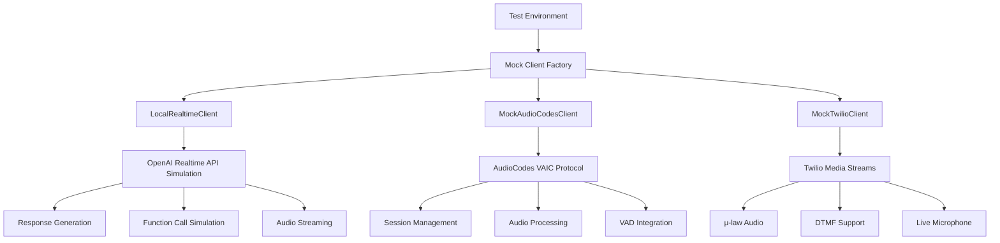

# Mock Clients Implementation

## Overview

The mock clients system in OpusAgent provides comprehensive testing and development capabilities without requiring real telephony infrastructure or OpenAI API access. It includes multiple specialized mock clients that simulate different platforms and protocols, enabling developers to test voice agent functionality in a controlled, cost-effective environment.

## Architecture

### Core Components



### Component Hierarchy

1. **Mock Client Factory** - Factory functions for creating pre-configured mock clients
2. **LocalRealtimeClient** - Complete OpenAI Realtime API simulation
3. **MockAudioCodesClient** - AudioCodes VAIC protocol simulation
4. **MockTwilioClient** - Twilio Media Streams protocol simulation
5. **WebSocket Mock** - WebSocket interface compatibility layer

## Implementation Details

### LocalRealtimeClient

The `LocalRealtimeClient` provides a complete drop-in replacement for the OpenAI Realtime API:

```python
class LocalRealtimeClient:
    def __init__(
        self,
        logger: Optional[logging.Logger] = None,
        session_config: Optional[SessionConfig] = None,
        response_configs: Optional[Dict[str, LocalResponseConfig]] = None,
        default_response_config: Optional[LocalResponseConfig] = None,
        enable_vad: Optional[bool] = None,
        vad_config: Optional[Dict[str, Any]] = None,
        enable_transcription: Optional[bool] = None,
        transcription_config: Optional[Dict[str, Any]] = None,
    ):
        self._audio_manager = AudioManager()
        self._event_handler = EventHandlerManager()
        self._response_generator = ResponseGenerator()
        self._response_timings = []
```

#### Key Features

- **Complete API Simulation**: Drop-in replacement for OpenAI Realtime API
- **Smart Response Selection**: Context-aware response selection based on conversation
- **Audio Processing**: Real audio file streaming and caching
- **Function Call Simulation**: Mock function calls with custom arguments
- **Performance Metrics**: Timing and performance tracking
- **Error Handling**: Graceful error handling and fallbacks

#### Response Selection Algorithm

```python
def _determine_response_key(self, options: ResponseCreateOptions) -> Optional[str]:
    """Determine which response configuration to use based on context."""
    context = self._get_conversation_context(options)
    
    # Score all response configurations
    scored_configs = self._score_response_configurations(context, options)
    
    # Return the highest scoring configuration
    if scored_configs:
        return scored_configs[0][0]
    return None
```

### MockAudioCodesClient

The `MockAudioCodesClient` simulates AudioCodes VAIC protocol behavior:

```python
class MockAudioCodesClient:
    def __init__(
        self,
        bridge_url: str,
        bot_name: str = "TestBot",
        caller: str = "+15551234567",
        logger: Optional[logging.Logger] = None,
        vad_config: Optional[Dict[str, Any]] = None,
    ):
        self.session_manager = SessionManager(self.config, self.logger)
        self.audio_manager = AudioManager(self.logger)
        self.message_handler = MessageHandler(self.session_manager, self.logger)
        self.conversation_manager = ConversationManager(
            self.session_manager, self.audio_manager, self.logger
        )
        self.vad_manager = VADManager(
            self.session_manager.stream_state,
            self.logger,
            self._handle_vad_event
        )
```

#### Key Features

- **Session Management**: Complete session lifecycle simulation
- **Audio Processing**: File-based and live microphone audio handling
- **VAD Integration**: Voice Activity Detection with configurable thresholds
- **Multi-turn Conversations**: Complex conversation flow testing
- **Audio Playback**: Real-time audio response playback
- **DTMF Support**: Touch-tone input simulation

### MockTwilioClient

The `MockTwilioClient` implements Twilio Media Streams protocol:

```python
class MockTwilioClient:
    def __init__(
        self,
        bridge_url: str,
        stream_sid: Optional[str] = None,
        account_sid: Optional[str] = None,
        call_sid: Optional[str] = None,
        logger: Optional[logging.Logger] = None,
    ):
        self.stream_sid = stream_sid or f"MZ{uuid.uuid4().hex}"
        self.account_sid = account_sid or f"AC{uuid.uuid4().hex}"
        self.call_sid = call_sid or f"CA{uuid.uuid4().hex}"
        self.sequence_number = 0
        self.connected = False
```

#### Key Features

- **Twilio Protocol**: Complete Media Streams protocol implementation
- **μ-law Audio**: Audio format conversion and processing
- **Live Microphone**: Real-time microphone input and processing
- **DTMF Support**: Touch-tone input handling
- **Audio Collection**: AI response audio collection and analysis
- **Multi-turn Testing**: Complex conversation flow validation

## Mock Client Factory

The factory system provides pre-configured mock clients for different scenarios:

### Customer Service Mock

```python
def create_customer_service_mock(
    audio_dir: str = "demo/audio",
    logger: Optional[logging.Logger] = None
) -> LocalRealtimeClient:
    """Create a mock client configured for customer service scenarios."""
    
    response_configs = {
        "greeting": LocalResponseConfig(
            text="Hello! Welcome to our customer service. How can I help you today?",
            audio_file=f"{audio_dir}/greeting.wav",
            delay_seconds=0.03,
            audio_chunk_delay=0.15
        ),
        "account_help": LocalResponseConfig(
            text="I'd be happy to help you with your account. Let me look that up for you.",
            audio_file=f"{audio_dir}/account_help.wav",
            delay_seconds=0.04,
            audio_chunk_delay=0.2
        ),
        # ... more configurations
    }
    
    return LocalRealtimeClient(
        logger=logger,
        session_config=session_config,
        response_configs=response_configs,
        default_response_config=default_config
    )
```

### Sales Mock

```python
def create_sales_mock(
    audio_dir: str = "demo/audio",
    logger: Optional[logging.Logger] = None
) -> LocalRealtimeClient:
    """Create a mock client configured for sales scenarios."""
    
    response_configs = {
        "sales_greeting": LocalResponseConfig(
            text="Hi there! I'm calling about our special offer today. Are you interested?",
            audio_file=f"{audio_dir}/sales_greeting.wav",
            delay_seconds=0.03,
            audio_chunk_delay=0.15
        ),
        "product_pitch": LocalResponseConfig(
            text="Our product offers amazing benefits that can save you money and time.",
            audio_file=f"{audio_dir}/product_pitch.wav",
            delay_seconds=0.04,
            audio_chunk_delay=0.2
        ),
        # ... more configurations
    }
```

### Function Testing Mock

```python
def create_function_testing_mock(
    logger: Optional[logging.Logger] = None
) -> LocalRealtimeClient:
    """Create a mock client configured for testing function calls."""
    
    session_config = SessionConfig(
        model="gpt-4o-realtime-preview-2025-06-03",
        modalities=["text"],
        tools=[
            {
                "type": "function",
                "function": {
                    "name": "get_weather",
                    "description": "Get weather information for a location",
                    "parameters": {
                        "type": "object",
                        "properties": {
                            "location": {"type": "string"},
                            "unit": {"type": "string", "enum": ["celsius", "fahrenheit"]}
                        },
                        "required": ["location"]
                    }
                }
            }
        ]
    )
    
    response_configs = {
        "weather_function": LocalResponseConfig(
            text="I'll check the weather for you.",
            function_call={
                "name": "get_weather",
                "arguments": {
                    "location": "New York",
                    "unit": "fahrenheit"
                }
            },
            delay_seconds=0.03
        )
    }
```

## Configuration Management

### Environment Variables

```bash
# Enable mock mode
export OPUSAGENT_USE_MOCK=true

# Set mock server URL
export OPUSAGENT_MOCK_SERVER_URL=ws://localhost:8080

# Enable local transcription
export LOCAL_REALTIME_ENABLE_TRANSCRIPTION=true

# VAD configuration
export VAD_ENABLED=true
export VAD_THRESHOLD=0.5
```

### Session Configuration

```python
session_config = SessionConfig(
    model="gpt-4o-realtime-preview-2025-06-03",
    modalities=["text", "audio"],
    voice="alloy",
    input_audio_format="pcm16",
    output_audio_format="pcm16",
    instructions="You are a helpful customer service agent.",
    temperature=0.6,
    max_response_output_tokens=4096,
    tools=get_customer_service_tools(),
    tool_choice="auto"
)
```

## Usage Examples

### Basic LocalRealtimeClient Usage

```python
# Basic setup
client = LocalRealtimeClient()
await client.connect("ws://localhost:8080")

# Add custom responses
client.add_response_config(
    "greeting",
    LocalResponseConfig(
        text="Hello! How can I help?",
        audio_file="audio/greeting.wav",
        delay_seconds=0.05
    )
)

# Use smart response selection
client.setup_smart_response_examples()

# Monitor performance
timings = client.get_response_timings()
for timing in timings:
    print(f"Response {timing['response_key']}: {timing['duration']:.3f}s")
```

### AudioCodes Mock Client Usage

```python
# Basic session management
async with MockAudioCodesClient("ws://localhost:8080") as client:
    # Initiate session
    success = await client.initiate_session()
    if success:
        # Send user audio
        await client.send_user_audio("audio/user_input.wav")
        # Wait for AI response
        response = await client.wait_for_llm_response()
        # End session
        await client.end_session("Test completed")

# Multi-turn conversation testing
audio_files = ["audio/turn1.wav", "audio/turn2.wav", "audio/turn3.wav"]
async with MockAudioCodesClient("ws://localhost:8080") as client:
    result = await client.multi_turn_conversation(audio_files)
    print(f"Success rate: {result.success_rate:.1f}%")
    client.save_collected_audio("output/")

# Live audio capture
async with MockAudioCodesClient("ws://localhost:8080") as client:
    # Start live audio capture
    client.start_live_audio_capture()
    # Enable VAD for speech detection
    client.enable_vad({"threshold": 0.6})
    # ... perform testing ...
    client.stop_live_audio_capture()
```

### Twilio Mock Client Usage

```python
# Basic call flow
async with MockTwilioClient("ws://localhost:8000/twilio-agent") as client:
    # Initiate call flow
    await client.initiate_call_flow()
    
    # Wait for AI greeting
    greeting = await client.wait_for_ai_greeting()
    
    # Send user audio
    await client.send_user_audio("audio/user_input.wav")
    
    # Wait for AI response
    response = await client.wait_for_ai_response()
    
    # Save collected audio
    client.save_collected_audio("output_dir")

# Live conversation
async with MockTwilioClient("ws://localhost:8000/twilio-agent") as client:
    result = await client.live_conversation(
        wait_for_greeting=True,
        auto_detect_silence=True,
        silence_threshold=2.0
    )
    
    print(f"Conversation completed: {result['turns']} turns")
    print(f"Total duration: {result['duration']:.2f}s")
```

### Factory Usage

```python
# Create customer service mock
customer_service_client = create_customer_service_mock(
    audio_dir="demo/audio",
    logger=logging.getLogger("customer_service_test")
)

# Create sales mock
sales_client = create_sales_mock(
    audio_dir="demo/audio",
    logger=logging.getLogger("sales_test")
)

# Create function testing mock
function_client = create_function_testing_mock(
    logger=logging.getLogger("function_test")
)

# Create simple mock with custom responses
responses = {
    "hello": "Hi there!",
    "help": "I'm here to help!",
    "goodbye": "See you later!"
}
simple_client = create_simple_mock(
    responses=responses,
    audio_dir="demo/audio"
)
```

## Testing and Validation

### Validation Scripts

The mock clients include comprehensive validation scripts:

```bash
# Run LocalRealtimeClient validation
python scripts/validate_local_realtime_client.py --verbose

# Run telephony mock validation
python scripts/validate_telephony_mock.py --verbose

# Run Twilio bridge validation
python scripts/validate_twilio_bridge.py --verbose

# Run VAD integration validation
python scripts/validate_vad_integration.py --all --verbose

# Run transcription validation
python scripts/validate_realtime_transcription.py --verbose
```

### Test Categories

1. **Client Initialization** - Basic client creation and configuration
2. **Response Configuration** - Response management and selection
3. **Intent Detection** - Keyword matching and intent recognition
4. **Conversation Context** - Context management and tracking
5. **WebSocket Connection** - Connection lifecycle and error handling
6. **Audio Processing** - Audio file handling and streaming
7. **Function Calls** - Function call simulation and execution
8. **Performance Metrics** - Timing and performance tracking
9. **Error Handling** - Error scenarios and fallbacks
10. **Integration Testing** - End-to-end workflow validation

### Validation Results

```json
{
  "timestamp": "2024-01-15T10:30:00.123456",
  "tests": {
    "Basic Initialization": {
      "status": "PASSED",
      "details": "",
      "timestamp": "2024-01-15T10:30:00.123456"
    },
    "Response Configuration": {
      "status": "PASSED",
      "details": "",
      "timestamp": "2024-01-15T10:30:00.124567"
    }
  },
  "summary": {
    "total_tests": 45,
    "passed": 45,
    "failed": 0,
    "errors": 0,
    "success_rate": 100.0
  }
}
```

## Performance Characteristics

### Latency Considerations

- **Response Generation**: 10-100ms for simple responses
- **Audio Streaming**: Real-time with configurable chunk delays
- **Function Calls**: 5-50ms for mock function execution
- **WebSocket Communication**: Minimal overhead with mock connections
- **VAD Processing**: 10-30ms per audio chunk

### Resource Usage

- **Memory**: Audio caching and conversation history
- **CPU**: Audio processing and response generation
- **Network**: WebSocket communication (minimal in mock mode)
- **Storage**: Audio file caching and test results

## Error Handling

### Connection Errors

```python
try:
    async with MockAudioCodesClient("ws://localhost:8080") as client:
        await client.initiate_session()
except ConnectionError as e:
    print(f"Connection failed: {e}")
except Exception as e:
    print(f"Unexpected error: {e}")
```

### Audio Processing Errors

```python
try:
    await client.send_user_audio("audio/user_input.wav")
except FileNotFoundError:
    print("Audio file not found")
except AudioProcessingError as e:
    print(f"Audio processing failed: {e}")
```

### Response Generation Errors

```python
try:
    response = await client.wait_for_llm_response(timeout=30.0)
except TimeoutError:
    print("Response timeout")
except ResponseGenerationError as e:
    print(f"Response generation failed: {e}")
```

## Monitoring and Logging

### Structured Logging

```python
# Configure logging for mock clients
logger = configure_logging("mock_client")
logger.setLevel(logging.DEBUG)

# Client will use structured logging with prefixes
# [CLIENT] - Main client operations
# [SESSION] - Session management
# [AUDIO] - Audio processing
# [VAD] - Voice activity detection
# [CONVERSATION] - Conversation management
```

### Performance Monitoring

```python
# Get response timings
timings = client.get_response_timings()
for timing in timings:
    print(f"Response: {timing['response_key']}")
    print(f"  Duration: {timing['duration']:.3f}s")
    print(f"  Audio chunks: {timing['audio_chunks']}")
    print(f"  Text length: {timing['text_length']}")

# Get VAD state
vad_state = client.get_vad_state()
print(f"VAD enabled: {vad_state['enabled']}")
print(f"Speech detected: {vad_state['speech_detected']}")
print(f"Confidence: {vad_state['confidence']:.3f}")

# Get transcription state
transcription_state = client.get_transcription_state()
print(f"Transcription enabled: {transcription_state['enabled']}")
print(f"Backend: {transcription_state['backend']}")
print(f"Language: {transcription_state['language']}")
```

## Troubleshooting

### Common Issues

1. **Import Errors**
   ```bash
   # Ensure you're in the project root
   cd /path/to/fastagent
   python scripts/run_validation.py
   ```

2. **Missing Dependencies**
   ```bash
   # Install required packages
   pip install websockets pydantic asyncio sounddevice numpy scipy
   ```

3. **Audio Device Issues**
   ```bash
   # Check available audio devices
   python -c "import sounddevice as sd; print(sd.query_devices())"
   ```

4. **WebSocket Connection Issues**
   ```bash
   # Check if server is running
   curl http://localhost:8000/health
   ```

### Debug Mode

```bash
# Run with maximum verbosity
python scripts/validate_local_realtime_client.py --verbose

# Check individual components
python -c "
from opusagent.local.realtime import LocalRealtimeClient
client = LocalRealtimeClient()
print('Client created successfully')
"
```

## Future Enhancements

### Planned Features

1. **Advanced Response Selection**: Machine learning-based response selection
2. **Multi-language Support**: Support for multiple languages and accents
3. **Custom Audio Generation**: Text-to-speech integration for dynamic audio
4. **Scenario Templates**: Pre-built conversation scenarios
5. **Performance Optimization**: Enhanced caching and streaming
6. **Integration Testing**: Automated integration test suites
7. **Real-time Analytics**: Live performance monitoring
8. **Custom Protocols**: Support for additional telephony protocols

### Integration Opportunities

- **External TTS Services**: Integration with real TTS services
- **Audio Processing Libraries**: Enhanced audio processing capabilities
- **Testing Frameworks**: Integration with pytest and unittest
- **CI/CD Pipelines**: Automated testing in deployment pipelines
- **Monitoring Systems**: Integration with APM and logging systems

## Conclusion

The mock clients implementation in OpusAgent provides a comprehensive testing and development environment for voice agent applications. Its modular design, extensive configuration options, and realistic simulation capabilities make it an essential tool for building and testing conversational AI systems.

The system's ability to simulate multiple telephony platforms, handle complex conversation flows, and provide detailed performance metrics makes it suitable for both development and production testing scenarios. The factory pattern and validation framework ensure consistent, reliable testing across different use cases and platforms. 