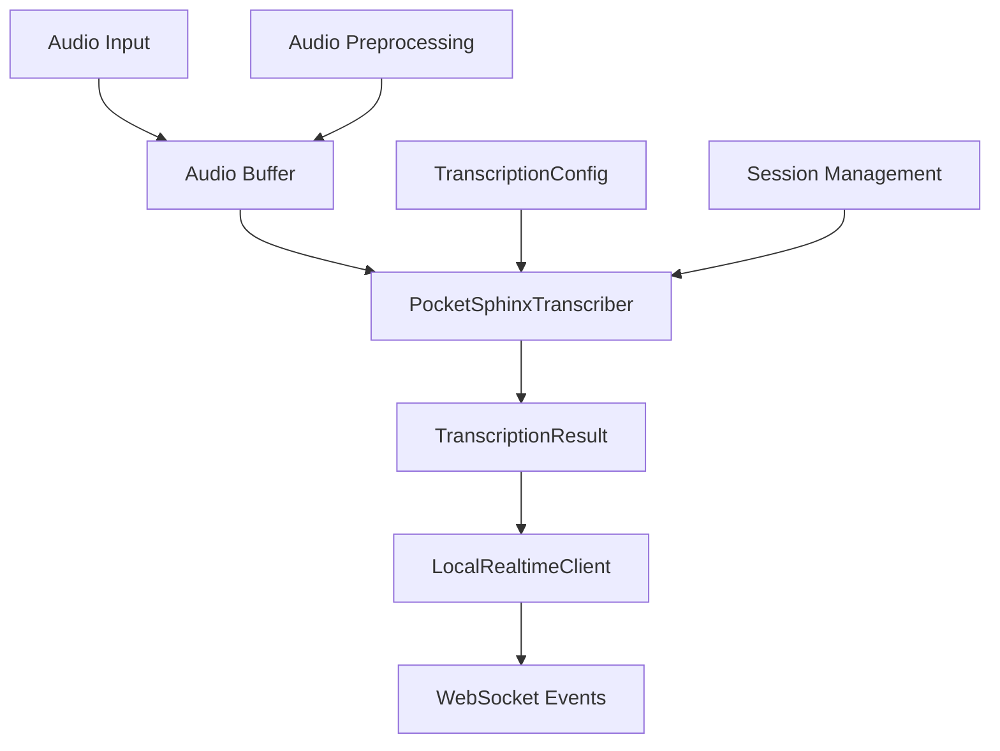

# PocketSphinx Transcription Integration

This document describes the PocketSphinx transcription backend integration within the OpusAgent system, specifically designed for real-time audio processing and mock OpenAI API behavior.

## 📋 Overview

The PocketSphinx transcription backend provides lightweight, offline audio-to-text conversion capabilities integrated within the OpusAgent local transcription system. It's designed for real-time streaming transcription rather than batch file processing.

## 🏗️ Architecture

### Integration Points



### Core Components

- **PocketSphinxTranscriber**: Main transcription backend in `opusagent/local/transcription/backends/pocketsphinx.py`
- **TranscriptionConfig**: Configuration management with PocketSphinx-specific options
- **BaseTranscriber**: Abstract interface that PocketSphinxTranscriber implements
- **TranscriptionFactory**: Factory pattern for creating transcriber instances

## 🚀 Usage

### Basic Integration

```python
from opusagent.local.transcription import TranscriptionFactory, load_transcription_config
from opusagent.local.transcription.backends.pocketsphinx import PocketSphinxTranscriber

# Load configuration
config = load_transcription_config()

# Create transcriber
transcriber = TranscriptionFactory.create_transcriber(config)

# Initialize
await transcriber.initialize()

# Process audio chunks
result = await transcriber.transcribe_chunk(audio_data)

# Finalize
final_result = await transcriber.finalize()

# Cleanup
await transcriber.cleanup()
```

### Configuration

The PocketSphinx backend supports extensive configuration through environment variables:

```python
from opusagent.local.transcription.models import TranscriptionConfig

config = TranscriptionConfig(
    backend="pocketsphinx",
    sample_rate=16000,
    chunk_duration=1.0,
    confidence_threshold=0.5,
    
    # PocketSphinx specific options
    pocketsphinx_hmm="/path/to/custom/hmm",
    pocketsphinx_lm="/path/to/custom/lm",
    pocketsphinx_dict="/path/to/custom/dict",
    pocketsphinx_audio_preprocessing="normalize",
    pocketsphinx_vad_settings="conservative",
    pocketsphinx_auto_resample=True,
    pocketsphinx_input_sample_rate=24000
)
```

## ⚙️ Configuration Options

### Environment Variables

| Variable | Default | Description |
|----------|---------|-------------|
| `TRANSCRIPTION_BACKEND` | `pocketsphinx` | Backend to use |
| `TRANSCRIPTION_SAMPLE_RATE` | `16000` | Audio sample rate |
| `TRANSCRIPTION_CHUNK_DURATION` | `1.0` | Audio chunk duration in seconds |
| `TRANSCRIPTION_CONFIDENCE_THRESHOLD` | `0.5` | Minimum confidence threshold |
| `POCKETSPHINX_HMM` | `None` | Custom acoustic model path |
| `POCKETSPHINX_LM` | `None` | Custom language model path |
| `POCKETSPHINX_DICT` | `None` | Custom dictionary path |
| `POCKETSPHINX_AUDIO_PREPROCESSING` | `normalize` | Audio preprocessing type |
| `POCKETSPHINX_VAD_SETTINGS` | `conservative` | VAD sensitivity |
| `POCKETSPHINX_AUTO_RESAMPLE` | `true` | Enable auto-resampling |
| `POCKETSPHINX_INPUT_SAMPLE_RATE` | `24000` | Input sample rate |

### Audio Preprocessing Options

- **none**: No preprocessing
- **normalize**: Audio normalization (default)
- **amplify**: Audio amplification
- **noise_reduction**: Noise reduction
- **silence_trim**: Silence trimming

### VAD Settings

- **default**: Default VAD behavior
- **aggressive**: Aggressive voice activity detection
- **conservative**: Conservative VAD (default)

## 🎯 Features

### Real-time Streaming

The PocketSphinx backend is optimized for real-time audio processing:

```python
# Process audio chunks as they arrive
async def process_audio_stream(audio_chunks):
    transcriber = PocketSphinxTranscriber(config)
    await transcriber.initialize()
    
    for chunk in audio_chunks:
        result = await transcriber.transcribe_chunk(chunk)
        if result.text:
            print(f"Partial: {result.text}")
    
    final_result = await transcriber.finalize()
    print(f"Final: {final_result.text}")
```

### Session Management

```python
# Start a new transcription session
transcriber.start_session()

# Process audio during session
result = await transcriber.transcribe_chunk(audio_data)

# End session and get final result
transcriber.end_session()
final_result = await transcriber.finalize()
```

### Audio Optimization

- **Auto-resampling**: Automatically converts 24kHz audio to 16kHz for optimal PocketSphinx performance
- **Audio preprocessing**: Configurable preprocessing pipeline
- **Chunk processing**: Configurable chunk sizes for real-time streaming
- **Utterance management**: Proper start/end utterance handling

## 📊 Output Format

The PocketSphinx backend returns `TranscriptionResult` objects:

```python
class TranscriptionResult:
    text: str                    # Transcribed text
    confidence: float            # Confidence score (0.0 to 1.0)
    is_final: bool              # Whether this is the final result
    processing_time: float       # Processing time in seconds
    error: Optional[str]         # Error message if any
```

### Example Output

```python
# Partial result during streaming
TranscriptionResult(
    text="hello world",
    confidence=0.85,
    is_final=False,
    processing_time=0.1
)

# Final result
TranscriptionResult(
    text="hello world how are you today",
    confidence=0.78,
    is_final=True,
    processing_time=0.05
)
```

## 🔧 Advanced Usage

### Custom Models

```python
config = TranscriptionConfig(
    backend="pocketsphinx",
    pocketsphinx_hmm="/path/to/custom/acoustic_model",
    pocketsphinx_lm="/path/to/custom/language_model",
    pocketsphinx_dict="/path/to/custom/dictionary"
)
```

### Integration with LocalRealtimeClient

```python
from opusagent.local.realtime.client import LocalRealtimeClient

# The LocalRealtimeClient automatically uses PocketSphinx
# when configured for transcription
client = LocalRealtimeClient(
    transcription_config=TranscriptionConfig(backend="pocketsphinx")
)

# Audio chunks are automatically transcribed and events emitted
await client.start_transcription()
```

## 🎯 Use Cases

### 1. Real-time Call Simulation
Use PocketSphinx for real-time transcription during call simulations:

```python
# In mock call scenarios
transcriber = PocketSphinxTranscriber(config)
await transcriber.initialize()

# Process caller audio in real-time
caller_audio = get_caller_audio_chunk()
result = await transcriber.transcribe_chunk(caller_audio)
```

### 2. Local Development
PocketSphinx is ideal for local development without internet dependencies:

```python
# Works completely offline
config = TranscriptionConfig(backend="pocketsphinx")
transcriber = TranscriptionFactory.create_transcriber(config)
```

### 3. Resource-Constrained Environments
Lightweight processing for embedded or resource-limited systems:

```python
# Low CPU and memory usage
config = TranscriptionConfig(
    backend="pocketsphinx",
    chunk_duration=0.5,  # Smaller chunks for faster processing
    confidence_threshold=0.3  # Lower threshold for more results
)
```

## 🛠️ Troubleshooting

### Common Issues

1. **Import Error**: If PocketSphinx is not available:
   ```bash
   pip install pocketsphinx==0.1.18
   ```

2. **Low Confidence Scores**: Normal for PocketSphinx, especially with:
   - Background noise
   - Multiple speakers
   - Unusual accents
   - Technical vocabulary

3. **Audio Format Issues**: Ensure audio is in supported formats:
   - 16-bit PCM (recommended)
   - WAV format
   - 16kHz sample rate (auto-resampled if needed)

### Performance Optimization

1. **Use appropriate chunk sizes**: Balance between latency and accuracy
2. **Enable audio preprocessing**: Normalization helps with clarity
3. **Adjust confidence thresholds**: Lower thresholds for more results
4. **Custom models**: Use domain-specific models for better accuracy

## 📈 Performance Characteristics

- **Speed**: Fastest transcription backend (0.288s average processing time)
- **Accuracy**: 60-80% for clear speech in quiet environments
- **Resource Usage**: Low CPU and memory requirements
- **Offline**: Works completely offline, no internet required
- **Real-time**: Optimized for streaming audio processing

## 🔗 Related Files

- `opusagent/local/transcription/backends/pocketsphinx.py` - Main implementation
- `opusagent/local/transcription/models.py` - Configuration models
- `opusagent/local/transcription/factory.py` - Factory for creating instances
- `opusagent/local/transcription/config.py` - Configuration loading
- `opusagent/local/audio/card_replacement/` - Sample audio files for testing
- `opusagent/local/realtime/client.py` - Integration with LocalRealtimeClient 