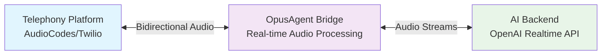
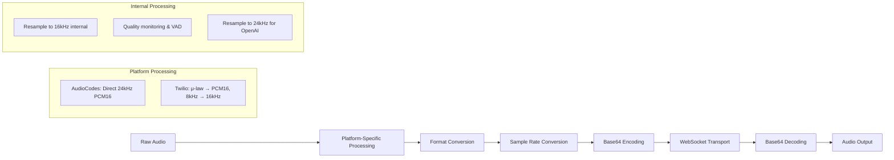

# Real-Time Audio Streaming in OpusAgent

## Overview

OpusAgent's real-time audio streaming system enables low-latency, bidirectional voice communication between telephony platforms and AI backends. This document provides a comprehensive guide to understanding, implementing, and optimizing real-time audio streaming in OpusAgent applications.

## Architecture

### Core Components



### Audio Flow

1. **User Speech** → Telephony Platform → OpusAgent Bridge → AI Backend
2. **AI Response** → AI Backend → OpusAgent Bridge → Telephony Platform → User

## Audio Specifications

### Supported Formats

| Platform | Input Format | Output Format | Sample Rate | Channels | Encoding |
|----------|--------------|---------------|-------------|----------|----------|
| **AudioCodes VAIC** | PCM16 | PCM16 | 24kHz (preferred) / 16kHz | Mono | Base64 |
| **Twilio Media Streams** | μ-law | μ-law | 8kHz | Mono | Base64 |
| **OpenAI Realtime** | PCM16 | PCM16 | 24kHz | Mono | Base64 |
| **Internal Processing** | PCM16 | PCM16 | 16kHz | Mono | Base64 |

### Audio Chunk Requirements

- **AudioCodes**: Variable chunk sizes (typically 3200+ bytes for 16kHz, larger for 24kHz)
- **Twilio**: 160 bytes per chunk (20ms at 8kHz μ-law)
- **OpenAI**: 24kHz PCM16 chunks (variable size based on audio content)
- **Encoding**: Base64 for WebSocket transport
- **Note**: No automatic padding implemented - chunks are sent as received

### Quality Parameters

```python
# AudioCodes VAIC Configuration
AUDIOCODES_CONFIG = {
    "sample_rate": 24000,  # Preferred 24kHz, falls back to 16kHz
    "channels": 1,
    "bit_depth": 16,
    "format": "PCM16",
    "chunk_duration_ms": 100,
    "min_chunk_bytes": 3200
}

# Twilio Media Streams Configuration
TWILIO_CONFIG = {
    "sample_rate": 8000,
    "channels": 1,
    "format": "mulaw",
    "chunk_duration_ms": 20,
    "chunk_bytes": 160
}

# OpenAI Realtime Configuration
OPENAI_CONFIG = {
    "sample_rate": 24000,
    "channels": 1,
    "format": "PCM16",
    "chunk_duration_ms": 100
}
```

## Implementation Details

### Bridge Architecture

The core streaming functionality is implemented in the bridge classes:

```python
class BaseRealtimeBridge:
    def __init__(self, platform_websocket, realtime_websocket, session_config):
        self.platform_websocket = platform_websocket
        self.realtime_websocket = realtime_websocket
        self.session_config = session_config
        self.conversation_id = None
        self.media_format = None
        
        # Initialize handlers
        self.audio_handler = AudioStreamHandler(
            platform_websocket=platform_websocket,
            realtime_websocket=realtime_websocket,
            call_recorder=self.call_recorder,
            enable_quality_monitoring=True,
            quality_thresholds=quality_thresholds,
            bridge_type=bridge_type,
        )
        
        self.session_manager = SessionManager(realtime_websocket, session_config)
        self.event_router = EventRouter()
        
    async def handle_audio_data(self, data: Dict[str, Any]):
        """Handle audio data from platform - implemented by subclasses"""
        pass
        
    async def handle_audio_commit(self):
        """Handle committing audio buffer and triggering response"""
        await self.audio_handler.commit_audio_buffer()
        
        if not self.realtime_handler.response_active:
            await self.session_manager.create_response()
```

### Audio Processing Pipeline



### Audio Quality Monitoring

The system includes real-time audio quality analysis through the `AudioQualityMonitor` class:

```python
# Quality monitoring is enabled in AudioStreamHandler
quality_thresholds = QualityThresholds(
    min_snr_db=20.0,  # Minimum signal-to-noise ratio
    max_thd_percent=1.0,  # Maximum total harmonic distortion
    max_clipping_percent=0.1,  # Maximum acceptable clipping
    min_quality_score=60.0,  # Minimum overall quality score
)

# Audio quality is analyzed for each incoming chunk
if self.enable_quality_monitoring and self.quality_monitor:
    quality_metrics = self.quality_monitor.analyze_audio_chunk(audio_bytes)
    logger.debug(f"Audio quality - SNR: {quality_metrics.snr_db:.1f}dB, "
                f"THD: {quality_metrics.thd_percent:.2f}%, "
                f"Clipping: {quality_metrics.clipping_percent:.2f}%, "
                f"Score: {quality_metrics.quality_score:.1f}")
```

## Platform-Specific Implementations

### AudioCodes VAIC Bridge

```python
class AudioCodesBridge(BaseRealtimeBridge):
    async def handle_session_start(self, message: dict):
        """Handle start of user audio stream"""
        conversation_id = message.get("conversationId")
        supported_formats = message.get("supportedMediaFormats", ["raw/lpcm16"])
        
        # Prefer 24kHz format if available (AudioCodes supports it natively)
        if "raw/lpcm16_24" in supported_formats:
            self.media_format = "raw/lpcm16_24"
            logger.info("Using 24kHz PCM16 format for optimal audio quality")
        else:
            self.media_format = supported_formats[0]
            logger.info(f"Using media format: {self.media_format}")
    
    async def handle_audio_data(self, message: dict):
        """Process AudioCodes audio chunks"""
        # Delegate to audio handler for processing
        await self.audio_handler.handle_incoming_audio(message)
        
    async def handle_outgoing_audio_audiocodes(self, response_dict: Dict[str, Any]):
        """Send audio to AudioCodes - no resampling needed for 24kHz"""
        audio_delta = ResponseAudioDeltaEvent(**response_dict)
        
        # Send audio directly to AudioCodes (supports 24kHz natively)
        stream_chunk = PlayStreamChunkMessage(
            type=TelephonyEventType.PLAY_STREAM_CHUNK,
            conversationId=self.conversation_id,
            streamId=self.audio_handler.active_stream_id,
            audioChunk=audio_delta.delta,  # Send original 24kHz audio
            participant="caller",
        )
        await self.platform_websocket.send_json(stream_chunk.model_dump())
```

### Twilio Media Streams Bridge

```python
class TwilioBridge(BaseRealtimeBridge):
    async def handle_audio_data(self, data: dict):
        """Process Twilio media chunks"""
        try:
            media_msg = MediaMessage(**data)
            audio_payload = media_msg.media.payload
            mulaw_bytes = base64.b64decode(audio_payload)
            
            # Buffer audio chunks
            self.audio_buffer.append(mulaw_bytes)
            if len(self.audio_buffer) >= 2:  # ~40ms
                combined = b"".join(self.audio_buffer)
                pcm16 = self._convert_mulaw_to_pcm16(combined)
                b64_pcm = base64.b64encode(pcm16).decode()
                
                # Send to OpenAI (will be resampled to 24kHz by AudioStreamHandler)
                await self.realtime_websocket.send(
                    InputAudioBufferAppendEvent(
                        type="input_audio_buffer.append", audio=b64_pcm
                    ).model_dump_json()
                )
                self.audio_buffer.clear()
        except Exception as e:
            logger.error(f"Error handling Twilio media: {e}")

    async def send_audio_to_twilio(self, pcm16_data: bytes):
        """Send audio to Twilio with resampling and format conversion"""
        # Resample from 24kHz to 8kHz
        resampled_pcm16 = self._resample_audio(pcm16_data, 24000, 8000)
        
        # Convert to μ-law
        mulaw = self._convert_pcm16_to_mulaw(resampled_pcm16)
        
        # Send in 20ms chunks (160 bytes at 8kHz)
        chunk_size = 160
        for i in range(0, len(mulaw), chunk_size):
            chunk = mulaw[i : i + chunk_size]
            if len(chunk) < chunk_size:
                # Pad with μ-law silence (0x80)
                chunk += b"\x80" * (chunk_size - len(chunk))
            
            payload_b64 = base64.b64encode(chunk).decode()
            await self.send_platform_json(
                OutgoingMediaMessage(
                    event=TwilioEventType.MEDIA,
                    streamSid=self.stream_sid,
                    media=OutgoingMediaPayload(payload=payload_b64),
                ).model_dump()
            )
```

## Performance Optimization

### Latency Optimization

1. **Minimal Processing**: Audio processing is optimized to minimize latency
2. **Direct Forwarding**: AudioCodes uses direct 24kHz streaming without resampling
3. **Efficient Buffering**: Twilio uses small buffers (~40ms) to reduce latency
4. **Async Processing**: All audio operations use async/await for non-blocking execution

### Memory Management

```python
# AudioStreamHandler manages audio processing efficiently
class AudioStreamHandler:
    def __init__(self, platform_websocket, realtime_websocket, call_recorder=None):
        self.audio_chunks_sent = 0
        self.total_audio_bytes_sent = 0
        self.internal_sample_rate = 16000  # Internal processing rate
        
    async def handle_incoming_audio(self, data: Dict[str, Any]):
        """Process incoming audio with quality monitoring"""
        # Resample to internal rate (16kHz) for processing
        # Then resample to OpenAI rate (24kHz) for transmission
        # Quality monitoring and VAD processing at internal rate
```

### Buffer Management

The system uses platform-specific buffering strategies:

- **AudioCodes**: Large chunks processed directly
- **Twilio**: Small buffers (2 chunks ~40ms) for optimal latency
- **Quality Monitoring**: Enabled for AudioCodes, not for Twilio (bypasses AudioStreamHandler)

## Error Handling and Recovery

### Connection Failures

```python
# Basic error handling in bridges
async def receive_from_platform(self):
    """Receive and process data from the platform WebSocket."""
    try:
        async for message in self.platform_websocket.iter_text():
            if self._closed:
                break
            data = json.loads(message)
            await self.event_router.handle_platform_event(data)
    except Exception as e:
        logger.error(f"Error in receive_from_platform: {e}")
        await self.close()

async def close(self):
    """Safely close both WebSocket connections."""
    if not self._closed:
        self._closed = True
        
        # Stop and finalize call recording
        if self.call_recorder:
            try:
                await self.call_recorder.stop_recording()
                summary = self.call_recorder.get_recording_summary()
                logger.info(f"Call recording finalized: {summary}")
            except Exception as e:
                logger.error(f"Error finalizing call recording: {e}")
        
        # Close connections
        try:
            if self.platform_websocket and not self._is_websocket_closed():
                await self.platform_websocket.close()
        except Exception as e:
            logger.error(f"Error closing platform connection: {e}")
```

### Audio Quality Issues

The `AudioQualityMonitor` provides real-time quality analysis:

```python
class AudioQualityMonitor:
    def analyze_audio_chunk(self, audio_bytes: bytes) -> QualityMetrics:
        """Analyze audio quality for a single chunk."""
        # Calculate SNR, THD, clipping percentage, and quality score
        # Log warnings for quality issues
        # Trigger callbacks for quality alerts
        
    def _check_quality_alerts(self, metrics: QualityMetrics):
        """Check for quality alerts and trigger callbacks."""
        if metrics.snr_db < self.thresholds.min_snr_db:
            logger.warning(f"Low SNR detected: {metrics.snr_db:.1f} dB")
        
        if metrics.clipping_percent > self.thresholds.max_clipping_percent:
            logger.warning(f"Audio clipping detected: {metrics.clipping_percent:.2f}%")
```

## Testing and Validation

### Audio Streaming Tests

The codebase includes comprehensive tests for audio streaming functionality:

```python
# Example test structure from tests/opusagent/bridges/
class TestAudioCodesBridge:
    async def test_handle_audio_data(self):
        """Test basic audio streaming functionality"""
        bridge = AudioCodesBridge(mock_telephony_ws, mock_realtime_ws)
        
        # Test audio data handling
        test_data = {"audioChunk": base64.b64encode(b'\x00' * 3200).decode('utf-8')}
        await bridge.handle_audio_data(test_data)
        
        # Verify audio was processed by AudioStreamHandler
        assert bridge.audio_handler.audio_chunks_sent > 0

class TestTwilioBridge:
    async def test_handle_audio_data(self):
        """Test Twilio media message handling"""
        bridge = TwilioBridge(mock_telephony_ws, mock_realtime_ws)
        
        # Test media message processing
        test_data = {
            "event": "media",
            "media": {"payload": base64.b64encode(b'\x00' * 160).decode()}
        }
        await bridge.handle_audio_data(test_data)
        
        # Verify audio buffering
        assert len(bridge.audio_buffer) == 1
```

### Performance Benchmarks

Performance testing is conducted through validation scripts:

- **Latency Analysis**: `scripts/latency_analyzer.py` parses logs to calculate conversation turn latencies
- **Audio Quality**: Quality monitoring provides real-time metrics during operation
- **Integration Tests**: Validation scripts test end-to-end audio flow with real platforms

## Configuration and Tuning

### Environment Variables

```bash
# Audio streaming configuration (from opusagent/config/constants.py)
DEFAULT_SAMPLE_RATE=16000
DEFAULT_CHANNELS=1
DEFAULT_BITS_PER_SAMPLE=16
DEFAULT_AUDIO_CHUNK_SIZE=3200
DEFAULT_AUDIO_CHUNK_SIZE_LARGE=32000

# Quality monitoring
AUDIO_QUALITY_MONITORING=true
LATENCY_ALERT_THRESHOLD=500
CHUNK_SIZE_ALERT_THRESHOLD=3000

# VAD configuration
VAD_ENABLED=true
SPEECH_START_THRESHOLD=2
SPEECH_STOP_THRESHOLD=3
```

### Bridge Configuration

```python
# AudioCodes bridge configuration (from actual implementation)
AUDIOCODES_BRIDGE_CONFIG = {
    "bridge_type": "audiocodes",
    "vad_enabled": True,
    "media_format": "raw/lpcm16_24",  # Prefer 24kHz
    "quality_monitoring": True,
    "quality_thresholds": QualityThresholds(
        min_snr_db=20.0,
        max_thd_percent=1.0,
        max_clipping_percent=0.1,
        min_quality_score=60.0,
    )
}

# Twilio bridge configuration
TWILIO_BRIDGE_CONFIG = {
    "bridge_type": "twilio",
    "vad_enabled": True,
    "media_format": "mulaw",
    "sample_rate": 8000,
    "chunk_size": 160,  # 20ms at 8kHz
    "buffer_size": 2,   # ~40ms buffer
}
```

## Best Practices

### 1. Audio Quality
- Use 24kHz PCM16 for AudioCodes when available for optimal quality
- Ensure proper μ-law to PCM16 conversion for Twilio (8kHz → 16kHz → 24kHz)
- Monitor audio quality using the built-in `AudioQualityMonitor`
- Handle audio format conversions efficiently with proper resampling

### 2. Performance
- AudioCodes: Use direct 24kHz streaming to avoid resampling overhead
- Twilio: Use small buffers (~40ms) for optimal latency
- Implement async/await for all audio operations
- Monitor quality metrics in real-time for performance issues

### 3. Reliability
- Implement proper error handling in WebSocket message loops
- Use try/except blocks around audio processing operations
- Log detailed metrics for debugging audio issues
- Handle connection failures gracefully with proper cleanup

### 4. Platform-Specific Considerations
- **AudioCodes**: Prefers 24kHz PCM16, supports direct streaming
- **Twilio**: Requires 8kHz μ-law, needs format conversion and resampling
- **Quality Monitoring**: Available for AudioCodes via AudioStreamHandler, not for Twilio
- **VAD**: Enabled by default, can be disabled via configuration

## Troubleshooting

### Common Issues

1. **High Latency**
   - Check network connectivity between platform and OpenAI API
   - Verify audio chunk sizes are appropriate for the platform
   - Monitor audio processing overhead in AudioStreamHandler
   - Review WebSocket connection stability and ping/pong intervals

2. **Audio Quality Issues**
   - Validate audio format compliance (PCM16 for AudioCodes, μ-law for Twilio)
   - Check sample rate conversions (8kHz → 16kHz → 24kHz for Twilio)
   - Monitor quality metrics from AudioQualityMonitor
   - Verify base64 encoding/decoding is working correctly

3. **Connection Failures**
   - Check WebSocket connection health and authentication
   - Verify API keys and authentication tokens
   - Review firewall and network configuration
   - Monitor connection logs for timeout or disconnection events

4. **Platform-Specific Issues**
   - **AudioCodes**: Ensure 24kHz format is supported if using high-quality mode
   - **Twilio**: Verify μ-law conversion and 8kHz sample rate compliance
   - **Quality Monitoring**: Only available for AudioCodes (Twilio bypasses AudioStreamHandler)

### Debug Tools

```python
# Enable debug logging for audio processing
import logging
logging.getLogger("opusagent.audio_stream_handler").setLevel(logging.DEBUG)
logging.getLogger("opusagent.bridges").setLevel(logging.DEBUG)

# Monitor audio quality metrics
if bridge.audio_handler.quality_monitor:
    summary = bridge.audio_handler.quality_monitor.get_quality_summary()
    print(f"Audio quality summary: {summary}")

# Check audio statistics
stats = bridge.audio_handler.get_audio_stats()
print(f"Audio stats: {stats}")
```

## Future Enhancements

### Planned Features

1. **Enhanced Audio Processing**: Improved resampling algorithms and format conversion efficiency
2. **Unified Quality Monitoring**: Extend quality monitoring to all platforms including Twilio
3. **Advanced VAD Integration**: Better speech detection and activity management
4. **Performance Optimization**: Further latency reduction and throughput improvements
5. **Comprehensive Testing**: Additional validation scripts and performance benchmarks

### Research Areas

- **Audio Format Optimization**: Investigation of more efficient audio codecs and compression
- **Real-time Analytics**: Advanced streaming analytics and monitoring capabilities
- **Cross-platform Standardization**: Unified audio processing pipeline across all platforms
- **Quality of Service**: Advanced QoS mechanisms for audio streaming

## Conclusion

Real-time audio streaming is a critical component of OpusAgent's voice interaction capabilities. The current implementation provides:

- **AudioCodes Integration**: Direct 24kHz PCM16 streaming for optimal quality
- **Twilio Integration**: Efficient μ-law to PCM16 conversion with proper resampling
- **Quality Monitoring**: Real-time audio quality analysis for AudioCodes platform
- **VAD Support**: Voice Activity Detection for improved conversation flow
- **Comprehensive Testing**: Validation scripts and unit tests for reliability

The system handles the complexities of different audio formats, sample rates, and platform requirements while maintaining low latency and high quality. Platform-specific optimizations ensure optimal performance for each telephony provider.

For more information on specific platform integrations, see:
- [AudioCodes Bridge Documentation](audiocodes_message_models.md)
- [Twilio Bridge Documentation](README_twilio_integration.md)
- [Call Flow Documentation](callflow.md)
- [Telephony Bridge Documentation](telephony_realtime_bridge.md) 