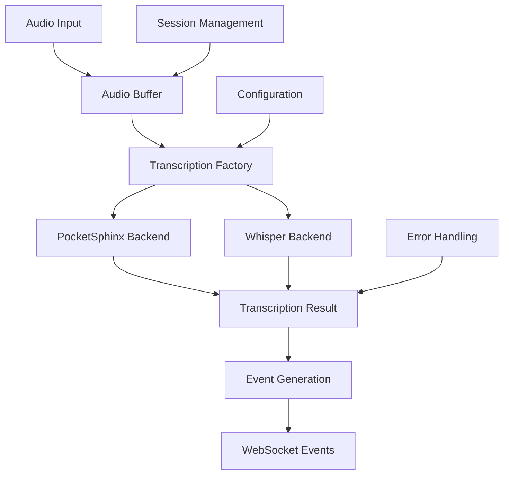

# Transcription Implementation

## Overview

The transcription system in OpusAgent provides real-time audio-to-text conversion capabilities with support for multiple backends. It features a modular, extensible architecture that integrates seamlessly with the LocalRealtimeClient to simulate OpenAI's Realtime API transcription behavior.

## Architecture

### Core Components



### Component Hierarchy

1. **BaseTranscriber** - Abstract interface for all transcription backends
2. **PocketSphinxTranscriber** - Lightweight, offline transcription
3. **WhisperTranscriber** - High-accuracy transcription using OpenAI Whisper
4. **TranscriptionFactory** - Factory pattern for creating transcriber instances
5. **TranscriptionConfig** - Configuration management with validation
6. **EventHandlerManager** - Integration with LocalRealtimeClient

## Implementation Details

### BaseTranscriber Interface

```python
class BaseTranscriber(ABC):
    def __init__(self, config: TranscriptionConfig):
        self.config = config
        self.logger = logging.getLogger(f"{__name__}.{self.__class__.__name__}")
        self._initialized = False
        self._audio_buffer = []
        self._session_active = False

    @abstractmethod
    async def initialize(self) -> bool:
        """Initialize the transcription backend."""
        pass

    @abstractmethod
    async def transcribe_chunk(self, audio_data: bytes) -> TranscriptionResult:
        """Transcribe a chunk of audio data."""
        pass

    @abstractmethod
    async def finalize(self) -> TranscriptionResult:
        """Complete transcription and return final result."""
        pass

    @abstractmethod
    async def cleanup(self) -> None:
        """Clean up resources."""
        pass
```

### PocketSphinx Implementation

The PocketSphinx backend provides lightweight, offline transcription:

#### Key Features

```python
class PocketSphinxTranscriber(BaseTranscriber):
    def __init__(self, config: TranscriptionConfig):
        super().__init__(config)
        self._decoder = None
        self._accumulated_text = ""
        
        # PocketSphinx-specific optimizations
        self.pocketsphinx_audio_preprocessing = "normalize"
        self.pocketsphinx_vad_settings = "conservative"
        self.pocketsphinx_auto_resample = True
        self.pocketsphinx_input_sample_rate = 24000
```

#### Audio Processing Pipeline

```python
async def transcribe_chunk(self, audio_data: bytes) -> TranscriptionResult:
    # Auto-resample if needed
    if self.config.pocketsphinx_auto_resample and self.config.pocketsphinx_input_sample_rate != 16000:
        audio_data = self._resample_audio_for_pocketsphinx(
            audio_data, 
            self.config.pocketsphinx_input_sample_rate, 
            16000
        )
    
    # Convert to numpy array
    audio_array = self._convert_audio_for_processing(audio_data)
    
    # Apply preprocessing
    audio_array = self._apply_audio_preprocessing(audio_array)
    
    # Process with PocketSphinx
    self._decoder.process_raw(audio_array.tobytes(), False, False)
    hypothesis = self._decoder.hypothesis()
    
    return TranscriptionResult(
        text=hypothesis,
        confidence=1.0,  # PocketSphinx doesn't provide confidence
        is_final=False
    )
```

#### Optimization Features

- **Audio Preprocessing**: Normalize, amplify, noise reduction, silence trimming
- **Auto-resampling**: Automatic conversion to 16kHz for optimal performance
- **VAD Integration**: Conservative speech detection settings
- **Chunked Processing**: Efficient handling of variable-length audio

### Whisper Implementation

The Whisper backend provides high-accuracy transcription:

#### Key Features

```python
class WhisperTranscriber(BaseTranscriber):
    def __init__(self, config: TranscriptionConfig):
        super().__init__(config)
        self._model = None
        self._temp_dir = None
        self._accumulated_text = ""
        self._last_segment_end = 0.0
```

#### Model Loading

```python
async def initialize(self) -> bool:
    try:
        import openai_whisper as whisper
        
        model_name = self.config.model_size  # tiny, base, small, medium, large
        self._model = whisper.load_model(model_name, device=self.config.device)
        
        self._temp_dir = tempfile.mkdtemp(prefix="whisper_transcription_")
        self._initialized = True
        
        return True
    except ImportError:
        self.logger.error("Whisper not available. Install with: pip install openai-whisper")
        return False
```

#### Chunked Processing

```python
async def transcribe_chunk(self, audio_data: bytes) -> TranscriptionResult:
    # Convert and buffer audio
    audio_array = self._convert_audio_for_processing(audio_data)
    self._audio_buffer.extend(audio_array)
    
    # Process when buffer is large enough
    chunk_samples = int(self.config.sample_rate * self.config.chunk_duration * 2)
    if len(self._audio_buffer) >= chunk_samples:
        chunk_data = np.array(self._audio_buffer[:chunk_samples])
        overlap_samples = int(chunk_samples * 0.1)
        self._audio_buffer = self._audio_buffer[chunk_samples - overlap_samples:]
        
        # Transcribe with Whisper
        result = await asyncio.get_event_loop().run_in_executor(
            None, self._transcribe_with_whisper, chunk_data
        )
        return result
```

#### Advanced Features

- **Multiple Model Sizes**: tiny, base, small, medium, large
- **GPU Acceleration**: CUDA support for faster processing
- **Word Timestamps**: Detailed timing information
- **Language Detection**: Automatic language identification
- **Temperature Control**: Adjustable randomness in transcription

### Configuration Management

#### TranscriptionConfig Model

```python
class TranscriptionConfig(BaseModel):
    backend: str = Field(default="pocketsphinx")
    language: str = "en"
    model_size: str = "base"  # For Whisper
    chunk_duration: float = Field(default=1.0, gt=0.0)
    confidence_threshold: float = Field(default=0.5, ge=0.0, le=1.0)
    sample_rate: int = Field(default=16000, gt=0)
    enable_vad: bool = True
    device: str = Field(default="cpu", pattern=r"^(cpu|cuda)$")
    
    # PocketSphinx specific
    pocketsphinx_hmm: Optional[str] = None
    pocketsphinx_lm: Optional[str] = None
    pocketsphinx_dict: Optional[str] = None
    pocketsphinx_audio_preprocessing: str = Field(
        default="normalize", 
        pattern=r"^(none|normalize|amplify|noise_reduction|silence_trim)$"
    )
    pocketsphinx_vad_settings: str = Field(
        default="conservative", 
        pattern=r"^(default|aggressive|conservative)$"
    )
    pocketsphinx_auto_resample: bool = True
    pocketsphinx_input_sample_rate: int = Field(default=24000, gt=0)
    
    # Whisper specific
    whisper_model_dir: Optional[str] = None
    whisper_temperature: float = Field(default=0.0, ge=0.0, le=1.0)
```

#### Environment Variables

| Variable | Default | Description |
|----------|---------|-------------|
| `TRANSCRIPTION_BACKEND` | `pocketsphinx` | Backend to use (pocketsphinx/whisper) |
| `TRANSCRIPTION_LANGUAGE` | `en` | Language code |
| `WHISPER_MODEL_SIZE` | `base` | Whisper model size |
| `TRANSCRIPTION_CHUNK_DURATION` | `1.0` | Audio chunk duration in seconds |
| `TRANSCRIPTION_CONFIDENCE_THRESHOLD` | `0.5` | Minimum confidence threshold |
| `TRANSCRIPTION_SAMPLE_RATE` | `16000` | Audio sample rate |
| `TRANSCRIPTION_ENABLE_VAD` | `true` | Enable VAD integration |
| `WHISPER_DEVICE` | `cpu` | Processing device (cpu/cuda) |
| `POCKETSPHINX_AUDIO_PREPROCESSING` | `normalize` | Audio preprocessing type |
| `POCKETSPHINX_VAD_SETTINGS` | `conservative` | VAD sensitivity |
| `POCKETSPHINX_AUTO_RESAMPLE` | `true` | Auto-resample audio |
| `WHISPER_TEMPERATURE` | `0.0` | Whisper temperature setting |

### Factory Pattern

```python
class TranscriptionFactory:
    @staticmethod
    def create_transcriber(config: Union[Dict[str, Any], TranscriptionConfig]):
        if isinstance(config, dict):
            config = TranscriptionConfig(**config)
        
        backend = config.backend.lower()
        if backend == "pocketsphinx":
            return PocketSphinxTranscriber(config)
        elif backend == "whisper":
            return WhisperTranscriber(config)
        else:
            raise ValueError(f"Unsupported transcription backend: {backend}")

    @staticmethod
    def get_available_backends() -> List[str]:
        available = []
        try:
            import pocketsphinx
            available.append("pocketsphinx")
        except ImportError:
            pass
        available.append("whisper")
        return available
```

## Integration with LocalRealtimeClient

### Client Integration

```python
class LocalRealtimeClient:
    def __init__(self, enable_transcription: Optional[bool] = None, 
                 transcription_config: Optional[Dict[str, Any]] = None):
        # Initialize transcription
        self._initialize_transcription(enable_transcription)
        
    def _initialize_transcription(self, enable_transcription: Optional[bool] = None):
        # Determine if transcription should be enabled
        if enable_transcription is None:
            input_transcription = self.session_config.input_audio_transcription
            if input_transcription and input_transcription.get("model"):
                self._transcription_enabled = True
            else:
                self._transcription_enabled = False
        else:
            self._transcription_enabled = enable_transcription

        if self._transcription_enabled:
            # Load configuration and create transcriber
            transcription_config = load_transcription_config()
            transcription_config = transcription_config.__class__(
                **{**transcription_config.__dict__, **self._transcription_config}
            )
            
            self._transcriber = TranscriptionFactory.create_transcriber(transcription_config)
```

### Event Handler Integration

```python
class EventHandlerManager:
    async def _transcribe_audio_buffer(self, item_id: str) -> None:
        """Process audio buffer through transcription."""
        try:
            # Combine audio chunks
            combined_audio = b"".join(self._session_state["audio_buffer"])
            
            if not combined_audio:
                return

            # Start transcription session
            self._transcriber.start_session()

            # Process audio in chunks
            chunk_size = DEFAULT_AUDIO_CHUNK_SIZE
            accumulated_text = ""

            for i in range(0, len(combined_audio), chunk_size):
                chunk = combined_audio[i : i + chunk_size]
                
                # Transcribe chunk
                result = await self._transcriber.transcribe_chunk(chunk)
                
                if result.error:
                    await self._send_transcription_failed_event(item_id, result.error)
                    return

                # Send delta event if there's new text
                if result.text and result.text.strip():
                    await self._send_transcription_delta_event(
                        item_id, result.text, result.confidence
                    )
                    accumulated_text += result.text

            # Finalize transcription
            final_result = await self._transcriber.finalize()
            
            if final_result.error:
                await self._send_transcription_failed_event(item_id, final_result.error)
                return

            # Send completion event
            final_text = final_result.text if final_result.text else accumulated_text
            await self._send_transcription_completed_event(
                item_id, final_text, final_result.confidence
            )

            # End transcription session
            self._transcriber.end_session()

        except Exception as e:
            await self._send_transcription_failed_event(item_id, str(e))
```

### Event Generation

The system generates several transcription-related events:

```python
async def _send_transcription_delta_event(self, item_id: str, text: str, confidence: float):
    """Send transcription delta event."""
    event = {
        "type": ServerEventType.CONVERSATION_ITEM_INPUT_AUDIO_TRANSCRIPTION_DELTA,
        "item_id": item_id,
        "content_index": 0,
        "delta": text,
    }
    await self._send_event(event)

async def _send_transcription_completed_event(self, item_id: str, text: str, confidence: float):
    """Send transcription completion event."""
    event = {
        "type": ServerEventType.CONVERSATION_ITEM_INPUT_AUDIO_TRANSCRIPTION_COMPLETED,
        "item_id": item_id,
        "content_index": 0,
        "transcript": text,
        "confidence": confidence,
    }
    await self._send_event(event)

async def _send_transcription_failed_event(self, item_id: str, error: str):
    """Send transcription failure event."""
    event = {
        "type": ServerEventType.CONVERSATION_ITEM_INPUT_AUDIO_TRANSCRIPTION_FAILED,
        "item_id": item_id,
        "content_index": 0,
        "error": {"message": error},
    }
    await self._send_event(event)
```

## Usage Examples

### Basic Transcription Usage

```python
from opusagent.local.transcription import TranscriptionFactory, load_transcription_config

# Load configuration
config = load_transcription_config()

# Create transcriber
transcriber = TranscriptionFactory.create_transcriber(config)

# Initialize
await transcriber.initialize()

# Start session
transcriber.start_session()

# Process audio chunks
audio_data = b"..."  # Your audio data
result = await transcriber.transcribe_chunk(audio_data)
print(f"Transcribed: {result.text}")

# Finalize
final_result = await transcriber.finalize()
print(f"Final result: {final_result.text}")

# Cleanup
transcriber.end_session()
await transcriber.cleanup()
```

### LocalRealtimeClient Integration

```python
from opusagent.local.realtime import LocalRealtimeClient
from opusagent.models.openai_api import SessionConfig

# Configure session with transcription
session_config = SessionConfig(
    model="gpt-4o-realtime-preview-2025-06-03",
    modalities=["text", "audio"],
    voice="alloy",
    input_audio_transcription={"model": "whisper-1"}  # Enable transcription
)

# Configure transcription backend
transcription_config = {
    "backend": "whisper",
    "model_size": "base",
    "language": "en",
    "device": "cpu",
    "confidence_threshold": 0.6,
    "chunk_duration": 2.0
}

# Create client with transcription
client = LocalRealtimeClient(
    session_config=session_config,
    enable_transcription=True,
    transcription_config=transcription_config
)

# Connect and use
await client.connect("ws://localhost:8080")

# Transcription events will be automatically generated
```

### Runtime Control

```python
# Enable transcription during runtime
client.enable_transcription({
    "backend": "pocketsphinx",
    "chunk_duration": 1.0
})

# Disable transcription
client.disable_transcription()

# Get transcription state
state = client.get_transcription_state()
print(f"Transcription enabled: {state['enabled']}")
print(f"Backend: {state['backend']}")
```

## Testing and Validation

### Validation Scripts

The codebase includes comprehensive validation tools:

```bash
# Run complete transcription validation
python scripts/validate_transcription_capability.py

# Test specific backend
python scripts/validate_transcription_capability.py --backend pocketsphinx

# Test with audio file
python scripts/validate_transcription_capability.py --audio-file path/to/audio.wav

# Generate test audio and run validation
python scripts/validate_transcription_capability.py --generate-test-audio

# Realtime transcription validation
python scripts/validate_realtime_transcription.py --backend whisper --verbose
```

### Test Categories

1. **Backend Availability** - Check if backends are properly installed
2. **Configuration Loading** - Validate configuration parsing
3. **Transcriber Initialization** - Test backend setup
4. **Audio Conversion** - Validate audio format processing
5. **Chunk Transcription** - Test real-time chunk processing
6. **Client Integration** - Test LocalRealtimeClient integration
7. **Event Generation** - Validate WebSocket event generation
8. **Error Handling** - Test error scenarios and fallbacks
9. **Performance** - Measure processing time and resource usage

### Validation Results

```json
{
  "timestamp": "2024-12-19T14:30:15",
  "tests": [
    {
      "name": "Backend Availability: pocketsphinx",
      "passed": true,
      "details": "Backend pocketsphinx is available",
      "timestamp": "2024-12-19T14:30:01"
    },
    {
      "name": "Transcriber Initialization: pocketsphinx",
      "passed": true,
      "details": "Successfully initialized pocketsphinx transcriber",
      "timestamp": "2024-12-19T14:30:02"
    }
  ],
  "summary": {
    "total_tests": 6,
    "passed": 6,
    "failed": 0,
    "success_rate": 100.0
  }
}
```

## Performance Characteristics

### PocketSphinx Performance

- **Latency**: ~10-50ms per chunk
- **Memory Usage**: ~50-100MB
- **CPU Usage**: Low to moderate
- **Accuracy**: Good for clear speech, moderate for noisy environments
- **Offline**: Yes, no internet required

### Whisper Performance

- **Latency**: ~100-500ms per chunk (depending on model size)
- **Memory Usage**: ~500MB-2GB (depending on model size)
- **CPU Usage**: High (GPU recommended)
- **Accuracy**: Excellent across various conditions
- **Offline**: Yes, after model download

### Optimization Tips

1. **Model Size Selection**: Use smaller models for lower latency
2. **Chunk Duration**: Balance between latency and accuracy
3. **Device Selection**: Use GPU for Whisper when available
4. **Audio Preprocessing**: Apply appropriate preprocessing for your environment
5. **Backend Selection**: Use PocketSphinx for real-time, Whisper for accuracy

## Troubleshooting

### Common Issues

1. **Import Errors**
   ```bash
   # Install PocketSphinx
   pip install pocketsphinx
   
   # Install Whisper
   pip install openai-whisper
   ```

2. **Audio Format Issues**
   ```python
   # Ensure audio is in correct format
   audio_data = to_float32_mono(raw_audio, sample_width=2, channels=1)
   ```

3. **Transcription Not Working**
   ```python
   # Check configuration
   config = load_transcription_config()
   print(f"Backend: {config.backend}")
   print(f"Sample rate: {config.sample_rate}")
   ```

4. **High Latency**
   ```python
   # Reduce chunk duration
   config.chunk_duration = 0.5  # Smaller chunks
   
   # Use smaller model
   config.model_size = "tiny"  # For Whisper
   ```

### Debug Mode

```python
import logging
logging.basicConfig(level=logging.DEBUG)

# Enable transcription debug logging
transcriber = TranscriptionFactory.create_transcriber(config)
result = await transcriber.transcribe_chunk(audio_data)
print(f"Transcription Debug: {result}")
```

## Future Enhancements

### Planned Features

1. **Additional Backends** - Support for more transcription engines
2. **Streaming Transcription** - Real-time streaming without chunking
3. **Multi-language Support** - Automatic language detection and switching
4. **Custom Models** - Support for fine-tuned models
5. **Advanced Audio Processing** - Noise reduction and echo cancellation
6. **Performance Profiling** - Detailed metrics and optimization tools

### Extension Points

The modular architecture allows easy extension:

```python
class CustomTranscriber(BaseTranscriber):
    def __init__(self, config: TranscriptionConfig):
        super().__init__(config)
        # Initialize your custom backend
    
    async def initialize(self) -> bool:
        # Initialize your transcription backend
        return True
    
    async def transcribe_chunk(self, audio_data: bytes) -> TranscriptionResult:
        # Implement your transcription logic
        return TranscriptionResult(
            text="transcribed text",
            confidence=0.9,
            is_final=False
        )
```

## Conclusion

The transcription implementation in OpusAgent provides a robust, configurable, and high-performance solution for real-time audio-to-text conversion. With its modular architecture, comprehensive testing, and seamless LocalRealtimeClient integration, it serves as a solid foundation for voice-enabled applications.

The system balances accuracy, latency, and resource usage while providing extensive configuration options and detailed monitoring capabilities. The validation framework ensures reliability and helps with troubleshooting and optimization. 