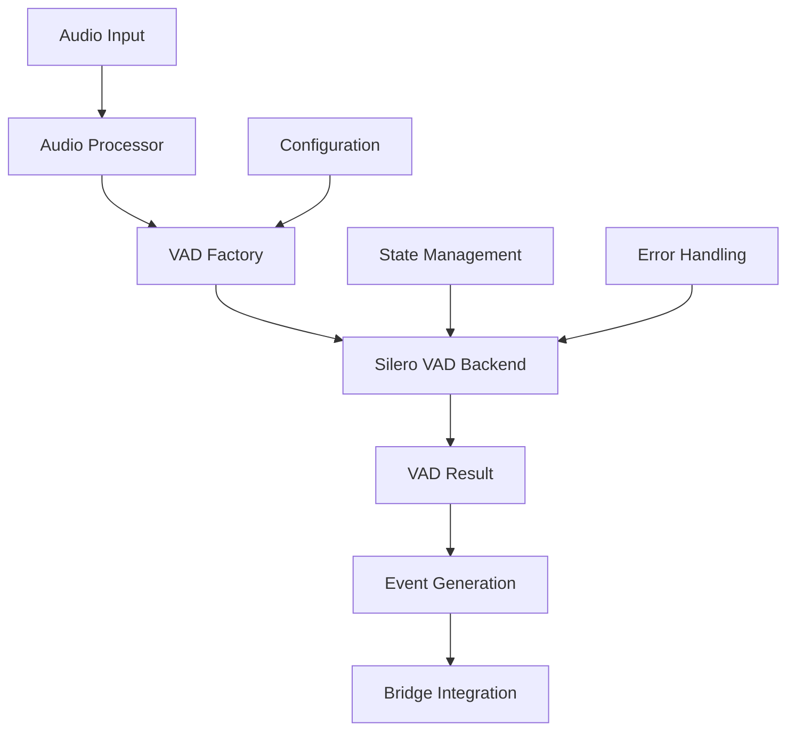

# Voice Activity Detection (VAD) Implementation

## Overview

The Voice Activity Detection (VAD) system in OpusAgent provides real-time speech detection capabilities for telephony and conversational AI applications. It features a modular, pluggable architecture with support for multiple backends, configurable thresholds, and seamless integration with the bridge system.

## Architecture

### Core Components



### Component Hierarchy

1. **BaseVAD** - Abstract interface for all VAD backends
2. **SileroVAD** - Primary implementation using Silero VAD model
3. **VADFactory** - Factory pattern for creating VAD instances
4. **AudioProcessor** - Audio format conversion utilities
5. **VADConfig** - Configuration management

## Implementation Details

### BaseVAD Interface

```python
class BaseVAD(ABC):
    @abstractmethod
    def initialize(self, config):
        """Initialize the VAD system with configuration."""
        pass
    
    @abstractmethod
    def process_audio(self, audio_data) -> dict:
        """Process audio data and return VAD results."""
        pass
    
    @abstractmethod
    def reset(self):
        """Reset VAD state."""
        pass
    
    @abstractmethod
    def cleanup(self):
        """Cleanup VAD resources."""
        pass
```

### SileroVAD Implementation

The primary VAD implementation uses the Silero VAD model, providing:

- **Real-time processing** with configurable chunk sizes
- **Enhanced state management** with speech start/stop detection
- **Hysteresis implementation** to prevent rapid state changes
- **Timeout handling** for long speech segments
- **Multi-format audio support** (8kHz and 16kHz)

#### Key Features

```python
class SileroVAD(BaseVAD):
    def __init__(self):
        self.model = None
        self.sample_rate = 16000
        self.threshold = 0.5
        self.silence_threshold = 0.6
        self.min_speech_duration_ms = 500
        self.force_stop_timeout_ms = 2000
        self.device = "cpu"
        self.chunk_size = 512
        
        # State tracking
        self._speech_start_time = None
        self._last_speech_time = None
        self._consecutive_speech_count = 0
        self._consecutive_silence_count = 0
```

#### Speech State Machine

The VAD implements a state machine:

1. **Idle** - No speech detected
2. **Started** - Speech just began (requires 2 consecutive detections)
3. **Active** - Speech is ongoing
4. **Stopped** - Speech ended (3 consecutive silence detections OR timeout)

Note: The hysteresis values (2 for start, 3 for stop) are hardcoded in the implementation and cannot be configured via environment variables.

#### Process Audio Method

```python
def process_audio(self, audio_data: np.ndarray) -> Dict[str, Any]:
    """
    Process audio data with enhanced state management.
    
    Returns:
        Dictionary containing:
        - speech_prob: Maximum speech probability (0.0 to 1.0)
        - is_speech: Boolean indicating speech detection
        - speech_state: Current state ('started', 'active', 'stopped', 'idle')
        - force_stop: Boolean indicating timeout-based stop
        - speech_duration_ms: Duration of current speech segment
        - consecutive_speech_count: Number of consecutive speech detections
        - consecutive_silence_count: Number of consecutive silence detections
    """
```

### Audio Processing

#### Format Conversion

The `audio_processor.py` module provides utilities for converting various audio formats:

```python
def to_float32_mono(audio_data, sample_width, channels):
    """
    Convert raw audio bytes to float32 mono numpy array (-1 to 1).
    Supports PCM16, PCM24, and float32 formats.
    """
```

**Supported Formats:**
- **PCM16 Mono** (16-bit, 1 channel)
- **PCM24 Mono** (24-bit, 1 channel) 
- **Float32 Mono** (32-bit float, 1 channel)

#### Automatic Chunking

The VAD automatically handles variable-length audio inputs:

```python
# Handle variable-length input by splitting into chunks
if len(audio_data) != self.chunk_size:
    chunks = []
    for i in range(0, len(audio_data), self.chunk_size):
        chunk = audio_data[i : i + self.chunk_size]
        if len(chunk) == self.chunk_size:
            chunks.append(chunk)
    
    # Process each chunk and aggregate results
    speech_probs = []
    for chunk in chunks:
        audio_tensor = torch.from_numpy(chunk).float()
        speech_prob = self.model(audio_tensor, self.sample_rate).item()
        speech_probs.append(speech_prob)
    
    # Use maximum probability as overall result
    max_speech_prob = max(speech_probs) if speech_probs else 0.0
```

## Configuration

### Environment Variables

| Variable | Default | Description |
|----------|---------|-------------|
| `VAD_BACKEND` | `silero` | VAD backend to use |
| `VAD_SAMPLE_RATE` | `16000` | Audio sample rate in Hz |
| `VAD_CONFIDENCE_THRESHOLD` | `0.5` | Speech detection threshold (0.0-1.0) |
| `VAD_SILENCE_THRESHOLD` | `0.6` | Silence detection threshold (0.0-1.0) |
| `VAD_MIN_SPEECH_DURATION_MS` | `500` | Minimum speech segment duration |
| `VAD_CONFIDENCE_HISTORY_SIZE` | `5` | Size of confidence history buffer (currently unused) |
| `VAD_DEVICE` | `cpu` | Device for inference (cpu/cuda) |
| `VAD_CHUNK_SIZE` | `512` | Audio chunk size for processing |
| `VAD_FORCE_STOP_TIMEOUT_MS` | `2000` | Force stop after timeout |

### Configuration Loading

```python
def load_vad_config():
    """Load VAD configuration from environment variables."""
    return {
        'backend': os.getenv('VAD_BACKEND', 'silero'),
        'sample_rate': int(os.getenv('VAD_SAMPLE_RATE', 16000)),
        'threshold': float(os.getenv('VAD_CONFIDENCE_THRESHOLD', 0.5)),
        'silence_threshold': float(os.getenv('VAD_SILENCE_THRESHOLD', 0.6)),
        'min_speech_duration_ms': int(os.getenv('VAD_MIN_SPEECH_DURATION_MS', 500)),
        'confidence_history_size': int(os.getenv('VAD_CONFIDENCE_HISTORY_SIZE', 5)),
        'device': os.getenv('VAD_DEVICE', 'cpu'),
        'chunk_size': int(os.getenv('VAD_CHUNK_SIZE', 512)),
        'force_stop_timeout_ms': int(os.getenv('VAD_FORCE_STOP_TIMEOUT_MS', 2000)),
    }
```

## Integration with Bridges

### Bridge Integration

VAD is integrated into the bridge system through the `AudioStreamHandler`:

```python
class AudioStreamHandler:
    def __init__(self, ...):
        # VAD integration
        vad_config = load_vad_config()
        self.vad = VADFactory.create_vad(vad_config)
        self.vad_enabled = vad_config.get('backend', 'silero') is not None
        self._speech_active = False
```

### VAD Event Processing

```python
async def handle_incoming_audio(self, data: Dict[str, Any]) -> None:
    # VAD processing (local)
    if self.vad_enabled and self.vad:
        try:
            audio_arr = to_float32_mono(audio_bytes, sample_width=2, channels=1)  # PCM16 Mono
            vad_result = self.vad.process_audio(audio_arr)
            is_speech = vad_result.get('is_speech', False)
            speech_prob = vad_result.get('speech_prob', 0.0)
            
            # Emit VAD events on state transitions
            if is_speech and not self._speech_active:
                # Speech started
                vad_event = UserStreamSpeechStartedResponse(...)
                await self.platform_websocket.send_json(vad_event.model_dump())
                self._speech_active = True
            elif not is_speech and self._speech_active:
                # Speech stopped
                vad_event = UserStreamSpeechStoppedResponse(...)
                await self.platform_websocket.send_json(vad_event.model_dump())
                self._speech_active = False
        except Exception as e:
            logger.warning(f"VAD processing error: {e}")
```

### VAD Events

The system generates several VAD-related events (AudioCodes-specific):

1. **`userStream.speech.started`** - Speech detection began
2. **`userStream.speech.stopped`** - Speech detection ended
3. **`userStream.speech.committed`** - Speech committed for processing

Note: VAD event handling is platform-specific. AudioCodes bridge forwards these events directly, while Twilio bridge handles VAD differently.

## Usage Examples

### Basic VAD Usage

```python
from opusagent.vad.vad_config import load_vad_config
from opusagent.vad.vad_factory import VADFactory

# Load configuration
config = load_vad_config()

# Create VAD instance
vad = VADFactory.create_vad(config)

# Process audio
audio_data = np.array([...], dtype=np.float32)  # Your audio data
result = vad.process_audio(audio_data)

print(f"Speech detected: {result['is_speech']}")
print(f"Speech probability: {result['speech_prob']:.3f}")
print(f"Speech state: {result['speech_state']}")
```

### Bridge Integration

```python
# VAD is automatically enabled in bridges
bridge = AudioCodesBridge(
    websocket, 
    connection.websocket, 
    session_config,
    vad_enabled=True  # Enable VAD
)

# VAD events are automatically processed and forwarded
```

### Local VAD Client

```python
from opusagent.local.local_vad_client import LocalVADClient

async with LocalVADClient(
    bridge_url="ws://localhost:8000/caller-agent",
    vad_sensitivity=0.05,
    vad_silence_duration=1.0
) as client:
    # VAD is automatically enabled
    await client.initiate_session()
    client.start_recording()  # Starts microphone with VAD
```

## Testing and Validation

### VAD Validation Scripts

The codebase includes comprehensive validation tools:

```bash
# Run complete VAD validation
python scripts/run_vad_validation.py

# Run specific VAD tests
python scripts/validate_vad_integration.py --category speech --verbose

# Test VAD configuration
python scripts/validate_vad_config.py

# Test Silero VAD with microphone
python scripts/test_silero_vad.py --duration 10 --sensitivity 0.5
```

### Test Categories

1. **Initialization Tests** - VAD setup and configuration
2. **Audio Processing Tests** - Format conversion and chunking
3. **Speech Detection Tests** - Speech start/stop detection
4. **Runtime Control Tests** - Enable/disable during runtime
5. **Performance Tests** - Latency and resource usage
6. **Error Handling Tests** - Exception handling and fallbacks

### Validation Results

The validation system provides detailed reporting:

```json
{
  "timestamp": "2024-12-19T14:30:15",
  "test_categories": {
    "initialization": {"passed": 5, "failed": 0},
    "audio_processing": {"passed": 3, "failed": 0},
    "speech_detection": {"passed": 5, "failed": 0}
  },
  "performance_metrics": {
    "average_latency_ms": 0.0034,
    "max_latency_ms": 0.0095
  },
  "summary": {
    "total_tests": 17,
    "passed": 17,
    "failed": 0,
    "success_rate": 100.0
  }
}
```

## Performance Characteristics

### Latency

- **Average processing latency**: ~3.4ms per audio chunk
- **Maximum processing latency**: ~9.5ms per audio chunk
- **Real-time capable**: Designed for sub-50ms total latency

### Resource Usage

- **Memory**: ~100-500MB (depending on model size)
- **CPU**: Moderate usage during processing
- **GPU**: Optional acceleration with CUDA support

### Optimization Tips

1. **Chunk Size Tuning**: Adjust `VAD_CHUNK_SIZE` for latency vs accuracy
2. **Threshold Tuning**: Fine-tune `VAD_CONFIDENCE_THRESHOLD` for your environment
3. **Device Selection**: Use GPU (`VAD_DEVICE=cuda`) for higher throughput
4. **Batch Processing**: Process multiple chunks together when possible

## Troubleshooting

### Common Issues

1. **Import Errors**
   ```bash
   # Install VAD dependencies
   pip install torch torchaudio silero-vad
   ```

2. **Audio Format Issues**
   ```python
   # Ensure audio is in correct format
   audio_data = to_float32_mono(raw_audio, sample_width=2, channels=1)
   ```

3. **VAD Not Detecting Speech**
   ```python
   # Lower the threshold for more sensitive detection
   config['threshold'] = 0.3  # More sensitive
   config['silence_threshold'] = 0.4  # Less sensitive
   ```

4. **High Latency**
   ```python
   # Reduce chunk size for lower latency
   config['chunk_size'] = 256  # Smaller chunks
   ```

### Debug Mode

```python
import logging
logging.basicConfig(level=logging.DEBUG)

# Enable VAD debug logging
vad = VADFactory.create_vad(config)
result = vad.process_audio(audio_data)
print(f"VAD Debug: {result}")
```

## Future Enhancements

### Planned Features

1. **Multi-Speaker Detection** - Identify different speakers
2. **Advanced Audio Processing** - Noise reduction and echo cancellation
3. **Custom Model Support** - Load custom VAD models
4. **WebRTC VAD Integration** - Alternative backend option
5. **Performance Profiling** - Detailed metrics dashboard

### Extension Points

The modular architecture allows easy extension:

```python
class CustomVAD(BaseVAD):
    def initialize(self, config):
        # Initialize your custom VAD backend
        pass
    
    def process_audio(self, audio_data):
        # Implement your VAD logic
        return {
            'speech_prob': probability,
            'is_speech': is_speech,
            'speech_state': state
        }
```

## Conclusion

The VAD implementation in OpusAgent provides a robust, configurable, and high-performance solution for real-time speech detection. With its modular architecture, comprehensive testing, and seamless bridge integration, it serves as a solid foundation for voice-enabled applications.

The system balances accuracy, latency, and resource usage while providing extensive configuration options and detailed monitoring capabilities. The validation framework ensures reliability and helps with troubleshooting and optimization. 