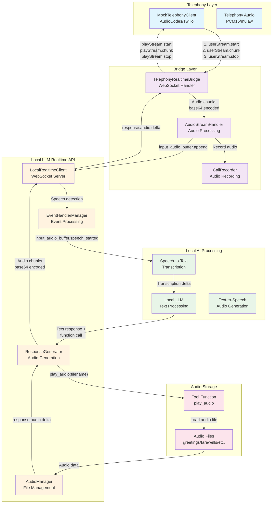

# Local LLM Audio Flow Diagram

This diagram shows how the local LLM system handles audio streaming from telephony through STT, local AI reasoning, and back to telephony.



## Detailed Flow Description

### 1. **Telephony Input**
- **MockTelephonyClient** (AudioCodes/Twilio) sends audio chunks via WebSocket
- Messages: `userStream.start` → `userStream.chunk` (audio data) → `userStream.stop`
- Audio format: PCM16 (AudioCodes) or mulaw (Twilio)

### 2. **Bridge Processing**
- **TelephonyRealtimeBridge** receives telephony messages
- **AudioStreamHandler** processes audio chunks and validates size (min 3200 bytes)
- **CallRecorder** records caller audio for analysis
- Audio is converted to base64 and sent to Mock OpenAI

### 3. **Local LLM Processing**
- **LocalRealtimeClient** provides local AI reasoning via WebSocket server
- **EventHandlerManager** processes incoming audio and handles speech detection
- **AudioManager** manages audio file loading and caching
- **ResponseGenerator** creates streaming responses with local AI decisions

### 4. **Local AI Decision Making**
- **Local LLM** processes transcribed text and generates responses locally
- AI decides which audio file to play based on conversation context
- Calls `play_audio()` function with appropriate filename (e.g., "greetings/greetings_01.wav")

### 5. **Audio File Selection**
- **Tool Function** (`play_audio`) receives filename from AI
- **Audio Files** are organized by category (greetings, farewells, errors, etc.)
- Files are loaded and converted to proper format (16kHz, mono, 16-bit PCM)

### 6. **Audio Response Generation**
- **ResponseGenerator** streams audio data in chunks (3200 bytes = 200ms)
- Sends `response.audio.delta` events with configurable delays
- Simulates realistic streaming behavior

### 7. **Response Back to Telephony**
- **TelephonyRealtimeBridge** receives audio deltas from Local LLM
- Converts back to telephony format and sends via `playStream` messages
- Messages: `playStream.start` → `playStream.chunk` (audio) → `playStream.stop`

## Key Features

- **Local AI Reasoning**: Local LLM processes text and makes decisions without external API calls
- **Audio File Management**: Organized categories with numbered files for different scenarios
- **Function Calling**: AI uses `play_audio()` tool to select appropriate audio responses
- **Bidirectional Flow**: Full round-trip audio processing from telephony to local AI and back
- **Local Processing**: All AI reasoning happens locally for privacy and low latency
- **Audio Quality**: Supports various formats with automatic conversion to 16kHz PCM

## Audio File Categories

```
opusagent/mock/audio/
├── greetings/     # Welcome messages (greetings_01.wav - greetings_10.wav)
├── farewells/     # Goodbye messages (farewells_01.wav - farewells_10.wav)
├── default/       # General responses (default_01.wav - default_10.wav)
├── errors/        # Error situations (errors_01.wav - errors_10.wav)
├── confirmations/ # Confirmations (confirmations_01.wav - confirmations_10.wav)
├── sales/         # Sales interactions (sales_01.wav - sales_10.wav)
├── customer_service/ # Customer service (customer_service_01.wav - customer_service_10.wav)
├── technical_support/ # Tech support (technical_support_01.wav - technical_support_10.wav)
└── card_replacement/ # Card replacement (card_replacement_01.wav - card_replacement_10.wav)
``` 